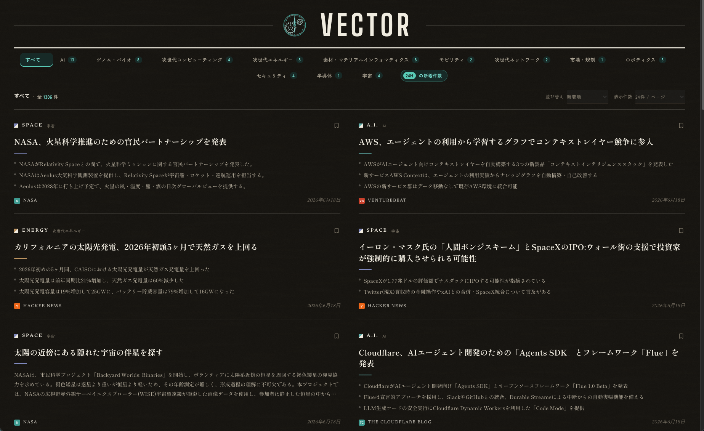
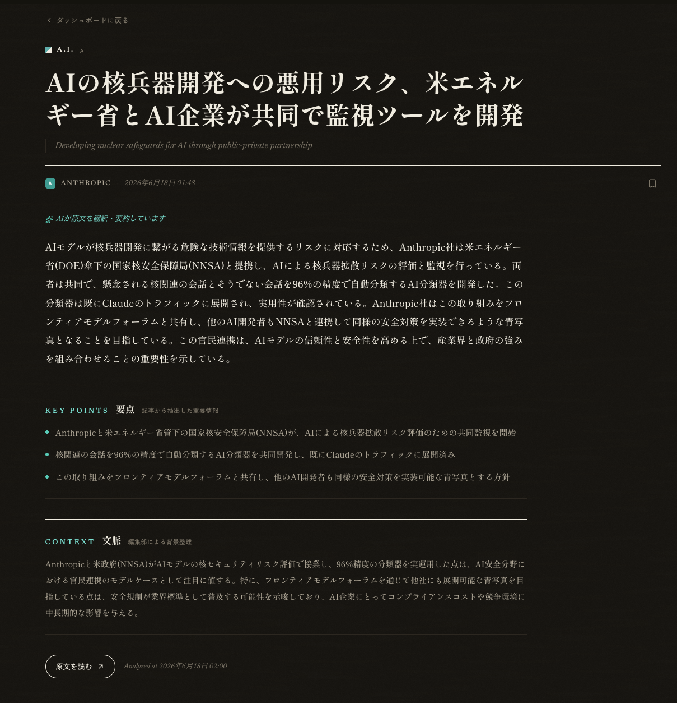
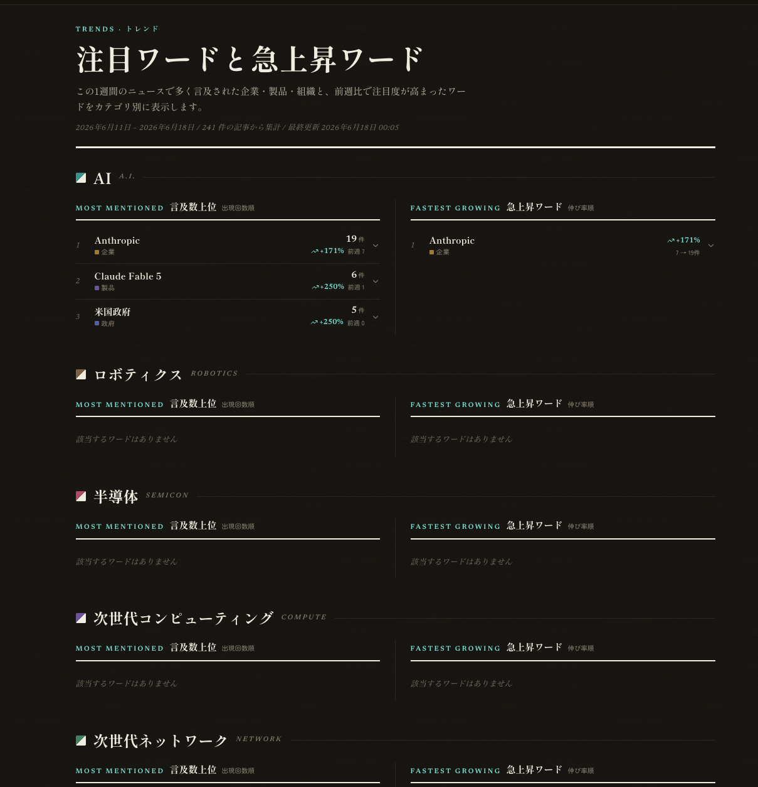
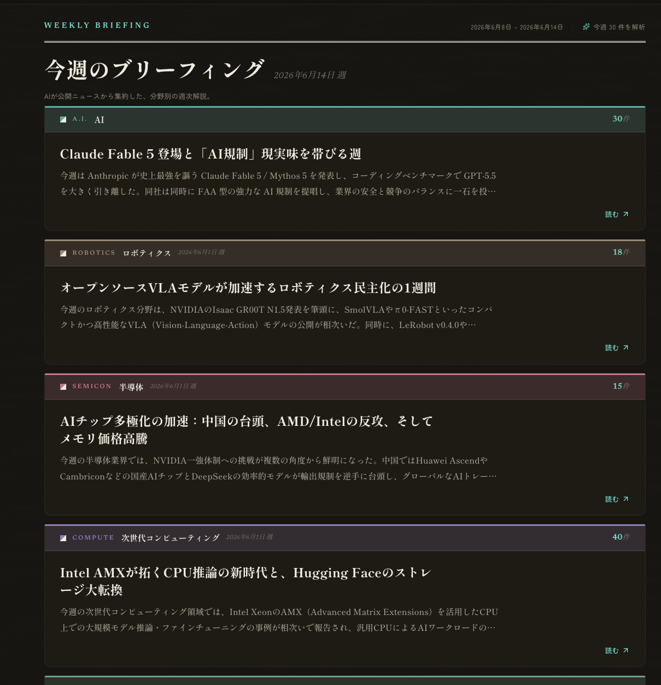
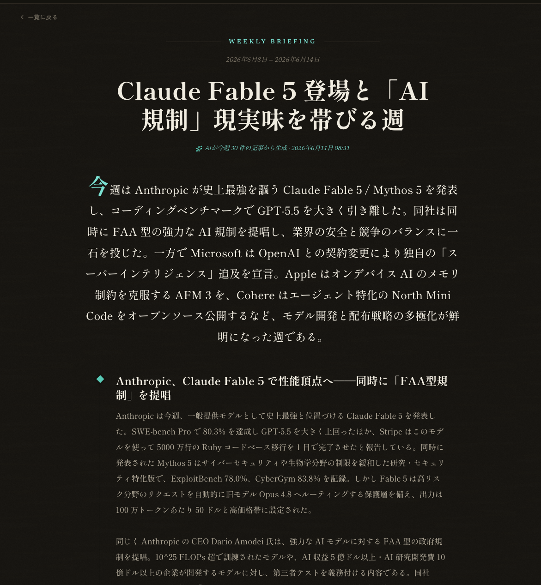
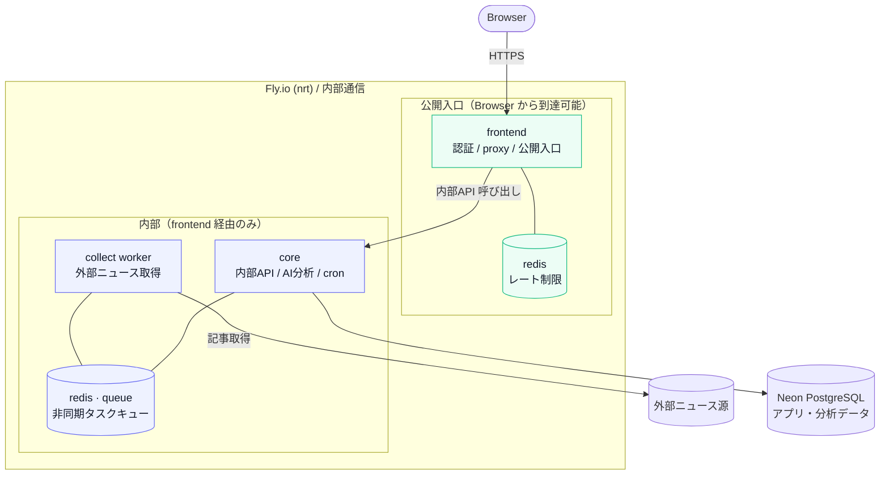
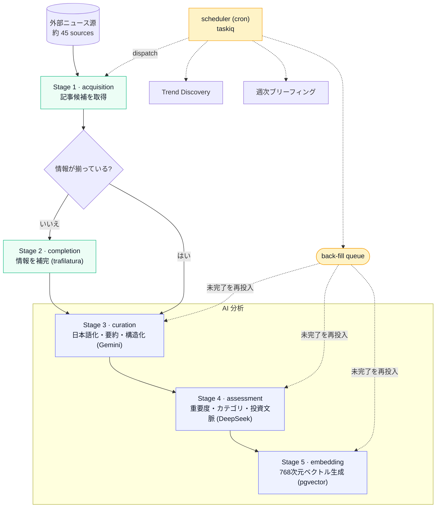

# Vector

> 海外テックニュース収集・AI翻訳・投資分析ダッシュボード

次世代コンピューティング、マテリアル・インフォマティクスなど、日本では情報が少ない先端分野の海外ニュースを自動収集し、AI で翻訳・要約・インパクト分析を行う投資ダッシュボードです。

## 画面プレビュー

Vector は、海外の先端テックニュースを自動収集し、AI で日本語に翻訳・要約したうえで、投資判断に必要な要点・背景・トレンドを確認できるダッシュボードです。



## 主な画面

| ニュース詳細 | トレンド分析 |
|---|---|
|  |  |
| AI が記事を翻訳・要約し、要点と背景文脈を整理する。 | カテゴリごとに言及数と急上昇ワードを集計し、直近の注目テーマを把握する。 |

| 週次ブリーフィング | ブリーフィング詳細 |
|---|---|
|  |  |
| カテゴリごとに、1週間の重要なニュースと論点をまとめる。 | 複数記事をもとに、週次の市場・技術動向を読み物として整理する。 |

### 解決する課題

- 海外テックニュースは英語記事が多く、日本語話者の投資家が継続的に追うには負荷が高い
- 日々の記事は断片的で、AI・半導体・宇宙などの分野ごとに「今週何が起きたのか」を把握しづらい
- 投資判断の前段で必要な要点・背景・流れを拾うために、複数の記事を読み比べる時間がかかる

### 主要機能

- テックニュースの自動収集
- AI による日本語翻訳・要約・背景整理
- カテゴリ別の記事一覧とフィルタリング
- 関連記事推薦
- 週次 LLM ブリーフィング
- 注目ワード / 急上昇ワードの集計

## Architecture

Vector は、ブラウザから直接到達できる入口を Next.js BFF に寄せ、backend API と worker 群を内部側に閉じる構成です。
本番環境では Fly.io の 5 app と Neon PostgreSQL で動作しています。
公開リポジトリ内の `fly*.toml` は構成を説明するための placeholder 付き設定です。実際の app 名、内部 URL、デプロイ手順は private な運用情報として管理しています。



公開入口、内部 API、外部 HTML 取得 worker、DB 権限を分けることで、外部入力を扱う処理の影響範囲を小さくしています。
詳しい app 分割、DB / Redis / secret の境界、非同期パイプライン、設計判断の背景は [docs/architecture.md](docs/architecture.md) にまとめています。

## ニュース処理パイプライン

ニュース収集、本文補完、AI 分析、関連記事検索、トレンド抽出、週次ブリーフィング生成は、非同期パイプラインとして処理しています。



各 stage の成功・失敗は Pipeline Events として記録し、非同期処理で起きた問題を後から追跡できるようにしています。詳しい queue 構成、AI provider の使い分け、再実行・保留・監査ログの設計は [docs/architecture.md](docs/architecture.md) にまとめています。

## 開発と設計への向き合い方

Vector は、最初から明確な設計思想を持って作り始めたアプリではありません。立ち上げ当初は、AI エージェントが生成したコードを十分に理解できないまま承認することも多く、まずは動くものを作るところから始まりました。

そこから、技術書を読み、既存実装をレビューし、実装中の失敗を振り返る中で、少しずつ「自分が何を大事にして設計するのか」を言語化してきました。

今は、機能を増やすことだけでなく、価値の中核に設計を集中すること、責任の境界をわかりやすくすること、不正な状態を作りにくくすること、
失敗したときに後から原因を追えることを重視しています。

その考え方の変化は [docs/design-journey/](docs/design-journey/) にまとめています。
現在のアーキテクチャや主要な設計判断は [docs/architecture.md](docs/architecture.md) を参照してください。
AI エージェントとの具体的な分担や検証の進め方は [docs/how-i-build-with-ai.md](docs/how-i-build-with-ai.md) を参照してください。


## Getting Started

ローカルでは Docker Compose で起動できます。Gemini / DeepSeek の API key と、各種 secret の設定が必要です。

```bash
cp .env.example .env
docker compose up -d --build
```

起動後、`http://localhost:3000` を開きます。
環境変数の一覧は [.env.example](.env.example) を参照してください。

## Docs

- [docs/architecture.md](docs/architecture.md): 本番構成、非同期パイプライン、セキュリティ境界、設計判断
- [docs/design-journey/](docs/design-journey/): 設計に対する考え方が変わっていった記録
- [docs/how-i-build-with-ai.md](docs/how-i-build-with-ai.md): AI エージェントとの開発プロセス
- [docs/development.md](docs/development.md): ローカル開発、検証コマンド、CI / security gate
