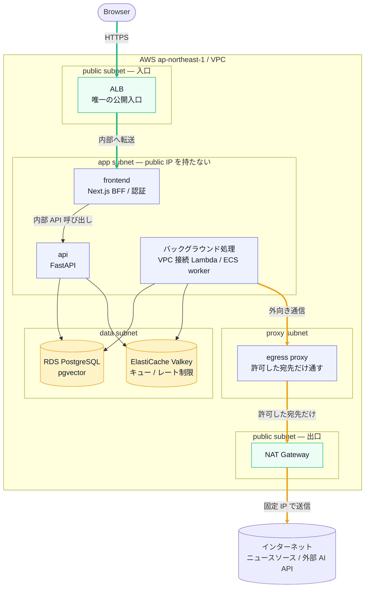
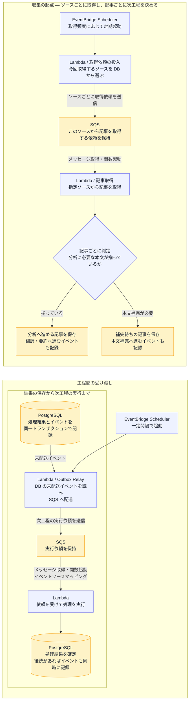

# Vector

> 海外テックニュース収集・AI翻訳・投資分析ダッシュボード

先端テクノロジーに関する海外の情報は、日本でニュースとして取り上げられるまでに時間がかかり、最新の動向をすばやく把握しづらいと感じていました。

この課題を解決したいという思いから、海外のニュース記事を自動で収集・翻訳・要約し、何が起きているのかを日本語ですばやく把握できるアプリの開発を始めました。

公開URL: [https://vectorbrief.online](https://vectorbrief.online)
本サービスは外部のAI APIを利用したポートフォリオ作品です。閲覧機能は公開していますが、AIエージェント機能と会員登録は招待制です。利用を希望される方は、X（@yook_dev）までお気軽にご連絡ください。

## 画面プレビュー

Vector は、海外の先端テックニュースを自動収集し、AI で日本語に翻訳・要約したうえで、投資判断に必要な要点・背景・トレンドを確認できるダッシュボードです。


## AIエージェントによるリサーチ機能

内部に蓄積された記事と、外部から取得した記事を横断してリサーチし、質問への回答を生成します。

https://github.com/user-attachments/assets/9b2a6caa-37ae-4382-b3c8-47964ee52cfb

以下の記事は、初期実装時点の設計と、そこから見えた課題をまとめた開発記録です。当時は小規模な招待制運用を前提に、まず機能を成立させることを優先しており、将来のスケールを支える実行制御や責任分離を十分に設計へ反映できていませんでした。その反省から、現在は工程構成、run の実行制御、外部検索経路、LLM 呼び出し基盤を見直しています。記事中の構成は現行実装とは異なり、現行設計については別の記事で紹介する予定です。

- [PerplexityライクなQ&Aエージェントを個人開発アプリに組み込んだ——6つの工程に分けた設計の工夫](https://zenn.dev/yook/articles/qa-agent-six-stage-design)
- [PerplexityライクなQ&Aエージェントを個人開発アプリに組み込んだ——スケール時に実行モデルをどう変えるか](https://zenn.dev/yook/articles/qa-agent-scaling-execution-model)

## 主な画面

| ニュース詳細 | ブリーフィング詳細 |
|---|---|
|  |  |
| AI が記事を翻訳・要約し、要点と背景文脈を整理する。 | 複数記事をもとに、週次の市場・技術動向を読み物として整理する。 |


## 開発と設計の記録

Vector では、2026年2月にコードを書き始めてから、アプリケーションが形になっていくまでの過程を記録しています。

最初は AI が生成したコードを十分に理解できないまま承認していました。そこから、技術書を読み、既存実装を見直し、失敗を振り返る中で、設計や開発に対する考え方が少しずつ変わっていきました。

[設計の歩み](docs/design-journey/)には、開発を始めてから2026年7月頃までに、自分の考え方がどう変わっていったのかをまとめています。現在とは異なる考えや進め方も含まれていますが、その時点で何を考え、どのようにアプリケーションと向き合っていたのかを残した記録です。

AI との開発の進め方についても、その後、考え方が大きく変わりました。[AI エージェントとの開発の進め方](docs/how-i-build-with-ai.md)では、これまで試してきた方法と、2026年9月時点で考えていることをまとめています。

- 開発を始めてから7月頃までの設計に対する考え方の変化 → [docs/design-journey/](docs/design-journey/)
- アプリケーションの現在の設計と主要な設計判断 → [docs/architecture.md](docs/architecture.md)
- AI との開発で試してきたことと、9月時点での考え → [docs/how-i-build-with-ai.md](docs/how-i-build-with-ai.md)

## 解決する課題

- 海外テックニュースは英語記事が多く、日本語話者の投資家が継続的に追うには負荷が高い
- 日々の記事は断片的で、AI・半導体・宇宙などの分野ごとに「今週何が起きたのか」を把握しづらい
- 投資判断の前段で必要な要点・背景・流れを拾うために、複数の記事を読み比べる時間がかかる

## 主要機能

- テックニュースの自動収集
- AI による日本語翻訳・要約・背景整理
- カテゴリ別の記事一覧とフィルタリング
- 関連記事推薦
- 週次 LLM ブリーフィング
- 注目ワード / 急上昇ワードの集計

## 技術スタック

| 領域 | 採用技術 |
|---|---|
| フロントエンド | Next.js 16 (App Router / BFF)・React 19・TypeScript・Tailwind CSS v4・shadcn/ui |
| 認証 | Better Auth (frontend BFF で完結) |
| バックエンド | Python 3.13・FastAPI・Pydantic / SQLModel・Alembic |
| 記事処理 | EventBridge Scheduler・AWS Lambda・Amazon SQS・Transactional Outbox |
| その他の非同期処理 | taskiq (worker / scheduler)・ElastiCache Valkey (queue / レート制限) |
| データ | Amazon RDS for PostgreSQL・pgvector (768次元ベクトル検索) |
| AI | Gemini (翻訳・要約・リサーチ計画・回答生成・Embedding)・DeepSeek (重要度・投資文脈分析・検索クエリ生成・根拠精査) |
| 外部検索 | Amazon Bedrock AgentCore Gateway (Web Search) |
| 基盤・可観測性 | AWS ECS Fargate (ap-northeast-1)・Terraform・Docker Compose・Logfire (OpenTelemetry)・GitHub Actions |

## Architecture

Vector は、ブラウザから直接到達できる入口を Next.js BFF に寄せ、backend API と worker 群を内部側に閉じる構成です。
本番環境は AWS (ap-northeast-1) で動作しています。ALB を唯一の公開入口とし、frontend・API・リサーチや週次ブリーフィングなどの worker は ECS Fargate で実行します。記事の収集・分析は EventBridge Scheduler・SQS・Lambda によるイベント駆動構成です。データは RDS PostgreSQL と ElastiCache Valkey に置き、構成は Terraform (`infra/aws/`) で管理しています。

以前は Fly.io と Neon PostgreSQL で運用していましたが、この構成はすでに停止しています。現在の本番インフラの正本は `infra/aws/` の Terraform です。

### ネットワーク境界と通信経路


```mermaid
flowchart TB
    Browser([Browser])
    Internet[("インターネット<br/>ニュースソース / 外部 AI API")]

    subgraph VPC["AWS ap-northeast-1 / VPC"]
        subgraph PubIn["public subnet — 入口"]
            ALB["ALB<br/>唯一の公開入口"]
        end

        subgraph AppNet["app subnet — public IP を持たない"]
            FE["frontend<br/>Next.js BFF / 認証"]
            API["api<br/>FastAPI"]
            WORKER["バックグラウンド処理<br/>VPC 接続 Lambda / ECS worker"]
        end

        subgraph DataNet["data subnet"]
            RDS[("RDS PostgreSQL<br/>pgvector")]
            VK[("ElastiCache Valkey<br/>キュー / レート制限")]
        end

        subgraph ProxyNet["proxy subnet"]
            PROXY["egress proxy<br/>許可した宛先だけ通す"]
        end

        subgraph PubOut["public subnet — 出口"]
            NAT["NAT Gateway"]
        end
    end

    Browser ==>|HTTPS| ALB
    ALB ==>|内部へ転送| FE
    FE -->|内部 API 呼び出し| API
    FE ~~~ WORKER
    API --> RDS
    API --> VK
    WORKER --> RDS
    WORKER --> VK
    WORKER ==>|外向き通信| PROXY
    PROXY ==>|許可した宛先だけ| NAT
    NAT ==>|固定 IP で送信| Internet

    linkStyle 0,1 stroke:#10b981,stroke-width:3px
    linkStyle 8,9,10 stroke:#f59e0b,stroke-width:3px

    classDef edge fill:#ecfdf5,stroke:#10b981,color:#111827;
    classDef internal fill:#eef2ff,stroke:#6366f1,color:#111827;
    classDef data fill:#fef3c7,stroke:#f59e0b,color:#111827;
    class ALB,NAT edge
    class FE,API,WORKER,PROXY internal
    class RDS,VK data
```

緑の線はブラウザからの公開経路、オレンジの線は外部ニュース・AI API への通信経路を示しています。バックグラウンド処理は通信上の役割としてまとめており、各処理が必要な DB・Valkey に接続します。Lambda は VPC 接続先を示し、実行環境自体をサブネット内に配置するものではありません。

公開入口、内部 API、外部 HTML の取得処理、DB 権限を分けることで、外部入力を扱う処理の影響範囲を小さくしています。
この分割の背景と、非同期パイプライン・セキュリティ境界の設計判断は [docs/architecture.md](docs/architecture.md) にまとめています。ただし、同文書のインフラ構成は旧 Fly.io / Neon 運用時の記録であり、現在の AWS 構成を説明するものではありません。

以下の記事は、Fly.io / Neon から AWS へ移行した時点の選定理由とトレードオフをまとめた記録です。現在も本番基盤には AWS を利用していますが、個別の構成や運用方式はその後も更新しており、現行構成の正本は `infra/aws/` です。

[個人開発サービスを Fly.io + Neon から AWS に移行した — 選定の理由とトレードオフ](https://zenn.dev/yook/articles/aws-migration-from-flyio-neon-tradeoffs)


## ニュース処理パイプライン

取得した記事は、必要に応じて本文を補完し、翻訳・要約、重要度・投資文脈の分析、Embedding（ベクトル）生成へ進みます。途中で対象外と判定した記事は、後続の分析へ進めません。

### イベント駆動による実行と工程間の受け渡し


```mermaid
flowchart TB
    subgraph Start["収集の起点 — ソースごとに取得し、記事ごとに次工程を決める"]
        direction TB
        SCHEDULE["EventBridge Scheduler<br/>取得頻度に応じて定期起動"]
        SCHEDULE --> DISPATCH["Lambda / 取得依頼の投入<br/>今回取得するソースを DB から選ぶ"]
        DISPATCH -->|ソースごとに取得依頼を送信| REQUEST["SQS<br/>このソースから記事を取得する依頼を保持"]
        REQUEST -->|メッセージ取得・関数起動| ACQUIRE["Lambda / 記事取得<br/>指定ソースから記事を取得"]
        ACQUIRE --> READY{"記事ごとに判定<br/>分析に必要な本文が揃っているか"}
        READY -->|揃っている| ANALYZABLE["分析へ進める記事を保存<br/>翻訳・要約へ進むイベントも記録"]
        READY -->|本文補完が必要| INCOMPLETE["補完待ちの記事を保存<br/>本文補完へ進むイベントも記録"]
    end

    subgraph Handoff["工程間の受け渡し"]
        direction TB
        TIMER["EventBridge Scheduler<br/>一定間隔で起動"]
        subgraph Delivery["結果の保存から次工程の実行まで"]
            direction LR
            DB[("PostgreSQL<br/>処理結果とイベントを<br/>同一トランザクションで記録")]
            DB -->|未配送イベント| RELAY["Lambda / Outbox Relay<br/>DB の未配送イベントを読み<br/>SQS へ配送"]
            RELAY -->|次工程の実行依頼を送信| QUEUE["SQS<br/>実行依頼を保持"]
            QUEUE -->|メッセージ取得・関数起動<br/>イベントソースマッピング| NEXT["Lambda<br/>依頼を受けて処理を実行"]
            NEXT --> SAVE[("PostgreSQL<br/>処理結果を確定<br/>後続があればイベントも同時に記録")]
        end
        TIMER --> RELAY
    end

    Start ~~~ Handoff

    classDef compute fill:#eef2ff,stroke:#6366f1,color:#111827;
    classDef data fill:#fef3c7,stroke:#f59e0b,color:#111827;
    class SCHEDULE,DISPATCH,ACQUIRE,TIMER,RELAY,NEXT compute
    class REQUEST,DB,QUEUE,SAVE,ANALYZABLE,INCOMPLETE data
    class READY compute
```

収集では、取得頻度に応じて対象ソースを選び、ソースごとの取得依頼を SQS へ送ります。取得した記事は、本文が揃っていれば翻訳・要約へ、本文の補完が必要なら本文補完へ進みます。どちらの分岐でも、記事と次工程へのイベントを同一トランザクションで保存し、下段の Outbox Relay による配送へつなぎます。図では取得失敗・重複・保存対象外の経路を省略しています。

工程間の受け渡しは、次の流れで進みます。

1. **処理結果とイベントを一緒に記録する。** 記事取得などの工程が完了すると、処理結果と、次工程へ進むためのイベントを PostgreSQL の同一トランザクションで保存します。イベントの保存先が Outbox です。これにより、結果だけが保存され、次工程へ渡すイベントが記録されない状態を防ぎます。
2. **Scheduler が Relay を定期起動する。** EventBridge Scheduler は一定間隔で Outbox Relay の Lambda を起動します。DB の変更を監視しているのではなく、起動された Relay が Outbox の未配送イベントを読み出します。
3. **次工程の実行依頼を SQS へ送る。** Relay はイベントをメッセージとして、対応する工程の SQS キューへ送ります。このメッセージが、次工程を実行する依頼になります。
4. **SQS の依頼を取得して Lambda を起動する。** AWS が管理するイベントソースマッピングが SQS をポーリングし、取得したメッセージを渡して、その工程の Lambda 関数を起動します。関数内で SQS を監視する必要はありません。
5. **処理結果を確定し、後続があればイベントも記録する。** Lambda 関数は依頼を受けて処理を実行します。次の工程へ進む場合は、今回の処理結果と新しいイベントを同一トランザクションで記録します。そのイベントを Relay が配送し、同じ受け渡しを繰り返します。後続工程がない場合は、結果を保存して終了します。

未完了の分析工程を再投入する backfill も、Scheduler から定期実行します。

記事の取得から Embedding までの処理は、運用コストを最適化するため、Transactional Outbox・Amazon SQS・AWS Lambda を使うイベント駆動構成へ移行しました。

移行の背景、イベント駆動と定期実行の使い分け、Standard キューを選んだ理由、Outbox の再送・重複処理への対応については、以下の記事にまとめています。

[月額約270ドルの運用コストを見直すためのFargateからLambda・SQSへの移行とイベント駆動設計](https://zenn.dev/yook/articles/zenn-event-driven-outbox-draft)

旧 taskiq 経路は、工程ごとに段階的に撤去しています。

以下の記事は、移行前の Redis Streams を中心とした非同期パイプラインについて、再配送や重複実行から DB の整合性を守る仕組みをまとめた開発記録です。

[ニュースの収集とAI分析を支える非同期パイプラインの設計](https://zenn.dev/yook/articles/redis-streams-async-pipeline-recovery)


## Getting Started

ローカルでは Docker Compose で起動できます。Gemini / DeepSeek の API key と、各種 secret の設定が必要です。

```bash
cp .env.example .env
docker compose up -d --build
```

起動後、`http://localhost:3000` を開きます。
環境変数の一覧は [.env.example](.env.example) を参照してください。

## Docs

- [docs/architecture.md](docs/architecture.md): アプリケーション設計、非同期パイプライン、セキュリティ境界、設計判断（インフラ構成は Fly.io 運用時の記述）
- [docs/design-journey/](docs/design-journey/): 設計に対する考え方が変わっていった記録
- [docs/how-i-build-with-ai.md](docs/how-i-build-with-ai.md): AI エージェントとの開発プロセス

## 利用条件

本リポジトリには現時点でオープンソースライセンスを付与していません。
コードの再利用・改変・再配布を希望する場合は、事前に許諾を得てください。
