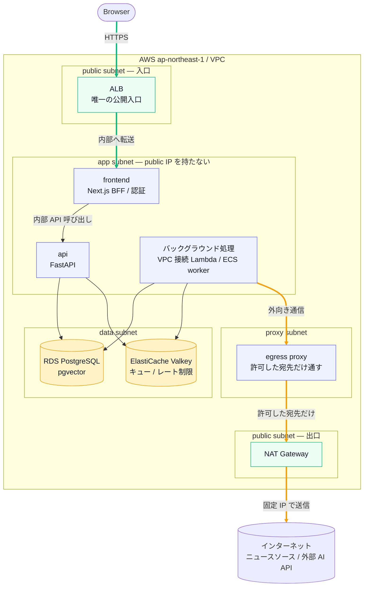
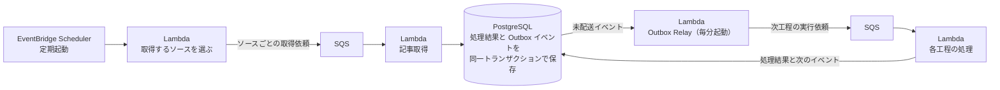

# Vector

> 海外の先端技術の動向を、日本語で手早く把握するニュース・リサーチアプリ

先端テクノロジーに関する海外の情報は、日本でニュースとして取り上げられるまでに時間がかかり、最新の動向をすばやく把握しづらいと感じていました。

この課題を解決したいという思いから、海外のニュース記事を自動で収集・翻訳・要約し、何が起きているのかを日本語ですばやく把握できるアプリの開発を始めました。

公開URL: [https://vectorbrief.online](https://vectorbrief.online)
本サービスは外部のAI APIを利用したポートフォリオ作品です。閲覧機能は公開していますが、AIエージェント機能と会員登録は招待制です。利用を希望される方は、X（@yook_dev）までお気軽にご連絡ください。

## 画面プレビュー

Vector は、海外の先端テックニュースを自動収集し、AI で日本語に翻訳・要約することで、最新の動向や記事の要点・背景を手早く確認できるダッシュボードです。


## AIエージェントによるリサーチ機能

内部に蓄積された記事と、外部から取得した記事を横断してリサーチし、出典を示しながら質問に回答します。回答中の引用から元の記事を開き、根拠を確認できます。

https://github.com/user-attachments/assets/cbd9db5b-e8e9-4a3a-ad84-c1c581770f6f

## 主な画面

| ニュース詳細 | ブリーフィング詳細 |
|---|---|
|  |  |
| AI が記事を翻訳・要約し、要点と背景文脈を整理する。 | 複数記事をもとに、週次の市場・技術動向を読み物として整理する。 |


## 開発と設計の記録

Vector では、2026年2月にコードを書き始めてから、アプリケーションが形になっていくまでの過程を記録しています。

最初は AI が生成したコードを十分に理解できないまま承認していました。そこから、技術書を読み、既存実装を見直し、失敗を振り返る中で、設計や開発に対する考え方が少しずつ変わっていきました。

[設計の歩み](docs/design-journey/)には、開発を始めてから2026年7月頃までに、自分の考え方がどう変わっていったのかをまとめています。現在とは異なる考えや進め方も含まれていますが、その時点で何を考え、どのようにアプリケーションと向き合っていたのかを残した記録です。

AI との開発の進め方についても、その後、考え方が大きく変わりました。[AI エージェントとの開発の進め方](docs/how-i-build-with-ai.md)では、これまで試してきた方法と、2026年9月時点で考えていることをまとめています。

- 開発を始めてから7月頃までの設計に対する考え方の変化 → [docs/design-journey/](docs/design-journey/)
- アプリケーションの現在の設計と主要な設計判断 → [docs/architecture.md](docs/architecture.md)
- AI との開発で試してきたことと、9月時点での考え → [docs/how-i-build-with-ai.md](docs/how-i-build-with-ai.md)

## 解決する課題

- 海外の先端技術の情報は、日本語で紹介されるまでに時間がかかり、最新の動向を追いづらい
- 複数の海外メディアを巡回し、英語の記事を読み比べて要点を把握するには時間がかかる
- 気になる技術や企業について、関連記事や出典を確認しながら、動向を手早く把握したい

## 主要機能

- テックニュースの自動収集
- AI による日本語翻訳・要約・背景整理
- カテゴリ別の記事一覧とフィルタリング
- 関連記事推薦
- 週次 LLM ブリーフィング
- 注目ワード / 急上昇ワードの集計

## 技術スタック

| 領域 | 採用技術 |
|---|---|
| フロントエンド | Next.js 16 (App Router / BFF)・React 19・TypeScript・Tailwind CSS v4・shadcn/ui |
| 認証 | Better Auth (frontend BFF で完結) |
| バックエンド | Python 3.13・FastAPI・Pydantic・SQLAlchemy・Alembic |
| 記事処理 | EventBridge Scheduler・AWS Lambda・Amazon SQS・Transactional Outbox |
| その他の非同期処理 | taskiq (worker / scheduler)・ElastiCache Valkey (queue / レート制限) |
| データ | Amazon RDS for PostgreSQL・pgvector (768次元ベクトル検索) |
| AI | Gemini (翻訳・要約・リサーチ計画・回答生成・Embedding)・DeepSeek (重要度・背景の分析・検索クエリ生成・根拠精査) |
| 外部検索 | Amazon Bedrock AgentCore Gateway (Web Search) |
| 基盤・可観測性 | AWS ECS Fargate (ap-northeast-1)・Terraform・Docker Compose・Logfire (OpenTelemetry)・GitHub Actions |

## Architecture

Vector は、ブラウザから直接到達できる入口を Next.js BFF に寄せ、backend API と worker 群を内部側に閉じる構成です。
本番環境は AWS (ap-northeast-1) で動作しています。ALB を唯一の公開入口とし、frontend・API・リサーチや週次ブリーフィングなどの worker は ECS Fargate で実行します。記事の収集・分析は EventBridge Scheduler・SQS・Lambda によるイベント駆動構成です。データは RDS PostgreSQL と ElastiCache Valkey に置き、構成は Terraform (`infra/aws/`) で管理しています。

以前は Fly.io と Neon PostgreSQL で運用していましたが、現在は AWS へ移行済みです。

### AWS全体構成


2026年9月時点の本番構成です。図の枠は役割ごとの区分で、ネットワーク境界は次の図で示します。

[図の読み方と構成の詳細](docs/aws-architecture.md) / [編集用draw.ioファイル](docs/assets/readme/aws-architecture.drawio)

### ネットワーク境界と通信経路


```mermaid
flowchart TB
    Browser([Browser])
    Internet[("インターネット<br/>ニュースソース / 外部 AI API")]

    subgraph VPC["AWS ap-northeast-1 / VPC"]
        subgraph PubIn["public subnet — 入口"]
            ALB["ALB<br/>唯一の公開入口"]
        end

        subgraph AppNet["app subnet — public IP を持たない"]
            FE["frontend<br/>Next.js BFF / 認証"]
            API["api<br/>FastAPI"]
            WORKER["バックグラウンド処理<br/>VPC 接続 Lambda / ECS worker"]
        end

        subgraph DataNet["data subnet"]
            RDS[("RDS PostgreSQL<br/>pgvector")]
            VK[("ElastiCache Valkey<br/>キュー / レート制限")]
        end

        subgraph ProxyNet["proxy subnet"]
            PROXY["egress proxy<br/>許可した宛先だけ通す"]
        end

        subgraph PubOut["public subnet — 出口"]
            NAT["NAT Gateway"]
        end
    end

    Browser ==>|HTTPS| ALB
    ALB ==>|内部へ転送| FE
    FE -->|内部 API 呼び出し| API
    FE ~~~ WORKER
    API --> RDS
    API --> VK
    WORKER --> RDS
    WORKER --> VK
    WORKER ==>|外向き通信| PROXY
    PROXY ==>|許可した宛先だけ| NAT
    NAT ==>|固定 IP で送信| Internet

    linkStyle 0,1 stroke:#10b981,stroke-width:3px
    linkStyle 8,9,10 stroke:#f59e0b,stroke-width:3px

    classDef edge fill:#ecfdf5,stroke:#10b981,color:#111827;
    classDef internal fill:#eef2ff,stroke:#6366f1,color:#111827;
    classDef data fill:#fef3c7,stroke:#f59e0b,color:#111827;
    class ALB,NAT edge
    class FE,API,WORKER,PROXY internal
    class RDS,VK data
```

緑の線はブラウザからの公開経路、オレンジの線は外部のニュースサイト・AI API への通信経路です。図の「バックグラウンド処理」は ECS の worker と、VPC に接続した Lambda をまとめて示しており、実際には処理ごとに接続できる DB・Valkey と外向きの宛先を分けています。

公開入口、内部 API、外部 HTML の取得処理、DB 権限を分けることで、外部入力を扱う処理の影響範囲を小さくしています。
この分割の背景と、非同期パイプライン・セキュリティ境界の設計判断は [docs/architecture.md](docs/architecture.md) にまとめています。ただし、同文書のインフラ構成は旧 Fly.io / Neon 運用時の記録であり、現在の AWS 構成を説明するものではありません。

Fly.io / Neon から AWS へ移行した際の選定理由とトレードオフは、次の記事にまとめています。構成はその後も更新しているため、記事の内容は移行時点のものです。

[個人開発サービスを Fly.io + Neon から AWS に移行した — 選定の理由とトレードオフ](https://zenn.dev/yook/articles/aws-migration-from-flyio-neon-tradeoffs)


## ニュース処理パイプライン

取得した記事は、必要に応じて本文を補完し、翻訳・要約、重要度・背景の分析、Embedding（ベクトル）生成へ進みます。途中で対象外と判定した記事は、後続の分析へ進めません。

### イベント駆動による工程間の受け渡し


```mermaid
flowchart LR
    SCHEDULE["EventBridge Scheduler<br/>定期起動"] --> DISPATCH["Lambda<br/>取得するソースを選ぶ"]
    DISPATCH -->|ソースごとの取得依頼| REQUEST["SQS"]
    REQUEST --> ACQUIRE["Lambda<br/>記事取得"]
    ACQUIRE --> DB[("PostgreSQL<br/>処理結果と Outbox イベントを<br/>同一トランザクションで保存")]
    DB -->|未配送イベント| RELAY["Lambda<br/>Outbox Relay（毎分起動）"]
    RELAY -->|次工程の実行依頼| QUEUE["SQS"]
    QUEUE --> NEXT["Lambda<br/>各工程の処理"]
    NEXT -->|処理結果と次のイベント| DB
```

各工程は、処理結果と次工程へのイベント（Outbox）を同じトランザクションで保存します。Outbox Relay が未配送のイベントを SQS へ送り、SQS から起動された Lambda が次の工程を実行します。これを Embedding まで繰り返すことで、結果だけが保存されて次工程へ進めなくなる状態を防いでいます。同じ依頼が重複して届いても結果を二重に保存しないようにし、途中で止まった記事は定期実行の backfill が再投入します。

記事の取得から Embedding までは、運用コストを見直すため、Fargate 上の worker からこの構成へ移行しました。移行の背景、イベント駆動と定期実行の使い分け、Outbox の再送・重複への対応は、次の記事にまとめています。

[月額約270ドルの運用コストを見直すためのFargateからLambda・SQSへの移行とイベント駆動設計](https://zenn.dev/yook/articles/zenn-event-driven-outbox-draft)


## Getting Started

ローカルでは Docker Compose で起動できます。Gemini / DeepSeek の API key と、各種 secret の設定が必要です。

```bash
cp .env.example .env
docker compose up -d --build
```

起動後、`http://localhost:3000` を開きます。
環境変数の一覧は [.env.example](.env.example) を参照してください。

## Docs

- [docs/architecture.md](docs/architecture.md): アプリケーション設計、非同期パイプライン、セキュリティ境界、設計判断（インフラ構成は Fly.io 運用時の記述）
- [docs/design-journey/](docs/design-journey/): 設計に対する考え方が変わっていった記録
- [docs/how-i-build-with-ai.md](docs/how-i-build-with-ai.md): AI エージェントとの開発プロセス

## 利用条件

本リポジトリには現時点でオープンソースライセンスを付与していません。
コードの再利用・改変・再配布を希望する場合は、事前に許諾を得てください。
