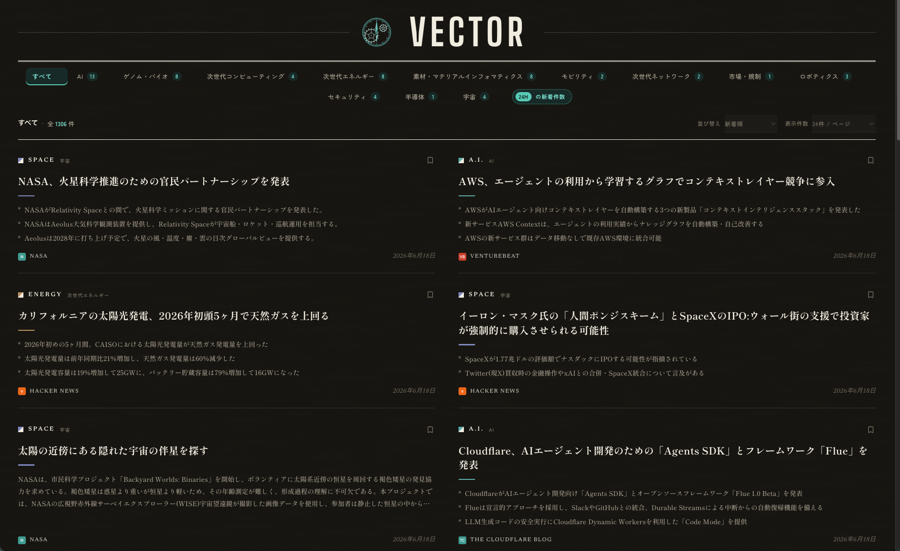
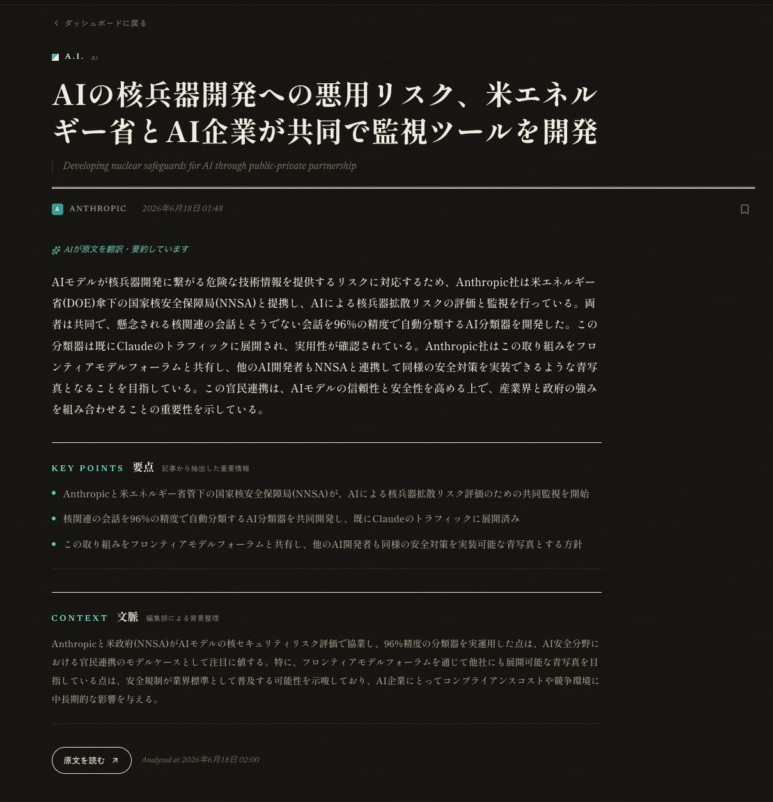
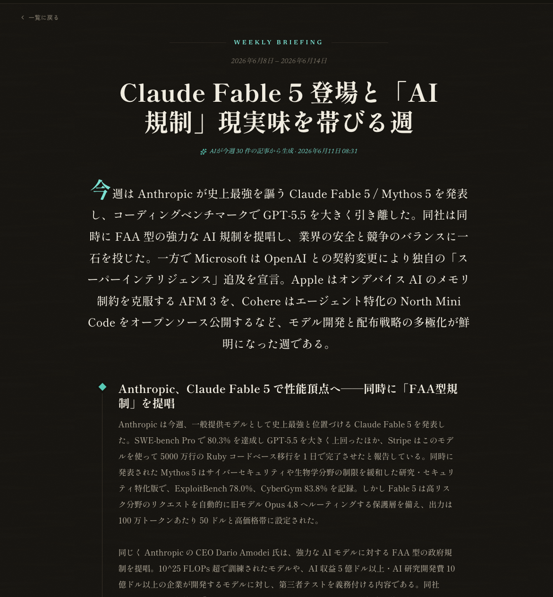
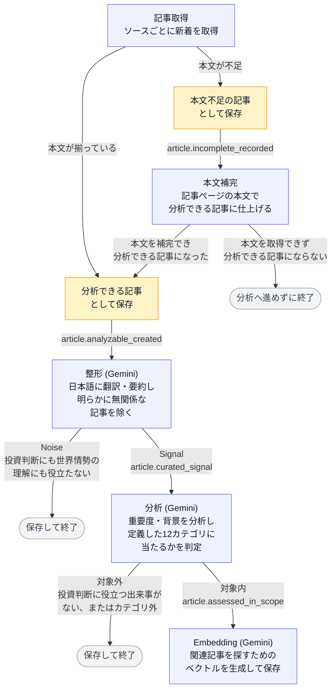

# Vector

> 海外の先端技術の動向を、日本語で手早く把握するニュース・リサーチアプリ

公開URL: [https://vectorbrief.online](https://vectorbrief.online)
本サービスは外部のAI APIを利用したポートフォリオ作品です。閲覧機能はログインなしで使えます。AIエージェント機能は、メールアドレスで会員登録すると使えます（1日10回まで）。

## 画面



### AIエージェントによるリサーチ

内部に蓄積された記事と、外部から取得した記事を横断してリサーチし、出典を示しながら質問に回答します。回答中の引用から元の記事を開き、根拠を確認できます。

https://github.com/user-attachments/assets/cbd9db5b-e8e9-4a3a-ad84-c1c581770f6f

### 主な画面

| ニュース詳細 | ブリーフィング詳細 |
|---|---|
|  |  |
| AI が記事を翻訳・要約し、要点と背景文脈を整理する。 | 複数記事をもとに、週次の市場・技術動向を読み物として整理する。 |

## なぜ作ったか

先端テクノロジーに関する海外の情報は、日本でニュースとして取り上げられるまでに時間がかかります。かといって英語の記事をそのまま読み続けるのは負担が大きく、動きの速い分野の動向をすばやく把握しづらいと感じていました。

そこで、海外のニュース記事を自動で収集・翻訳・要約し、何が起きているのかを日本語で手早く把握できるアプリの開発を始めました。あわせて、調べたい内容に出典とともに回答するAIエージェント機能も実装しました。

## 主要機能

- テックニュースの自動収集
- AI による日本語翻訳・要約・背景整理
- カテゴリ別の記事一覧とフィルタリング
- 関連記事推薦
- 週次 LLM ブリーフィング
- 注目ワード / 急上昇ワードの集計

## 技術スタック

| 領域 | 採用技術 |
|---|---|
| フロントエンド | Next.js 16 (App Router / BFF)・React 19・TypeScript・Tailwind CSS v4・shadcn/ui |
| 認証 | Better Auth (frontend BFF で完結) |
| バックエンド | Python 3.13・FastAPI・Pydantic・SQLAlchemy・Alembic |
| 記事処理 | EventBridge Scheduler・AWS Lambda・Amazon SQS・Transactional Outbox |
| その他の非同期処理 | taskiq (worker / scheduler)・ElastiCache Valkey (queue / レート制限) |
| データ | Amazon RDS for PostgreSQL・pgvector (768次元ベクトル検索) |
| AI | Gemini (翻訳・要約・重要度と背景の分析・リサーチ計画・検索クエリ生成・根拠精査・回答生成・週次ブリーフィング・Embedding) |
| 外部検索 | Amazon Bedrock AgentCore Gateway (Web Search) |
| 基盤・可観測性 | AWS ECS Fargate (ap-northeast-1)・Terraform・Docker Compose・Logfire (OpenTelemetry)・GitHub Actions |

## Architecture

本番環境は AWS (ap-northeast-1) で動作しています。公開入口は ALB だけで、ALB は Next.js の frontend にだけ転送します。frontend は BFF として認証を担い、backend API には frontend からしか接続できません。frontend・API・リサーチや週次ブリーフィングなどの worker は ECS Fargate で実行し、記事の収集・分析は EventBridge Scheduler・SQS・Lambda によるイベント駆動構成です。データは RDS PostgreSQL と ElastiCache Valkey に置き、構成は Terraform (`infra/aws/`) で管理しています。

### AWS全体構成


2026年9月時点の本番構成です。図の枠は役割ごとの区分で、ネットワーク境界は次の図で示します。

[図の読み方と構成の詳細](docs/aws-architecture.md) / [編集用draw.ioファイル](docs/assets/readme/aws-architecture.drawio)

### ネットワーク境界と通信経路


```mermaid
flowchart TB
    Browser([Browser])
    Internet[("インターネット<br/>ニュースソース / 外部 AI API")]

    subgraph VPC["AWS ap-northeast-1 / VPC"]
        subgraph PubIn["public subnet — 入口"]
            ALB["ALB<br/>唯一の公開入口"]
        end

        subgraph AppNet["app subnet — public IP を持たない"]
            FE["frontend<br/>Next.js BFF / 認証"]
            API["api<br/>FastAPI"]
            WORKER["バックグラウンド処理<br/>VPC 接続 Lambda / ECS worker"]
        end

        subgraph DataNet["data subnet"]
            RDS[("RDS PostgreSQL<br/>pgvector")]
            VK[("ElastiCache Valkey<br/>キュー / レート制限")]
        end

        subgraph ProxyNet["proxy subnet"]
            PROXY["egress proxy<br/>許可した宛先だけ通す"]
        end

        subgraph PubOut["public subnet — 出口"]
            NAT["NAT Gateway"]
        end
    end

    Browser ==>|HTTPS| ALB
    ALB ==>|内部へ転送| FE
    FE -->|内部 API 呼び出し| API
    FE ~~~ WORKER
    API --> RDS
    API --> VK
    WORKER --> RDS
    WORKER --> VK
    WORKER ==>|外向き通信| PROXY
    PROXY ==>|許可した宛先だけ| NAT
    NAT ==>|固定 IP で送信| Internet

    linkStyle 0,1 stroke:#10b981,stroke-width:3px
    linkStyle 8,9,10 stroke:#f59e0b,stroke-width:3px

    classDef edge fill:#ecfdf5,stroke:#10b981,color:#111827;
    classDef internal fill:#eef2ff,stroke:#6366f1,color:#111827;
    classDef data fill:#fef3c7,stroke:#f59e0b,color:#111827;
    class ALB,NAT edge
    class FE,API,WORKER,PROXY internal
    class RDS,VK data
```

緑の線はブラウザからの公開経路、オレンジの線は外部のニュースサイト・AI API への通信経路です。図の「バックグラウンド処理」は ECS の worker と、VPC に接続した Lambda をまとめて示しており、実際には処理ごとに接続できる DB・Valkey と外向きの宛先を分けています。

公開入口、内部 API、外部 HTML の取得処理、DB 権限を分けることで、外部入力を扱う処理の影響範囲を小さくしています。

## ニュース処理パイプライン

取得した記事は、必要に応じて本文を補完し、翻訳・要約、重要度・背景の分析、Embedding（ベクトル）生成へ進みます。途中で対象外と判定した記事は、後続の分析へ進めません。

### 処理の流れ


```mermaid
flowchart TB
    ACQ["記事取得<br/>ソースごとに新着を取得"]
    ACQ -->|本文が揃っている| ANALYZABLE["分析できる記事<br/>として保存"]
    ACQ -->|本文が不足| INCOMPLETE["本文不足の記事<br/>として保存"]
    INCOMPLETE -->|"article.incomplete_recorded"| COMP["本文補完<br/>記事ページの本文で<br/>分析できる記事に仕上げる"]
    COMP -->|"本文を補完でき<br/>分析できる記事になった"| ANALYZABLE
    COMP -->|"本文を取得できず<br/>分析できる記事にならない"| END1(["分析へ進めずに終了"])
    ANALYZABLE -->|"article.analyzable_created"| CUR["整形 (Gemini)<br/>日本語に翻訳・要約し<br/>明らかに無関係な<br/>記事を除く"]
    CUR -->|"Noise<br/>投資判断にも世界情勢の<br/>理解にも役立たない"| END2(["保存して終了"])
    CUR -->|"Signal<br/>article.curated_signal"| ASSESS["分析 (Gemini)<br/>重要度・背景を分析し<br/>定義した12カテゴリに<br/>当たるかを判定"]
    ASSESS -->|"対象外<br/>投資判断に役立つ出来事が<br/>ない、またはカテゴリ外"| END3(["保存して終了"])
    ASSESS -->|"対象内<br/>article.assessed_in_scope"| EMB["Embedding (Gemini)<br/>関連記事を探すための<br/>ベクトルを生成して保存"]

    classDef stage fill:#eef2ff,stroke:#6366f1,color:#111827;
    classDef saved fill:#fef3c7,stroke:#f59e0b,color:#111827;
    classDef stop fill:#f3f4f6,stroke:#9ca3af,color:#374151;
    class ACQ,COMP,CUR,ASSESS,EMB stage
    class ANALYZABLE,INCOMPLETE saved
    class END1,END2,END3 stop
```

各工程は処理結果とイベントを同じトランザクションで保存し（Transactional Outbox）、Outbox Relay がイベントを SQS へ送ると、次の工程の Lambda が起動します。結果だけが保存されて次の工程へ進めなくなる状態を防ぎ、同じ依頼が重複して届いても結果を二重に保存しません。途中で止まった記事は、定期実行の backfill が再投入します。

記事の取得から Embedding までは、運用コストを見直すため、Fargate 上の worker から SQS・Lambda によるイベント駆動構成へ移行しました。移行の背景、イベント駆動と定期実行の使い分け、Outbox の再送・重複への対応は、次の記事にまとめています。

[月額約270ドルの運用コストを見直すためのFargateからLambda・SQSへの移行とイベント駆動設計](https://zenn.dev/yook/articles/zenn-event-driven-outbox-draft)


## Getting Started

ローカルでは Docker Compose で起動できます。Gemini の API key と、各種 secret の設定が必要です。

```bash
cp .env.example .env
docker compose up -d --build
```

起動後、`http://localhost:3000` を開きます。
環境変数の一覧は [.env.example](.env.example) を参照してください。

## 開発の歩み

Vector は、アプリケーション開発の経験がまったくないところから、2026年2月に作り始めました。

最初は、AI が生成したコードを十分に理解できないまま承認していました。技術書を読み、既存実装を見直し、失敗を振り返る中で、設計や開発に対する考え方が少しずつ変わっていきました。

その時々に何を考え、どう判断しながら開発してきたのかを、当時の記録のまま残しています。よろしければご覧ください。

- [設計の歩み](docs/design-journey/) — 2026年2月〜7月頃、設計に対する考え方がどう変わっていったか
- [Architecture（Fly.io / Neon 運用期）](docs/architecture.md) — 旧構成で運用していた頃の設計文書。セキュリティ境界や非同期パイプラインの設計判断を記録しています
- [個人開発サービスを Fly.io + Neon から AWS に移行した — 選定の理由とトレードオフ](https://zenn.dev/yook/articles/aws-migration-from-flyio-neon-tradeoffs) — AWS へ移行した時点での選定理由
- [AI エージェントとの開発の進め方](docs/how-i-build-with-ai.md) — AI との開発で試してきたことと、2026年9月時点の考え

## 利用条件

本リポジトリには現時点でオープンソースライセンスを付与していません。
コードの再利用・改変・再配布を希望する場合は、事前に許諾を得てください。
