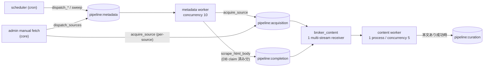

# Acquisition / Completion Redis Stream 分割仕様

> 日付: 2026-07-18(同日レビュー反映で改訂)
>
> ステータス: 実装方針合意済み
>
> 対象: `pipeline:content` を `pipeline:acquisition` / `pipeline:completion` へ分割し、`pipeline:metadata` を dispatch 制御専用キューとして位置付け直す
>
> 実行資源: 当面は 1 つの `broker_content` / content worker process を共有する
>
> Deploy 前提: greenfield(非公開・未デプロイ、legacy Stream / in-flight task / Redis volume を引き継がない)。2026-07-18 にユーザー確認済み
>
> Slice 境界: 本 slice は **code-complete(実装 + local 検証)で完了**する。初回 production deploy と release acceptance は、後続の rename slice(`pipeline:metadata` → `pipeline:dispatch` 全面改名)完了後の最終 topology 上で行う(§12・§13)

## 1. 位置付け

本仕様は、collection パイプラインの一段目(ニュースソースからの初回取得)と二段目(未完成記事の本文補完)を責務ごとの Redis Stream に分け、stage ごとの滞留を独立して観測できるようにするための実装契約である。

`curation-assessment-queue-separation-slice.md`(実装済み、#13)と同じ設計パターンを collection 側へ適用する。「キュー分離」の意味も同仕様と同じである。

> acquisition と completion は処理責務ごとに論理キューを分離している。
> 現時点では実行資源を増やさず、1 つの共有 content worker が両キューを処理する。

Redis Stream、consumer group state、保持上限、lag の分離を指し、worker process、concurrency、DB pool、failure domain の分離までは意味しない。

また本仕様は `pipeline:metadata` の役割を「メタデータ取得キュー」ではなく「対象選定・タスク投入・lease 掃除の制御キュー」として明文化する。本 slice では実態と乖離した説明(docstring / comment)だけを更新し、名前の全面改名(`pipeline:dispatch`)は後続 slice が行う。

```text
scheduler
  ↓
pipeline:metadata(対象選定・タスク投入・lease 掃除)
  ├─ pipeline:acquisition(初回取得)
  └─ pipeline:completion(本文補完)
```

## 2. Work Definition

### 2.1 Problem

現行は `acquire_source`(Stage 1)と `scrape_html_body`(Stage 2)が同じ `pipeline:content` Stream に入り、次を stage 単位で判別しにくい。

- どちらの stage が未配達 backlog を持っているか
- どちらの stage の task が長く実行開始を待っているか
- Stream の保持量や trim リスクをどちらが消費しているか
- 本文補完の滞留が shared worker の資源競合に起因し、worker 分割が必要か

さらに completion には「Redis 滞留がそのまま業務 retry 予算を燃やす」結合(§5)があり、現行の混在 Stream ではこの滞留を acquisition と切り分けて観測できない。分割は observability の改善であると同時に、attempt 燃焼の検知に必要な観測軸を作る。

また、`broker_metadata` の説明「RSS/HN メタデータ取得 + dispatch」は実態と乖離している。実際に載っているのは dispatch / sweep の制御タスクのみで、取得処理は content 側にある。

### 2.2 Evidence

| Evidence | 現状 |
|---|---|
| `backend/app/queue/brokers.py` | `broker_metadata` = `pipeline:metadata` / `broker_content` = `pipeline:content`。content は単一 Stream、`consumer_id="$"`、lock timeout なし |
| `backend/app/queue/tasks/acquisition.py` | dispatch 系 4 task は `broker_metadata`、`acquire_source`(timeout=300 / max_retries=0 / retry_on_error=False)は `broker_content`。取り込み成功後、DB commit 済みの新規 article ID ごとに `curate_content.kiq()` |
| `backend/app/queue/tasks/completion.py` | `dispatch_html_fetch_jobs` / `sweep_expired_leases` は `broker_metadata`、`scrape_html_body`(timeout=60 / max_retries=0 / retry_on_error=False)は `broker_content`。payload は `incomplete_article_id: int` のみで attempt 世代を持たない |
| `backend/supervisord/fetch.conf` | 1 container に metadata worker(concurrency 10)と content worker(concurrency 5)の 2 process。両 program とも task module は acquisition + completion |
| `backend/app/queue/lifecycle.py` | metadata / content 各 DB pool `(5, 5)`。scheduler lifecycle は metadata 側のみ |
| completion claim | `claim_ready_batch` は claim 時に `attempt_count + 1`(実行前に加算)。lease 5 分、batch 上限 100 件/分 |
| completion sweep | `sweep_expired_leases` は `running` → `open`(`ready_at=now`)に戻すのみで attempt を減算しない。現在は log のみで metric なし |
| completion 実行時 | `ReadyForArticleCompletion.try_advance_from` は DB の現在 `attempt_count` を採用し、`status="running"` 以外を弾くだけで message 由来の世代検証はない |
| completion CAS | `close_claimed` / `schedule_retry` は `status="running" AND attempt_count == ready.attempt_count` を条件とする compare-and-set。stale な Ready の DB 遷移は no-op になる |
| throughput 非対称 | claim 100 件/分 vs content worker 並列 5。100 件を lease 300 秒内に捌くには 1 件平均 15 秒未満、100 件/分の継続処理には平均 3 秒以下が必要 |
| handoff | 両 stage とも DB commit 後に `curate_content.kiq()`。taskiq receiver は `when_executed` でも handler error 後に無条件 ACK し(`receiver.py` の run_task → ack 順)、両 task は taskiq retry 無効 |
| handoff 喪失時の実回復 | acquisition 再実行は dedup で既存 article を `persisted_ids` に含めず、completion は `close_claimed` 済みで poller が再 claim しない。救済は `backfill_curations`(30 分猶予 + 7 日窓 + hold gate + kill switch + 日次予算の条件付き cron) |
| `backend/app/admin/pipeline/router.py` | admin 手動 fetch は core credentials から `acquire_source.kiq()` を is_active を見ずに直接呼ぶ。複数 source の `.kiq()` は非 atomic なループ |
| `backend/app/collection/sources/dispatch.py` | cron dispatch は `is_active == True` の source だけを選ぶ。inactive source は cron で再投入されない |
| `infra/redis/fly.toml` | collect ACL は `~pipeline:metadata ~pipeline:content ~pipeline:curation ~autoclaim:taskiq:pipeline:metadata ~autoclaim:taskiq:pipeline:content ~taskiq:*` |
| `backend/app/queue/stream_health.py` | `PIPELINE_QUEUE_TARGETS` は curation / assessment の 2 Stream のみ |
| `backend/scripts/pipeline_queue_status.py` | 表示は `PIPELINE_QUEUE_TARGETS` 駆動。Makefile の `QUEUES` 変数は定義のみで参照ゼロの死変数 |
| `Makefile` | `pipeline-status` の見出しは「Curation / assessment Stream status」で 4 stage 化に追従していない |
| `backend/fly.collect.toml` | comment「broker_metadata=acquisition+dispatch / broker_content=completion」は現時点で既に実態と乖離 |
| `backend/specs/redis-production-topology.md` | production SSoT が旧 `pipeline:content` ACL と 2 stage sampler のまま |
| `curation-assessment-queue-separation-slice.md` | multi-stream broker + queue label routing + 毎分 sampler + transport 契約の先行実装 |
| ローカル実測(2026-07-18 dev) | `pipeline:content` XLEN=10,006 / MEMORY USAGE=5,108,644 bytes、`pipeline:metadata` XLEN=10,007 / 6,021,308 bytes(両方 MAXLEN 上限到達) |

### 2.3 Invariants

コードが保証する不変条件。運用前提(SLO)は §5 に分離する。

1. task name `acquire_source` / `scrape_html_body` と payload schema(`AcquireSourceTaskInput` / `incomplete_article_id: int`)を変更しない。
2. dispatch / 制御タスク(`dispatch_high/medium/low`、`dispatch_sources`、`dispatch_html_fetch_jobs`、`sweep_expired_leases`)は `pipeline:metadata` に残す。
3. acquisition / completion 成功時の `curate_content` chain を維持する。
4. **transport loss** の回復経路: acquisition は次の cron dispatch(active source のみ)、completion は DB `ready_at` poller + lease sweep。transport replay を回復経路にしない。
5. **handoff loss**(DB commit 後の `curate_content.kiq()` 失敗)の回復経路は `backfill_curations` であり、hold gate / kill switch / 日次予算 / 30 分猶予〜7 日窓の**条件付き**である。本 slice はこの条件を変更せず、契約として記録・テストする。
6. stale な Ready(構築後に attempt 世代が進んだもの)による DB 状態遷移は CAS(`attempt_count` 一致条件)で拒否される。
7. retry は元 task と同じ stage Stream へ戻す(queue label 契約。production task は retry 無効のまま)。
8. worker process は metadata / content の 2 つ、concurrency は 10 / 5、DB pool は各 `(5, 5)` のままとする。
9. consumer group 名は両 Stream とも `taskiq`。group state は Stream ごとに独立する。
10. 新 Stream の consumer group 作成前に enqueue された task を失わない(`consumer_id="0-0"`)。
11. collect Redis user には fetch container の worker 稼働に必要な最小権限だけを与える。
12. `GET /api/v1/admin/pipeline/health` と admin fetch API の response shape を変更しない。
13. DB schema、API response、認証・認可、既存 task の timeout / retry 回数、completion の claim / lease / attempt semantics を変更しない。
14. Stream / group の欠落や Redis 接続失敗を backlog 0 として扱わない。

### 2.4 Non-goals

- acquisition / completion の worker process、container、Fly process group の分割
- stage ごとの専用 concurrency、予約枠、priority、公平性の保証
- completion の claim / lease / attempt semantics の変更(§5 の accepted risk への対処を含む)
- `scrape_html_body` payload への attempt token 追加などの message-level fencing(§5 follow-up、別 slice)
- admin 手動 fetch の job ID / status 永続化(§8、決定的な追跡が必要になった時点で別 slice)
- `pipeline:metadata` → `pipeline:dispatch` の改名(後続 slice。stream key / broker object / supervisord program / lifecycle 名まで全面統一)
- 初回 production deploy の実施(rename slice 後の release phase)
- admin pipeline health API の変更(completion の Redis 指標追加を含む)
- legacy `pipeline:content` の dual-read、data migration、rollback 互換、local Redis の自動 `DEL`
- DB migration、新規 dependency、環境変数の追加

### 2.5 Done(code-complete)

次をすべて満たした時点で本 slice は完了とする。production 観測・deploy を含む項目は release phase(§13)へ移した。

1. 新規 `acquire_source` は `pipeline:acquisition`、`scrape_html_body` は `pipeline:completion` にだけ enqueue される。
2. 1 つの `broker_content` / content worker が両 Stream の新規 message を処理し、受信元 Stream へ ACK する。
3. queue label routing と retry の同一 Stream 復帰を transport test で固定する(§10)。
4. worker process 数、concurrency、DB pool が増えていない。
5. sampler(`PIPELINE_QUEUE_TARGETS`)と operator 表示が 4 stage を対象にし、local Redis で観測できる。
6. completion 安全契約(§5)が成立する: CAS fencing のテスト固定、`sweep` metric の追加、閾値と accepted risk の文書化。
7. admin 手動 fetch の best-effort 契約(§8)が API docstring と運用文書に明記される。
8. collect ACL・production SSoT 文書・fly.collect.toml comment・Makefile が最終形の定義に更新される(適用は release phase)。
9. 関連する unit / integration / topology / ACL tests と `/check` が通る。

## 3. 設計

### 3.1 最終 topology



### 3.2 Queue contract

| Stage | Task | Redis Stream | 主な producer | Consumer | Group | `MAXLEN` |
|---|---|---|---|---|---|---|
| 制御 | `dispatch_high/medium/low` / `dispatch_sources` / `dispatch_html_fetch_jobs` / `sweep_expired_leases` | `pipeline:metadata` | scheduler(core)、admin(core) | metadata worker | `taskiq` | `~10,000` |
| acquisition | `acquire_source` | `pipeline:acquisition` | metadata worker(collect)、admin(core) | content worker | `taskiq` | `~10,000` |
| completion | `scrape_html_body` | `pipeline:completion` | metadata worker(collect) | content worker | `taskiq` | `~10,000` |

### 3.3 Broker contract

最終形の `broker_content` は概念上、次の設定とする。

```python
RedisStreamBroker(
    queue_name="pipeline:acquisition",
    additional_streams={"pipeline:completion": ">"},
    consumer_group_name="taskiq",
    consumer_id="0-0",
    maxlen=10_000,
    idle_timeout=600_000,
    unacknowledged_batch_size=100,
    unacknowledged_lock_timeout=60,
)
```

- `queue_name` は library が要求する primary Stream であり、acquisition を割り当てる。
- `additional_streams` は consumer の購読先を増やす設定で、producer の enqueue 先は決めない。
- `consumer_id="0-0"` により、worker startup より先に新 Stream へ入った message も新規 group が回収する。
- `unacknowledged_lock_timeout=60` は analysis slice で確立した「autoclaim lock の crash residue を期限切れにする」設定の踏襲(2026-07-18 採用合意)。相互排他保証とはみなさない。
- multi-stream receiver / `XAUTOCLAIM` / ghost PEL / lock の詳細 semantics は `curation-assessment-queue-separation-slice.md` §3.3 / §8 に従い、本仕様では重複記載しない。

`broker_content` / `broker_metadata` という Python object 名は本 slice では維持する(rename slice が一括で扱う)。`broker_acquisition` / `broker_completion` の 2 object は作らない。

### 3.4 Producer routing contract

task decorator に固定 `queue_name` label を付ける。

```python
@broker_content.task(
    task_name="acquire_source",
    queue_name="pipeline:acquisition",
    ...,
)

@broker_content.task(
    task_name="scrape_html_body",
    queue_name="pipeline:completion",
    ...,
)
```

`taskiq-redis` は `message.labels["queue_name"]` を XADD 先として使う。admin 手動経路(`acquire_source.kiq()` 直接呼び出し)も同じ decorated task を経由するため、呼出元ごとの queue 分岐は追加しない。`SimpleRetryMiddleware` は labels を引き継ぐため、retry も元 stage Stream へ戻る。

### 3.5 Shared worker contract

`backend/supervisord/fetch.conf` の起動 command は変更しない(comment のみ 2 Stream 購読の実態へ更新)。metadata / content 各 worker の DB pool `(5, 5)`、scheduler lifecycle は metadata 側のみ、`worker-fetch` container 内 2 process 同居、をすべて維持する。

### 3.6 分離されるもの・共有されるもの

| 対象 | 分離状態 | 効果 |
|---|---|---|
| Redis Stream key | 分離 | stage ごとの保持量、lag、PEL を読める |
| consumer group state | 分離 | stage ごとの `last-delivered-id` / `pending` を読める |
| `MAXLEN` budget | 分離 | 一方の履歴が他方を直接 trim しない |
| task wait metric | task name で分離 | 初回取得 / 本文補完の実行開始待ちを比較できる |
| Taskiq receiver | 共有 | 1 回の `XREADGROUP` で両 Stream を読む |
| content worker concurrency 5 | 共有 | stage ごとの予約枠はない |
| content DB pool `(5, 5)` | 共有 | DB capacity は増えない |
| container / VM / failure domain | 共有 | 片方の process fatal は両 stage に影響する |

Stream を分けただけでは acquisition の優先処理や starvation 回避を保証しない。この待ちを可視化し、必要になった時点で worker 分割へ進むことが本設計の狙いである。

## 4. Handoff loss と回復経路の契約

両 stage とも DB commit 後に `curate_content.kiq()` を呼ぶ。この enqueue が失敗した場合、taskiq retry は無効、`when_executed` ACK は handler error でも行われるため、transport は救済しない。再実行しても acquisition は dedup、completion は `close_claimed` 済みのため handoff は再生成されない。

実際の回復は `backfill_curations` である。次の条件付きであることを契約として明記する。

- `curation:hold` が立っている間は run 全体を skip する(hold gate)。
- `backfill_curations_enabled` の kill switch が off なら動かない。
- 日次予算の残がある場合だけ再投入する。
- 対象は `created_at` が「30 分猶予より古く、7 日窓より新しい」child-NULL 記事に限る。7 日を超えた行は分析価値なしとして削除される。

この回復は「無条件・即時」ではない。handoff loss が起きた記事は最大 30 分の遅延と上記条件を経て救済される。本 slice はこの挙動を変更しない(条件の見直しが必要になれば別 slice)。

## 5. Completion 滞留と attempt budget の契約

### 5.1 結合の機構

DB queue(`incomplete_articles`)と Redis Stream は独立した観測軸ではなく、lease / attempt で結合している。

1. `dispatch_html_fetch_jobs` は claim 時に `attempt_count + 1` し(実行前)、lease 5 分で `scrape_html_body` を enqueue する。
2. claim から実行完了までが lease 300 秒を超えると、`sweep_expired_leases` が行を `open` に戻し、次の claim が再び attempt を加算する。**Redis 滞留だけで、未実行のまま業務 retry 予算が燃える。**
3. 予算を使い切ると失敗ハンドラが `is_exhausted` により行を closed 化し、記事は永久に補完されない。
4. payload は `incomplete_article_id` のみで attempt 世代を持たない。実行開始時に DB の現在 `attempt_count` を採用するため、sweep / re-claim 後に初めて起動した古い message は現世代を名乗って外部 HTTP 取得と DB 遷移を実行できる。

### 5.2 三層の契約

| 層 | 内容 |
|---|---|
| **Invariant(コード保証)** | stale な Ready(構築後に世代が進んだもの)による DB 状態遷移は CAS で拒否される。重複実行があっても DB 状態は壊れない |
| **Runtime safety condition(運用前提 / SLO)** | claim から実行完了までが lease 300 秒を十分な余裕をもって下回る。コードはこれを保証しないため、観測と警告で守る(§5.3) |
| **Accepted risk(本 slice で受容)** | 実行開始前の古い message は current attempt を採用でき、重複した外部 HTTP 実行と attempt 消費を transport 層では防げない |
| **Follow-up(別 slice)** | payload への attempt token 追加などの message-level fencing。実測で safety condition の破れが観測された場合に起こす |

### 5.3 閾値と signal

completion Stream の滞留警告は lease 300 秒ちょうどでは遅い。sampler 周期・実行時間・対応余裕を差し引いた固定値とする。

```text
warning 閾値 120 秒 = lease 300 − 実行予算 60(scrape timeout)− sampler 周期 60 − 対応余裕 60
```

| Signal | 条件 | 意味 |
|---|---|---|
| warning | `pipeline:completion` の oldest outstanding enqueue age >= 120 秒 | attempt 燃焼リスク。worker 競合か throughput 低下を調査する |
| critical | 同 age >= 300 秒(lease 超過) | attempt 燃焼が進行中 |
| critical | `vector.completion.lease_swept` > 0 | lease 失効が実際に発生した(滞留または worker crash)。queue age と worker log で切り分ける |

`sweep_expired_leases` は現在 log のみのため、swept 件数を Logfire counter `vector.completion.lease_swept`(unit=1、attribute なし)として emit する。metric は sweep の決定境界を所有する sweep task 自身が出し、`vector.completion.processing_outcome` と同じ metrics module に置く。

### 5.4 throughput 非対称の evidence

claim は毎分最大 100 件、content worker の並列は 5 である。

- 100 件を lease 300 秒内に捌くには 1 件平均 15 秒未満が必要。
- 100 件/分を継続処理するには 1 件平均 3 秒以下が必要。

scrape timeout は 60 秒であり、遅いページが混じると容易に破れる非対称である。したがって §5.3 の観測は「あれば安心」ではなく、safety condition の成立を継続確認する主経路である。

### 5.5 指標の役割分担

| 問い | 見る場所 |
|---|---|
| 補完待ちの記事がどれだけ溜まっているか | admin pipeline health(DB の open+running 件数と最古 age) |
| claim 済み task が worker 競合で待っているか / attempt が燃えていないか | `pipeline:completion` の oldest age(§5.3 閾値)+ `lease_swept` + `task_wait_time{task_name="scrape_html_body"}` |
| 初回取得が worker 競合で待っているか | `pipeline:acquisition` の lag / oldest age + `task_wait_time{task_name="acquire_source"}` |

worker 分割判断には後 2 者を使う。DB queue の増加だけでは worker 競合と claim レートのどちらが律速か判別できない。

## 6. Observability contract

`curation-assessment-queue-separation-slice.md` §6 の毎分 sampler と用語・metric・失敗時 semantics をそのまま再利用し、対象を拡張する。

- `PIPELINE_QUEUE_TARGETS` へ `stage="acquisition"` / `stage="completion"` の 2 target を追加する(stage 属性の語彙が 2 → 4 値)。
- operator 表示(`make pipeline-status` → `backend/scripts/pipeline_queue_status.py`)は `PIPELINE_QUEUE_TARGETS` 駆動のため、target 追加だけで 4 stage 表示になる。script docstring と Makefile の見出し(「Curation / assessment Stream status」)を更新する。
- Makefile の `QUEUES` 変数は参照ゼロの死変数のため削除する。
- 監視 freshness(sample 欠落 3 分 / `observation_up=0` / timestamp stale)の検知条件は 4 stage 全体に適用する。
- completion の閾値 signal は §5.3 に従う。acquisition 側は lease 結合がないため、age は純粋な worker 競合指標として扱う。
- `XPENDING ... IDLE` を毎分経路に含めない既存制約は維持する。

## 7. ACL contract

fetch container(collect credentials)は metadata worker として両 Stream へ enqueue し、content worker として両 Stream を consume する。

collect ACL:

- 追加: `~pipeline:acquisition` `~pipeline:completion` `~autoclaim:taskiq:pipeline:acquisition` `~autoclaim:taskiq:pipeline:completion`
- 削除: `~pipeline:content` `~autoclaim:taskiq:pipeline:content`
- 維持: `~pipeline:metadata` `~autoclaim:taskiq:pipeline:metadata` `~pipeline:curation` `~taskiq:*`
- 追加しない: `~pipeline:assessment` `~pipeline:embedding` `~pipeline:maintenance`

`core` user は現行どおり `~* &* +@all` を維持する(admin 手動 fetch は core 経由)。

本 slice では `infra/redis/fly.toml` の定義と tests を最終形へ更新する。production への適用と検証(collect credentials の `.kiq()` smoke + `ACL DRYRUN` での拒否確認)は release phase で行う。

## 8. Admin 手動 fetch の best-effort 契約

admin の source ID 指定 fetch(`POST /api/v1/admin/pipeline/fetch`)は is_active を問わず enqueue でき、inactive source を意図的に取得する用途を維持する。その代わり次を契約として明記する(API docstring と運用文書に反映。response shape は変更しない)。

1. `202 Accepted` / `dispatchedCount` は enqueue の受付のみを表し、実行・完了・耐久性を保証しない。
2. inactive source の task は失われても cron による自動再投入がない。
3. operator は request 時刻と source ID に対応する実行ログ・失敗証跡を確認し、queue 滞留解消後も実行証跡がなければ再実行する。
4. 再実行しても durable row の重複は dedup で防がれるが、外部 HTTP 取得と新規記事の AI 処理は再発し得る。
5. 複数 source の `.kiq()` は非 atomic なループであり、途中失敗時は一部だけ enqueue 済みになり得る。
6. 決定的な追跡(job ID / status の永続化)が必要になった場合は別 slice で設計する。

## 9. Consumer group lifecycle / recovery

multi-stream receiver の autoclaim / ghost PEL / stale PEL の機構面は `curation-assessment-queue-separation-slice.md` §8 と同一 library・同一設定であり重複記載しない。collection 固有の条件を定義する。

### 9.1 Replay のコストモデル

`acquire_source` は過去の取得結果の再生ではなく、実行時点の live feed を再取得する。group 再作成による retained history の replay(最大 ~10,000 message)は次を意味する。

- ソースへの外部 HTTP 再取得バースト(source 側 rate limit / 負荷)。
- その時点で新規に発見された記事の永続化と、`curate_content` 以降の **AI 処理コスト**。
- completion 側の replay は、`running` 以外の行を Ready precondition が benign skip し、DB 遷移は CAS が守る。ただし §5.2 のとおり重複 HTTP は防げない。

「replay は全件 no-op」という前提を置かない。

### 9.2 Producer 停止境界

acquisition / completion Stream の producer は次の 3 経路であり、scheduler 停止だけでは止まらない。

1. scheduler の cron dispatch(停止対象)。
2. **metadata worker**: `pipeline:metadata` に積まれた dispatch / poller task の残りを飲み続ける限り enqueue が続く。worker-fetch container ごと停止する。
3. **admin 手動 fetch**: 復旧作業中は実行しない(運用上の合意事項)。

### 9.3 復旧手順(group 欠落時)

1. scheduler と worker-fetch container を停止し、復旧中の admin fetch 禁止を宣言する。
2. 両 Stream の retained 件数(`XLEN`)、PEL、DB 状態(incomplete_articles の open/running 分布)を確認する。
3. replay を受容できるか明示判断する(外部 HTTP バースト + 新規記事の AI 処理を含む)。
4. worker-fetch を再起動して group を再作成し(`0-0` replay)、lag / pending / `lease_swept` / 外部 fetch 失敗を観測する。
5. replay が安定した後、scheduler を再開し、最後に admin fetch を解禁する。

stage hold(backfill 用)は collection stage に存在せず、使わない。supervisor による自動再起動で group 再作成が先行した場合は、既に一部 replay 済みの前提で 2 以降を行う。復旧手段として未処理 entry の `DEL` / `XTRIM` を使わない。

## 10. Tests / verification

### 10.1 Static / unit contracts

1. `broker_content` の primary が `pipeline:acquisition`、additional が `{"pipeline:completion": ">"}` だけであり、`pipeline:content` を購読しない。
2. `broker_content.consumer_id == "0-0"`、`unacknowledged_lock_timeout == 60`、`unacknowledged_batch_size == 100`。
3. `acquire_source.labels["queue_name"] == "pipeline:acquisition"`、task labels が timeout=300 / max_retries=0 / retry_on_error=False のまま。
4. `scrape_html_body.labels["queue_name"] == "pipeline:completion"`、task labels が timeout=60 / max_retries=0 / retry_on_error=False のまま。
5. dispatch / sweep 系 task が `broker_metadata` のまま、schedule / labels / task name が変わっていない。
6. fetch.conf の program 数 / `--workers 1` / `--max-async-tasks 10・5` が変わっていない。metadata / content の DB pool `(5, 5)` が変わっていない。
7. `PIPELINE_QUEUE_TARGETS` が 4 stage を含み、stage 語彙が固定である。
8. `Makefile` に `pipeline:content` が残らず、`QUEUES` 死変数が削除されている。
9. `test_queue_separation_operator_contract.py` / ACL 期待値が §7 の最終形と一致する。
10. `sweep_expired_leases` が swept > 0 のとき `vector.completion.lease_swept` を swept 件数で加算し、0 のとき emit しない(capfire の zero-metric 制約に従い不在 assert)。

### 10.2 Transport integration contracts(実 Redis)

retry 検証は production labels では発火しないため、analysis slice と同様に `label_overrides={"max_retries": 2, "retry_on_error": True}` を人工付与する transport test 方式であることを明記する。

1. worker startup 前に新 Stream へ enqueue した message を `consumer_id="0-0"` の新 group が処理する。
2. 1 broker / 1 worker が acquisition / completion の両 Stream を読み、受信元 Stream へ ACK する。
3. 人工 retry labels 付き message の retry XADD 先が元の stage Stream である。
4. collect credentials で新 2 Stream への XADD / consume が成功し、旧 `pipeline:content` / assessment / embedding / maintenance が `NOPERM` になる。
5. sampler snapshot が 4 stage を独立に観測し、一方の失敗が他方を止めない。

### 10.3 Completion 安全契約

1. CAS fencing: Ready(attempt=N)構築後に DB が attempt=N+1 へ進んだ場合、`close_claimed` / `schedule_retry` が no-op になる(Invariant 6)。
2. Accepted risk の固定: claim(attempt=1)→ sweep → re-claim(attempt=2)の後に起動した古い message が、Ready 構築で attempt=2 を採用し実行に進めることをテストで文書化する(§5.2 の受容を将来の読者に固定する)。
3. sweep が attempt を減算しないこと、`ready_at=now` で即時再 claim 可能になることを固定する。
4. handoff loss 契約: curation 子が NULL の記事が `backfill_curations` の対象述語(30 分猶予〜7 日窓)に含まれることを確認する(既存 backfill tests でカバー済みなら参照を明記し、なければ追加する)。

### 10.4 検証手順

実装後は repository 標準の `/check` を実行する。local Redis integration(10.2)を環境都合で実行できない場合は、未実行項目と理由を明記する。

## 11. Memory / capacity

- worker process、DB engine、broker object は増やさない。`additional_streams` の key と group metadata 増加のみで、worker RSS への影響は無視できる範囲と見込む(release phase の deploy 前後で実測確認)。
- 保持 budget は collection 側 1 本 `~10,000` → 2 本(合計 `~20,000`)になる。2026-07-18 のローカル実測(content: 10,006 entries / 5,108,644 bytes ≒ 511 bytes/entry)を単純な目安にすると、両 Stream 満杯で約 +4.9 MiB の増加が planning estimate になる。completion payload は int 単体で content 平均より小さいため、実際はこれを下回る見込み。
- release phase の capacity gate: `used_memory / maxmemory >= 80%` なら公開を止める(production Redis 256 MB / `noeviction`)。deploy 前後に `used_memory` / `used_memory_peak` / 各 Stream `MEMORY USAGE` / worker RSS を確認する。

## 12. 合意事項と後続 slice(2026-07-18 確定)

1. **sampler 拡張**: 採用。`PIPELINE_QUEUE_TARGETS` へ 2 stage を追加する。
2. **`unacknowledged_lock_timeout=60`**: 採用。analysis slice の根拠を踏襲する。
3. **Deploy 前提**: greenfield(未デプロイ)をユーザー確認済み。
4. **rename slice**: `pipeline:metadata` → **`pipeline:dispatch`** へ、stream key / `broker_metadata` object 名 / supervisord program 名 / lifecycle 名(Logfire service / DB application_name)まで**全面統一**する。本 slice 完了後の別 PR とし、初回 production deploy より前に実施する。
5. **release phase**: 初回 production deploy と release acceptance(ACL 適用検証・capacity gate・production sampler 確認)は rename slice 完了後の最終 topology 上で行う。手順は analysis slice §9 を最終名で読み替えた release 仕様として rename slice 側に定義する。ACL cutover 後は旧 `pipeline:content` 前提 image へ direct rollback できないため、release 時点の互換 image digest を記録し、それ以前へは forward-fix とする。
6. **High 1 対処方針**: 本 slice は観測(§5.3)+ CAS fencing のテスト固定に留め、attempt / lease semantics の変更と message-level fencing は実測後の別 slice とする。
7. **High 4 対処方針**: admin 手動 fetch は best-effort を明記し(§8)、inactive source 取得の用途を維持する。

## 13. 実装順序(code-complete)

1. broker topology / queue label / retry routing / sampler 4-stage / completion 安全契約の contract tests を追加する。
2. `broker_content` を最終 2 Stream 構成へ変更し、両 task へ固定 queue label を付ける。
3. `vector.completion.lease_swept` metric を追加する。
4. `PIPELINE_QUEUE_TARGETS` / Makefile(QUEUES 削除・見出し)/ script docstring を新 contract へ更新する。
5. ACL 定義(`infra/redis/fly.toml`)・`redis-production-topology.md`・`fly.collect.toml` comment・`docs/architecture.md`・admin fetch docstring を最終形へ更新する。
6. local Redis integration で 2 Stream consume、retry routing、ACL、sampler を検証する。
7. repository 標準の `/check` を実行する。

以降は本 slice の外: rename slice(`pipeline:dispatch` 全面統一)→ release phase(初回 deploy + acceptance gate)。

## 14. 変更対象

| File | 変更 |
|---|---|
| `backend/app/queue/brokers.py` | multi-stream `broker_content`、開始 ID、lock TTL、metadata docstring 更新 |
| `backend/app/queue/tasks/acquisition.py` | `acquire_source` の queue label |
| `backend/app/queue/tasks/completion.py` | `scrape_html_body` の queue label、sweep の metric emit |
| `backend/app/collection/article_completion/metrics.py` | `vector.completion.lease_swept` counter 追加 |
| `backend/app/queue/stream_health.py` | `PIPELINE_QUEUE_TARGETS` へ acquisition / completion 追加 |
| `backend/scripts/pipeline_queue_status.py` | docstring の対象 stage 記述更新 |
| `backend/app/admin/pipeline/router.py` | best-effort 契約の docstring 追記(shape 無変更) |
| `backend/supervisord/fetch.conf` | comment のみ更新(command 無変更) |
| `Makefile` | `QUEUES` 死変数の削除、`pipeline-status` 見出しの 4 stage 化 |
| `infra/redis/fly.toml` | collect ACL を最終形へ更新 |
| `backend/fly.collect.toml` | broker 役割 comment の実態合わせ |
| `backend/specs/redis-production-topology.md` | production SSoT を新 topology / ACL / 4 stage sampler へ更新 |
| `backend/tests/test_queue_separation_operator_contract.py` | ACL / Makefile 期待値の更新 |
| `backend/tests/queue/test_collect_acl_integration.py` | 新 2 Stream の正方向 / 拒否側検証 |
| `backend/tests/...` | broker topology / queue label / retry routing / sampler 4-stage / completion 安全契約 |
| `docs/architecture.md` | collection topology(制御キュー + 2 stage Stream)の説明 |
| `docker-compose.yml` | stale comment だけ更新 |

次は意図的に変更しない。

- `backend/app/queue/lifecycle.py` / `composition.py`
- `backend/app/collection/**` のドメインロジック(metrics helper の追加を除く)
- `backend/app/admin/pipeline_health/*`
- completion の claim / lease / attempt semantics
- DB models / Alembic migrations / Pydantic API schemas
