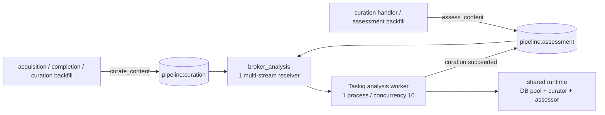

# Curation / Assessment Redis Stream 分割仕様

> 日付: 2026-07-17
>
> ステータス: 実装方針合意済み
>
> 対象: `pipeline:analysis` を `pipeline:curation` / `pipeline:assessment` へ分割する
>
> 実行資源: 当面は 1 つの `broker_analysis` / Taskiq worker process を共有する
>
> Deploy 前提: 現在は非公開・未デプロイで、production の legacy Stream / in-flight task / Redis volume を引き継がない

## 1. 位置付け

本仕様は、curation と assessment を処理特性・責務ごとの Redis Stream に分け、
stage ごとの滞留を独立して観測できるようにするための実装契約である。

本変更は稼働中システムのmigrationではなく、初回公開前のgreenfield deployとして扱う。
productionに旧 `pipeline:analysis` を作らず、互換consumer、旧ACL、rollback windowを持たない。
旧Redis volumeを再利用する必要が生じた場合は本仕様をそのまま適用せず、legacy drainを別仕様で定義する。

この構成は、次のように説明する。

> curation と assessment は処理責務ごとに論理キューを分離している。
> 現時点では実行資源を増やさず、1 つの共有 worker が両キューを処理する。

「キュー分離」は Redis Stream、consumer group state、保持上限、lag の分離を指す。
worker process、concurrency、DB pool、AI adapter、failure domain の分離までは意味しない。

## 2. Work Definition

### 2.1 Problem

現行は `curate_content` と `assess_content` が同じ `pipeline:analysis` Stream に入り、
次を stage 単位で判別しにくい。

- どちらの stage が未配達 backlog を持っているか
- どちらの stage の task が長く実行開始を待っているか
- Stream の保持量や trim リスクをどちらが消費しているか
- assessment の遅延が shared worker の資源競合に起因し、worker 分割が必要か

一方、現時点では assessment 専用 worker を常駐させるだけの根拠はない。
先に論理キューと観測軸を分け、実測後に実行資源の分離を判断できる状態を作る。

また、完了taskから得る `task_wait_time` だけでは完全starvationを検知できない。
初回公開時点からRedis group stateをproductionで定期観測し、worker分割判断に必要なlive backlogを
欠測も含めて記録する。

### 2.2 Evidence

| Evidence | 現状 |
|---|---|
| `backend/app/queue/brokers.py` | `broker_analysis` の primary Stream は `pipeline:analysis` |
| `backend/app/queue/tasks/curation.py` | `curate_content` は `broker_analysis` に登録 |
| `backend/app/queue/tasks/assessment.py` | `assess_content` も同じ `broker_analysis` に登録 |
| `backend/supervisord/analysis.conf` | 1 process、`--workers 1`、合計 `--max-async-tasks 10` で両 task を実行 |
| `backend/app/queue/composition.py` | 1 回の startup で curator / assessor を同じ state に配線 |
| `backend/app/queue/lifecycle.py` | `analysis` 用 DB engine / pool `(5, 5)` と Logfire service を 1 組生成 |
| `backend/uv.lock` | `taskiq==0.12.4`、`taskiq-redis==1.2.3` を固定 |
| `taskiq-redis 1.2.3` | `queue_name` task label で XADD 先を選び、`additional_streams` を同じ `XREADGROUP` で購読可能 |
| `taskiq-redis 1.2.3` receiver | 新規messageを取得したiterationでだけ各Streamへ`XAUTOCLAIM`を1回実行し、返却cursorを使わない。lock timeoutは新規lockのTTLを決めるが、既存lockによる排他blockは保証しない |
| `SimpleRetryMiddleware` | 元 message labels を retry enqueue に引き継ぐ |
| `Makefile` | `pipeline-status` は `XLEN` を queue depth と表示している |
| admin pipeline health | Redis Stream を読まず、`oldestQueueAgeSeconds` は completion の DB queue だけを表す |
| `infra/redis/fly.toml` | collect ACL は `pipeline:analysis` への producer 権限を持つ |
| Redis 7 Streams | [`XTRIM`](https://redis.io/docs/latest/commands/xtrim/)はPELを保護せず、[`XPENDING`](https://redis.io/docs/latest/commands/xpending/)の`IDLE` filterは返却1件でもPEL全体を走査し得る |
| deploy state | 現在は非公開・未デプロイで、production legacy queue / in-flight task は存在しない |

2026-07-17 のローカル観測では、`pipeline:analysis` は `XLEN=10,005`、
`MEMORY USAGE=4,920,580 bytes`、consumer group は `lag=0` / `pending=0` だった。
これは `XLEN` が「未処理件数」ではなく、ACK 済み履歴を含む保持件数であることも示す。
同時点の`pipeline:maintenance`は`XLEN=4,510` / `MEMORY USAGE=2,630,968 bytes`、
dev Redis全体は`used_memory=19.33 MiB / maxmemory=256 MiB`だった。

### 2.3 Invariants

1. `CurationTrigger` / `AssessmentTrigger` の payload schema を変更しない。
2. task name `curate_content` / `assess_content` を変更しない。
3. curation 成功後だけ assessment を enqueue する既存 chain を維持する。
4. assessment 成功かつ in-scope の場合だけ embedding を enqueue する既存 chain を維持する。
5. ACKは`when_executed`のままとし、payloadがStreamのretention window内に残る間のat-least-once
   deliveryと既存の冪等preconditionを維持する。`MAXLEN`超過後はDB backfillを回復経路とする。
6. retry は元 task と同じ stage Stream へ戻す。
7. worker process は 1 つ、Taskiq `--workers` は 1、共有 concurrency は合計 10 のままとする。
8. analysis 用 DB engine / pool、curator、assessor、provider rate-limit gate は各 process で 1 組だけ生成する。
9. consumer group 名は両 Stream とも `taskiq` とする。ただし group state は Redis Stream ごとに独立する。
10. 新 Stream の consumer group 作成前に enqueue された task を失わない。
11. group再作成時のreplayは全件no-opと仮定せず、AI quota / costを伴い得るcontrolled recoveryとして扱う。
12. autoclaim lockの新規keyに有限TTLを持たせてcrash residueを期限切れにするが、相互排他保証には使わない。
    stale PEL recoveryでは両Streamのclaimとquotaを一体で扱う。
13. recovery holdは既存 / provider holdを上書き・解除せず、今回所有するtokenだけを更新・削除する。
14. collect Redis user には curation enqueue に必要な最小権限だけを与え、assessment Stream は公開しない。
15. productionでstage別のlag、pending、oldest enqueue age、観測可用性を定期記録する。
16. pending entryのenqueue ageとdelivery idleを別概念として扱う。
17. DB schema、API response、認証・認可、AI model、既存taskのtimeout / retry回数、backfill予算を変更しない。
18. Stream / group の欠落や Redis 接続失敗を backlog 0 として扱わない。

### 2.4 Non-goals

- curation / assessment の Taskiq worker process、VM、container、Fly process group の分割
- stage ごとの専用 concurrency、予約枠、priority、公平性の保証
- assessment だけを先に処理する scheduling policy
- `GET /api/v1/admin/pipeline/health` の response shape または意味の変更
- DB migration、新規 dependency、環境変数の追加
- `pipeline:embedding` その他の既存 queue topology の変更
- worker 分割を自動実行する仕組み
- `taskiq-redis` receiverに独立したautoclaim polling loopを追加する変更
- 根拠のない固定 alert threshold の導入
- legacy `pipeline:analysis` のdual-read、data migration、rollback互換
- local Redisに残る旧 `pipeline:analysis` の自動 `DEL` / volume削除

### 2.5 Done

次をすべて満たした時点で本 slice は完了とする。

1. 新規 curation task は `pipeline:curation`、assessment task は `pipeline:assessment` にだけ enqueue される。
2. 1 つの `broker_analysis` / worker が両 Stream の新規 message を処理し、受信元 Streamへ ACK する。
3. retry が同じ stage Stream に再投入されることをテストで固定する。
4. worker process 数、合計 concurrency、DB pool、AI adapter 初期化回数が増えていない。
5. stageごとのlive lag、pending、oldest enqueue age、保持量、観測freshnessをproductionで定期観測できる。
6. 完全starvationで `task_wait_time` が出なくても、assessmentの滞留を検知できる。
7. collect ACL が初回deploy時点から最小権限になっている。
8. Redis memory 増加と per-Stream `MAXLEN` の trade-off が運用文書に残る。
9. group再作成時にAI処理が再実行され得る条件と復旧手順が明記されている。
10. 初回公開のdeploy順序と受入gateが成立する。
11. 関連する unit / integration / topology / ACL tests と `/check` が通る。

## 3. 合意済み設計

### 3.1 最終 topology



### 3.2 Queue contract

| Stage | Task | Redis Stream | 主な producer | Consumer | Group | `MAXLEN` |
|---|---|---|---|---|---|---|
| curation | `curate_content` | `pipeline:curation` | acquisition、completion、curation backfill | `broker_analysis` | `taskiq` | `~10,000` |
| assessment | `assess_content` | `pipeline:assessment` | curation、assessment backfill | `broker_analysis` | `taskiq` | `~10,000` |

Redis の consumer group は `(stream, group name)` の組で管理される。
両方で `taskiq` という同じ名前を使っても、`last-delivered-id`、`lag`、PEL は独立する。

### 3.3 Broker contract

最終形の `broker_analysis` は概念上、次の設定とする。

```python
RedisStreamBroker(
    queue_name="pipeline:curation",
    additional_streams={"pipeline:assessment": ">"},
    consumer_group_name="taskiq",
    consumer_id="0-0",
    maxlen=10_000,
    idle_timeout=600_000,
    unacknowledged_batch_size=100,
    unacknowledged_lock_timeout=60,
)
```

- `queue_name` は library が要求する primary Stream であり、curation を割り当てる。
- `additional_streams` は consumer の購読先を増やす設定で、producer の enqueue 先は決めない。
- `additional_streams` の値 `">"` は `XREADGROUP` で各 group の新規未配達 message を読む指定である。
- constructor の `consumer_id="0-0"` は `XGROUP CREATE` 時の開始位置である。`additional_streams` の `">"` とは別の契約である。
- `consumer_id="0-0"` により、worker startup より先に新 Stream へ入った message も新規 group が回収する。
- 既存 group に対しては group create が `BUSYGROUP` になるため、既存の配達位置を巻き戻さない。
- group が削除されて再作成された場合は保持中の履歴を先頭から再配達する。完了済みtaskの多くは
  Ready preconditionでskipするが、stage結果確定前に正常終了したtaskは再実行され得る。
- 具体的にはprovider rate-limit gateで`return`したtaskはACK済みでもDB stageが進んでいないため、
  replay時にgateが許可すればAI処理へ進み得る。
- `0-0` はmessage loss回避を優先する選択であり、group再作成を無害にする保証ではない。
- 1回の`XAUTOCLAIM`で`COUNT=100`はclaimを試行するentry数の上限であり、live payloadの返却は
  最大100件/Stream/callとなる。Redis内部でscanするPEL candidateは最大`COUNT * 10 = 1,000`件/Stream/call
  だが、これはghost cleanup件数ではない。
- Redis 7.4.7のall-ghost PEL実測では、1,001件に対する1 callでghost cleanupは100件、残り901件だった。
  taskiq-redis 1.2.3は返却cursorを使わず1 wakeにつき各Streamへ1 callだけ行うため、残りのghost cleanupには
  後続のwake / recovery iterationが必要になる。
- `unacknowledged_lock_timeout=60`は新しく作られたautoclaim lock keyを`0 < TTL <= 60`にし、worker
  crash後のresidueを期限切れにする。ただしtaskiq-redis 1.2.3のpipeline-composed lock pathは、外部tokenの
  `TTL=-1` lockが存在してもtokenを削除・置換せず`XAUTOCLAIM`へ進むことが実Redisで確認されている。
  このlockをverifiedなmutual-exclusion / scan blocking guaranteeとはみなさない。
- 現在は1 listener / shared worker topologyのため、このcoordination残留リスクを受容する。将来workerを
  分割する、または複数receiverを独立consumerとして動かす前に、autoclaim coordination mechanismを
  再評価して必要なら修正する。

`broker_analysis` という Python object 名は維持する。`broker_curation` と
`broker_assessment` の 2 object は作らない。1 つの Taskiq worker entrypoint、lifecycle、
composition state を共有するという今回の設計に一致しないためである。

### 3.4 Producer routing contract

task decorator に固定 `queue_name` label を付ける。

```python
@broker_analysis.task(
    task_name="curate_content",
    queue_name="pipeline:curation",
    ...,
)

@broker_analysis.task(
    task_name="assess_content",
    queue_name="pipeline:assessment",
    ...,
)
```

`taskiq-redis` は `message.labels["queue_name"]` を XADD 先として使う。
通常 chain と backfill は同じ decorated task を経由し、retry は受信 message labels を引き継ぐ。
いずれも呼出元ごとの queue 分岐は追加しない。

`SimpleRetryMiddleware` は受信 message の labels を次の `AsyncKicker` に引き継ぐ。
したがって `queue_name` label も維持され、assessment retry が curation Stream に混ざらない。

### 3.5 Shared worker contract

`backend/supervisord/analysis.conf` の起動 command は変更しない。

```text
taskiq worker --workers 1 --max-async-tasks 10 \
  app.queue.brokers:broker_analysis \
  app.queue.tasks.curation app.queue.tasks.assessment \
  --ack-type when_executed
```

次も維持する。

- `vector-worker-analysis` という Logfire / DB application name
- `analysis` DB pool `(pool_size=5, max_overflow=5)`
- 1 回の startup での `GeminiCurator` / `DeepSeekAssessor` 構築
- 1 つの `ProviderRateLimitGate`
- `worker-analysis` container 内で embedding / maintenance process と同居する現行 topology

## 4. 分離されるもの・共有されるもの

| 対象 | 分離状態 | 効果 |
|---|---|---|
| Redis Stream key | 分離 | stage ごとの保持量、lag、PEL を読める |
| consumer group state | 分離 | stage ごとの `last-delivered-id` / `pending` を読める |
| `MAXLEN` budget | 分離 | 一方の履歴が他方を直接 trim しない |
| task wait metric | task name で分離 | curation / assessment の実行開始待ちを比較できる |
| Taskiq receiver | 共有 | 1 回の `XREADGROUP` で両 Stream を読む |
| process / memory space | 共有 | worker 常駐メモリを増やさない |
| global concurrency 10 | 共有 | stage ごとの予約枠はない |
| DB pool cap 10 | 共有 | DB capacity は増えない |
| AI adapter / rate-limit gate | 共有 | provider 初期化と制御は従来どおり |
| container / VM / failure domain | 共有 | 片方の process fatal は両 stage に影響する |

同じ `XREADGROUP` と Taskiq の global concurrency を使うため、Stream を分けただけでは
assessment の優先処理や starvation 回避を保証しない。高頻度の curation が worker slot と
prefetch を占有すれば、assessment は別 Stream にいても待つ。この待ちを可視化し、必要になった
時点で worker 分割へ進むことが本設計の狙いである。

Stream entry の ID 順は維持されるが、concurrency が 10 あるため handler の実行・完了順までは
保証しない。また、2 Stream を横断した全順序は定義しない。
assessment は対応する curation 成功後に初めて enqueue され、処理開始時にも DB precondition を
再検証するため、cross-stream の全順序には依存しない。

## 5. Memory / capacity contract

### 5.1 Worker memory

worker process、Python interpreter、AI SDK、DB engine、Redis broker object は増やさない。
`additional_streams` の key と consumer group metadata が増えるだけなので、worker RSS の増加は
実質的に無視できる範囲と見込む。ただし deploy 前後の `worker_memory_utilization` で回帰を確認する。

### 5.2 Redis memory

productionのanalysis stageには最初から新2 Streamだけを作り、各Streamが`MAXLEN ~10,000`を持つ。
保持budgetは合計で概ね20,000 entriesであり、3 Stream互換期間は存在しない。

ローカル実測の4,920,580 bytes / 10,005 entriesを単純な目安にすると、新2 Streamの保持量は
合計約9.84 MB、旧1 Streamとの比較では約4.92 MB増になる。これはplanning estimateであり、
固定上限ではない。新しい`queue_name` label、payload size、consumer group / PEL overhead、
approximate trimにより変動する。

local Redisで旧`pipeline:analysis`を残したまま新2 Streamを満杯にした場合だけ、3 key合計で
約14.76 MB、旧1 Stream比で約9.84 MB増の目安になる。このlocal状態はproduction capacityへ
算入せず、必要なら別の明示的なdev cleanupで整理する。本実装は自動削除しない。

毎分samplerをTaskiq cronとして実行すると、既存`pipeline:maintenance`へ1日1,440 entriesが追加され、
既存の`MAXLEN ~10,000`へ到達する速度が上がる。上限自体は変更しない。ローカル実測を線形換算すると、
maintenance Streamは10,000 entriesで約5.83 MB、現在比で約3.20 MB増の目安になる。

影響範囲3 Streamの最終形は、新2 analysis Stream約9.84 MBとmaintenance Stream約5.83 MBを合わせた
約15.67 MBである。旧analysis Streamを置換・削除した比較ならローカル現状比は約8.12 MB増、
Non-goalどおりlocal legacyを残す比較なら約13.04 MB増となる。production capacityでは前者の最終形を
使い、local legacy残置は別枠で扱う。いずれもplanning estimateであり、result keyの1時間TTL分、
entry size差、allocator overheadはdeploy前後の実測で補正する。

`MAXLEN`が制限するのはStream entry数であり、Redis 7ではtrim後もpayloadのないPEL referenceが
残り得る。このghost PELとconsumer group metadataは20,000 entriesのpayload budgetに拘束されないため、
上記memory値をhard upper boundとしない。

分割の trade-off は次のとおり。

- 利点: curation の大量履歴が assessment の履歴を直接押し出さない。
- 利点: stage ごとの保持量と trim 接近を観測できる。
- コスト: 両 Stream が上限近くまで保持すると Redis memory は現行より増える。
- コスト: 毎分samplerは既存maintenance Streamのtrim頻度とRedis command数を増やす。
- リスク: `MAXLEN` は未処理か ACK 済みかを区別せず古い entry を trim するため、各 stage で
  10,000 件を超える長期 backlog は未配達または未ACK taskのpayloadを失う可能性がある。
- 緩和: lag / oldest ageを監視し、retention超過時はtransportの再配達ではなく、既存DB backfillと
  冪等preconditionで回復する。

production Redis は 256 MB / `noeviction` のため、上限到達時は task entry を evict せず write を
拒否する。deploy 前後に `used_memory`、`used_memory_peak`、`maxmemory`、write rejection、
各 Stream の `MEMORY USAGE` を確認する。dev の `allkeys-lru` と production の `noeviction` を
同じ失敗挙動だとみなさない。`used_memory / maxmemory >= 80%`なら初回公開を止め、operatorが
capacity対応を判断する。本sliceではRedis memoryの継続exporterを追加しないため、これはdeploy時と
手動diagnosticのcapacity gateであり、継続alertとは呼ばない。

## 6. Observability contract

### 6.1 用語を分ける

| 指標 | 定義 | 用途 |
|---|---|---|
| retained entries | `XLEN` | Stream が保持する ACK 済みを含む全 entry 数 |
| lag | `XINFO GROUPS` の `lag` | group に一度も配達されていない entry 数 |
| pending | `XINFO GROUPS` の `pending` | 配達済みだが未 ACK の entry 数。実行中・prefetch・stale PEL を含む |
| outstanding count | `lag + pending` | 未完了の概数。ghost PELも含み得るため純粋な待機件数とは呼ばない |
| undelivered enqueue age | 最古未配達entryのStream ID時刻からの経過 | consumerへ未配達のlive backlog age |
| pending enqueue age | PEL最小Stream ID時刻からの経過 | 配達済みentryを含む最古enqueue age |
| outstanding enqueue age | 上記2 ageの最大値 | stage全体の`queue age`として使う派生値 |
| pending delivery idle | 各PEL entryの最終配達からの経過 | crash / stuck taskの回収判断 |
| task wait time | enqueue時刻から`pre_execute`まで | 実行を開始できたtaskの履歴的な待ち時間 |
| execution time | `pre_execute` 以降の処理時間 | queue 待ちと handler 遅延の切り分け |

`XLEN` を queue depth または backlog と呼ばない。ACK 後も entry は Stream に残るためである。

`XPENDING <stream> taskiq - + 1`はPELの最小Stream IDを返す。そのIDから算出するのは
`pending enqueue age`であり、同じresponseのidleはその1 entryのdelivery idleにすぎない。
PEL全体のmaximum idleとはみなさない。

### 6.2 Production periodic sampler

完全starvationを検知する主経路として、`broker_maintenance`に毎分実行のread-only task
`observe_pipeline_queue_health`を追加する。analysis taskとは別Taskiq processで動くため、
analysisのglobal concurrencyが埋まってもsamplingを継続できる。

- schedule: `* * * * *`
- broker: `broker_maintenance`
- 対象: `pipeline:curation` / `pipeline:assessment`
- 対象2 Streamへのaccess: core credentialsによるread-only commandだけ
- DB、AI provider、result rowの更新: なし
- 新規process / dependency: なし

task bodyは対象2 Streamとdomain stateを変更しない。一方、Taskiq自身による
`pipeline:maintenance`へのenqueue / ACKと、`taskiq:*`へのTTL付きresult保存は既存どおり発生する。
task decoratorは`timeout=15`、`max_retries=0`、`retry_on_error=False`とし、次の毎分tickへ
持ち越すretryや監視task自身のpile-upを作らない。

samplerは各stageについて、同じRedis server `TIME`を基準に次を取得する。

```text
XLEN <stream>
XINFO GROUPS <stream>
XRANGE <stream> (<last-delivered-id> + COUNT 1
XPENDING <stream> taskiq - + 1
TIME
```

- stageごとに`TIME` / `XLEN` / `XINFO GROUPS` / `XPENDING`をread-only
  `MULTI/EXEC`で取得し、worker ACKと競合してcountとPEL明細が別時点になることを防ぐ。
- `XRANGE` は `lag > 0` の場合だけ実行し、最古未配達entryを得る。
- `XINFO GROUPS`からgroup名が完全一致する`taskiq`だけを選び、先頭groupを暗黙採用しない。
- `XPENDING`はPEL最小IDからpending enqueue ageを得る。
- `XPENDING - + 1`が返す1 entryのidleをmaximum / oldest idleとして公開しない。
- `XPENDING ... IDLE 600000 - + 1`は`COUNT 1`でもPEL全体を走査し得るため、毎分samplerと
  `MULTI/EXEC`には含めない。delivery idleはpending異常時のoperator診断でだけ取得する。
- `last-delivered-id`に依存する`XRANGE`だけはtransaction後に実行する。期待entryが既にtrimされるなど
  snapshotと矛盾した場合はstage全体を1回だけ再読し、解消しなければ観測失敗にする。
- 一方のstageの観測失敗で、他方のstageの観測を中止しない。

### 6.3 Metric contract

samplerは次のLogfire metricsを低cardinalityな`stage=curation|assessment`属性だけで記録する。

| Metric | Unit | 値 |
|---|---|---|
| `vector.pipeline.queue.retained_entries` | `1` | `XLEN` |
| `vector.pipeline.queue.lag` | `1` | consumer group lag |
| `vector.pipeline.queue.pending` | `1` | PEL件数 |
| `vector.pipeline.queue.oldest_undelivered_enqueue_age` | `s` | 最古未配達entryのenqueue age |
| `vector.pipeline.queue.oldest_pending_enqueue_age` | `s` | PEL最小IDのenqueue age |
| `vector.pipeline.queue.oldest_outstanding_enqueue_age` | `s` | 上記2 ageの最大値 |
| `vector.pipeline.queue.observation_up` | `1` | 観測成功1、unavailable 0 |
| `vector.pipeline.queue.observation_timestamp` | `s` | Redis `TIME` のUnix timestamp |

snapshot helperは対象entryがないageを`None`として返す。metric adapterはfull snapshotが正常で
count 0のときだけageを0へ変換して古いgaugeを消し、`observation_up=1`とRedis時刻の
`observation_timestamp`を記録する。CLI adapterは同じ`None`を`-`と表示する。

Stream / group欠落、`lag=null`、Redis接続失敗、再読後も解消しないsnapshot矛盾では、失敗したstageの
`observation_up=0`だけを記録する。取得不能なdata gaugeとsuccessful `observation_timestamp`は更新しない。
warning logのreasonは`stream_missing|group_missing|lag_unknown|redis_unavailable|inconsistent_snapshot`の
固定集合とし、metric属性には入れない。task ID、consumer UUID、message payloadもmetric属性へ入れない。

samplerはanalysis workerと別processだが、同じ`worker-analysis` VM / container failure domainにあり、
Logfireの`service.name`は`vector-worker-maintenance`となる。productionでは
`deployment.environment.name=production`とstageで絞り、次のいずれもmonitoring failureとして検知する。

1. `observation_up` sample自体が3分間ない。
2. `observation_up=0`が記録される。
3. successful `observation_timestamp`が3分間更新されない。

これによりRedis障害でmonitor task自体をdispatchできない場合と、taskは動くがsnapshotだけ失敗する場合を
区別する。business queue age thresholdはbaseline取得後に決めるが、観測停止の3分thresholdは初回公開時から
持つ。既存`LOGFIRE_TOKEN`が設定され、production sampleをexportできることも公開前gateに含める。

### 6.4 `task_wait_time` は補助指標

既存 `OpenTelemetryMiddleware` の `task_wait_time` histogram を再利用する。
middleware は producer の enqueue 時刻と worker の `pre_execute` 時刻の差を秒で記録し、
`task_name` attribute を持つ。

| Stage | Logfire / OTel filter |
|---|---|
| curation | `task_wait_time{task_name="curate_content"}` |
| assessment | `task_wait_time{task_name="assess_content"}` |

この値は Redis 内の待ちだけでなく worker の prefetch 待ちも含むため、共有 worker の競合を判断する
履歴指標として適している。一方、値の記録は`post_execute`で行われ、taskが完了するまでsampleが
出ない。assessmentが実行開始できない完全starvationでは値が出ないため、livenessの主指標にしない。

最低限、Logfire で stage 別 p50 / p95 / p99 と task count を同じ時間窓で比較できるようにする。
periodic samplerのlive age / lagと組み合わせてshared worker競合を判定する。

### 6.5 Manual diagnostic

`make pipeline-status` はlocal / operator向けの手動診断であり、production継続監視ではない。
少なくとも新2 Streamについて次を別列で表示する。

- Stream name
- retained (`XLEN`)
- group lag
- group pending
- oldest undelivered age
- oldest pending enqueue age
- oldest outstanding enqueue age
- observation status

算出元は次とする。

```text
XLEN <stream>
XINFO GROUPS <stream>
XPENDING <stream> taskiq - + 1
XRANGE <stream> (<last-delivered-id> + COUNT 1
TIME
```

`backend/scripts/pipeline_queue_status.py`をoperator adapterとし、snapshot helperの結果を整形する。
Makefileはこのscriptをbackend container内で実行し、Redis command semanticsを二重実装しない。

対象がなければageは`-`とする。Streamまたは`taskiq` groupが存在しない場合は`unavailable`、
`lag`がnullなら`unknown`とし、0を返さない。Makefile側で独自の異なる定義を作らず、periodic samplerと
同じcommand semanticsを使う。

pendingが長時間減らない場合だけ、operatorが`--check-idle`を明示して
`XPENDING <stream> taskiq IDLE 600000 - + 1`を追加実行する。この診断はO(PEL)になり得るため通常statusに
含めず、返った1件を「idle 600秒以上が少なくとも存在する」とだけ解釈する。最大idle値とは呼ばない。

consumer 名は process startup ごとの UUID で、停止済み consumer record も残り得る。
`XINFO GROUPS` の `consumers` 件数を worker 数や健全性の判定に使わない。

### 6.6 Admin pipeline health との境界

現行 `GET /api/v1/admin/pipeline/health` の `queueCount` / `oldestQueueAgeSeconds` は completion の
DB-backed queue だけを表す。curation / assessment の Redis Stream 指標で既存 field の意味を
暗黙に変更しない。

Redis queue 指標を管理画面 API に公開する場合は、失敗時 semantics と response contract を別 slice
で定義する。本 slice の worker 分割判断はLogfire periodic metricsと手動diagnosticで行う。

### 6.7 Worker 分割へ進む判断

本 slice では数値 threshold を推測で固定しない。deploy 後に baseline を取り、次が継続的に成立する
場合に worker 分割 spec を起こす。

1. `pipeline:assessment` のlag / oldest enqueue ageが増加し、自然に解消しない。
2. 完了taskでは`assess_content`のtask wait timeも合意したSLOを継続して超える。
3. 同時間帯に curation が shared concurrency / prefetch を占有している。
4. assessment handler 自体の実行時間、provider rate limit、DB 障害ではなく、共有 worker が主要因と
   判断できる。
5. 独立 worker の追加メモリと DB / Redis connection 増加を capacity 内で受容できる。

## 7. ACL contract

collect app は acquisition / completion から curation task を enqueue するため、
`pipeline:curation` への producer 権限が必要である。assessment producer は core app 内だけなので、
collect に `pipeline:assessment` を見せない。

### 7.1 初回deploy時の最終ACL

collect ACL:

- 追加: `~pipeline:curation`
- 削除: `~pipeline:analysis`
- 追加しない: `~pipeline:assessment`
- 維持: `~taskiq:*`
- 追加しない: assessment 用 autoclaim lock key

`core` user は現行どおり `~* &* +@all` を維持する。

productionに旧producerをdeployしないため、legacy ACLを一時保持しない。
Redis ACLを最終形へ更新した後、final routing labelを持つcore / collectだけを起動する。
正方向はcollect credentialsを使う有効な`curate_content.kiq()` smokeで検証し、Taskiq形式でないraw
`XADD`をproduction Streamへ入れない。拒否側はcore operatorが`ACL DRYRUN collect XADD ...`を使い、
assessment / embedding / maintenance / analysisが`NOPERM`になることを無変更で検証する。

## 8. Consumer group lifecycle / recovery

### 8.1 Initial creation

初回production deployではanalysis workerをproducerより先に起動する。worker startupが新2 Streamと
`taskiq` groupを作り、`consumer_id="0-0"`により起動順が前後しても先行entryを読み飛ばさない。

公開前に両groupについて次を確認する。

- groupが存在する。
- `last-delivered-id`、`lag`、`pending`が取得できる。
- periodic samplerが`observation_up=1`を記録する。
- `pipeline:analysis` key / groupはproductionに存在しない。

### 8.2 Group loss is an incident

group削除後のworker restartは、保持履歴を`0-0`から再配達し得る。これは通常の無害なself-healでは
なく、AI quota / costと重複side effectを伴い得るincident recoveryである。

`XGROUP DESTROY`やStream削除をworker稼働中に実行してはならない。予期せずgroupが欠落すると、
supervisorによるworker再起動後にreplayが先行する可能性があるため、復旧開始時点ですでに一部taskが
再実行された前提で扱う。

既知のgroup欠落を復旧するときは次の順にする。

1. analysis workerを停止し、collect、scheduler、backfillなどupstream producerも停止する。
2. recoveryごとに一意なtokenを生成し、対象stageの`curation:hold` / `assessment:hold`へ
   `SET <key> <token> NX EX 21600`を実行する。既存holdがあれば上書きせず、今回tokenを取得できたkeyだけを
   owned holdとして記録する。全対象keyで`EXISTS=1`かつ`PTTL>0`を確認する。
3. retained entries、対象stageのDB state、provider quota / budgetを確認する。今回のreceiverが新規作成した
   autoclaim lockは`0 < TTL <= 60`で期限切れになることを確認する。`TTL=-1`のforeign/orphan lockはtokenを
   保持したままscanが進み得るため、replayやwakeを防いだ原因とは断定しない。cleanupする場合だけ、
   全analysis worker停止を再確認してからcore権限でlock keyを削除する。
4. `0-0`からのreplayを受容できることを明示判断する。
5. workerを再起動してgroupを再作成し、lag / pending / processing outcome / provider usageを
   観測しながらreplayを進める。6時間を超える場合は、値が今回tokenと一致するowned holdだけを
   compare-and-expireでrefreshする。
6. replayが安定した後、値が今回tokenと一致するowned holdだけをatomic compare-and-deleteする。
   既存hold、またはreplay中のprovider failureで値が変わったholdは残し、producerとschedulerの再開可否を
   あらためて判断する。

stage holdが止めるのはbackfill enqueueだけであり、Streamに保持済みのtask、通常producer、workerによる
replayは止めない。また既存helperはbest-effortかつTTL 6時間で、確実な停止境界ではない。
replayを許可するまではworkerと全producerの停止を運用境界とする。

recovery用holdのrefresh / releaseはLuaで`GET == token`を確認してから`EXPIRE` / `DEL`する。
無条件`SET` / `DEL`で既存または新規provider holdを上書き・解除しない。

完了済みtaskはReady preconditionでskipし得るが、rate-limit returnなどstage結果確定前に
ACKされたtaskは再実行され得る。したがって「全replayが冪等skip」という前提を置かない。
復旧手段として未処理entryの`DEL` / `XTRIM`を使わない。

### 8.3 Stale PEL recovery

固定中の`taskiq-redis 1.2.3`は、`XREADGROUP`が新規messageを返したiterationでだけ
`XAUTOCLAIM`を実行する。groupが存在し、stale PELだけが残り、新規messageがない場合は、workerを
再起動しても`>`はそのpendingを返さず、時間だけでは回収されない。

periodic samplerはpending count / pending enqueue ageの停滞を検知するが、PELを変更しない。
pendingが既存task timeoutと`idle_timeout=600秒`を超えて減らない場合は、次の手順で扱う。

1. worker logと実行時間を確認し、正規の長時間実行中でないことを確認する。
2. collect、scheduler、backfillを停止し、両stageのPEL / quotaを確認したうえで、§8.2と同じ
   curation / assessment両方のholdを確認する。
3. `autoclaim:taskiq:pipeline:curation` / `autoclaim:taskiq:pipeline:assessment`を確認する。
   新規lockは`0 < TTL <= 60`でexpiryする。`TTL=-1`のforeign lockはworker稼働中に削除せず、cleanupするなら
   全analysis worker停止下に限定する。ただしtaskiq-redis 1.2.3はそのlockを残したまま`XAUTOCLAIM`へ進むため、
   lockの存在をwake / scanが止まった原因とはみなさない。
4. operatorの`--check-idle`診断を1回実行し、該当IDを`XRANGE <stream> <id> <id>`で照合する。
5. Ready preconditionが確実にidempotent skipする、既に全stage処理済みの既知targetだけを
   typed `curate_content.kiq()`で1件enqueueし、receiverの既存`XAUTOCLAIM`をwakeする。
   stale対象そのものや未処理targetをwakeに使わず、raw `XADD`も使わない。
6. multi-stream receiverは1回のwakeで両Streamへ`XAUTOCLAIM`を1 callずつ行う。live payloadのclaim返却は
   最大100件/Stream、合計200件である。Redis内部のscan-work capは最大1,000 PEL candidates/Stream、
   合計2,000件だが、scan件数をghost cleanup件数とはみなさない。Redis 7.4.7のall-ghost実測でobservableな
   cleanupは最大100件/Stream/callだった。
7. taskiq-redis 1.2.3は返却cursorを無視するため、1回で残ったghostのcleanupには後続のwake / recovery
   iterationが必要である。両stageのpending / outcome / provider usageを確認してから、必要分だけ既処理済み
   targetによるwakeを1件ずつ繰り返す。
8. PEL IDに対応するpayloadがtrim済みならtransport replayはできない。payload-less ghostをcleanupした後も、
   taskの回復経路はtransport replayではなくDB backfillとする。

安全なidempotent-skip targetがない、Streamがtrimリスクに近い、またはpendingが減らない場合は、その場でgroupを
再作成せずproducer停止を維持し、独立autoclaimまたは専用recovery toolをforward-fixとして別変更にする。

## 9. Initial production deploy

### 9.1 Preconditions

次を初回deployの前提とする。

- public trafficは停止中である。
- productionに旧analysis worker / producerは存在しない。
- `pipeline:analysis`を含む旧Redis volume / AOFを再利用しない。
- 旧in-flight taskを移送する要件はない。

いずれかが成立しない場合はdeployを止め、legacy migrationを別仕様として作る。

### 9.2 Deploy order

1. public traffic、collect、schedulerを停止した状態を確認する。
2. Redis ACLを最終形へ更新する。
3. final 2 Stream設定のanalysis workerを含む`worker-analysis` containerを起動する。
   同居するembedding / maintenance workerと既存Streamも起動するが、topology変更対象ではない。
4. `pipeline:curation` / `pipeline:assessment`のStreamと`taskiq` groupを確認する。
5. 統合schedulerは停止したまま、core one-shotから`observe_pipeline_queue_health.kiq()`を1分間隔で
   3回だけenqueueする。両stageの`observation_up=1`とmetric exportを確認する。
6. final collect image / credentialsのone-shotから有効な`curate_content.kiq()` smokeを流し、
   curation → assessmentのXADD、実行、ACKを確認する。拒否側ACLは`ACL DRYRUN`で確認する。
7. Redis memory、write rejection、worker restartがないことを確認する。
8. final collectと統合schedulerを起動する。この時点でqueue healthだけでなく、metadata、completion、
   backfillを含む既存cronがすべて有効になることを受容する。
9. scheduled queue health sampleをさらに3回連続で確認し、successful timestampのfreshnessが3分以内、
   cron error / unexpected enqueue / worker restartがないことを確認してから公開する。

### 9.3 Release acceptance gate

- analysis stageの置換対象Streamとして`pipeline:curation` / `pipeline:assessment`が存在し、
  legacy `pipeline:analysis`が存在しない。metadata / content / embedding / maintenanceなどは対象外である。
- collectはcurationへXADDでき、analysis / assessment / embedding / maintenanceには`NOPERM`となる。
- 1つのanalysis workerが両Streamをconsumeする。
- periodic samplerが完全starvationと観測停止を検知できる。
- `used_memory / maxmemory < 80%`である。
- `lag` / `pending` / oldest enqueue age / task wait timeをstage別に確認できる。
- smoke task後にpendingが0へ戻り、次stageへ正しくchainする。
- final ACLと新2 Stream contractを満たす最初のrollback-compatible revision / image digestを記録する。

### 9.4 Failure before first public release

初回公開前に失敗した場合はpublicを閉じたままproducerを止め、forward-fixを基本とする。
旧binaryは`pipeline:analysis`前提でfinal ACL / 2 Streamを扱えないため、codeだけのdirect rollbackで
運転継続しない。

テストデータを破棄して再試行する場合は、対象がproduction user data / taskでないことを確認し、
明示的な運用判断で行う。本仕様からRedis key / volumeを自動削除しない。

### 9.5 Rollback boundary after first public release

公開後にrollbackできるのは、final collect ACL、curation / assessmentのrouting label、両Streamを読む
consumer contractをすべて維持する記録済みrevisionだけである。これらを満たすrevisionがない場合は
public trafficとproducerを止め、forward-fixする。

legacy binaryへのdirect rollbackは禁止する。旧collectは`pipeline:analysis`へのXADDで`NOPERM`となり、
旧workerは新2 Streamを読めないためである。旧binaryへ戻す必要が生じた場合は、本仕様のrollbackではなく、
ACL再拡張、3 Stream互換worker、drain gateを持つ別migrationとして事前に設計する。

## 10. Failure semantics

| 状態 | 扱い |
|---|---|
| Stream / group がない | `unavailable`。backlog 0 ではない |
| group `lag` が null | `unknown`。`pending` だけで outstanding count を確定しない |
| Redis 接続失敗 | 観測失敗を明示。直前値を現在値として断定しない |
| periodic sample が3分間ない | monitoring freshness failure。queue正常とは判定しない |
| lag > 0 / pending = 0 | 未配達 backlog |
| lag = 0 / pending > 0 | 実行中、prefetch、crash 後 PEL のいずれか。idle と worker log で切り分ける |
| pending entry のenqueue ageが高い | 古いtaskが配達済みのまま未ACK。stale pendingと実行時間を併せて確認する |
| operator idle診断でentryあり | delivery idleが600秒以上のentryが少なくとも1件ある。PEL全体の最大idle値ではない |
| stale PELだけが残る | Taskiq 1.2.3は新規配達までautoclaimしない。§8.3のcontrolled wakeを使う |
| autoclaim lockが`TTL=-1` | foreign tokenを残したままscanが進み得るためblockingの証拠ではない。worker稼働中は変更せず、cleanupは全analysis worker停止下だけで行う |
| pending IDはあるがpayloadがない | `MAXLEN` trim後のghost PEL。transport replayせずDB backfillで回復する |
| group が欠落した | worker / producerを直ちに止める。既に一部replay済みの可能性を含むincidentとして扱う |
| task wait 高 / execution time 正常 | shared worker の待ちを疑う |
| task wait 正常 / execution time 高 | handler、provider、DB 側を疑う |
| per-Stream `MAXLEN` 接近かつ lag 増加 | 未配達 trim リスク。hold / producer 抑制 / capacity 対応を判断する |
| Redis maxmemory 接近 | production では write rejection リスク。worker追加より先に memory 対応を判断する |

## 11. Tests / verification

### 11.1 Static / unit contracts

1. `broker_analysis`のprimaryが`pipeline:curation`、additionalが
   `{"pipeline:assessment": ">"}`だけであり、`pipeline:analysis`を購読しない。
2. `broker_analysis.consumer_id == "0-0"`。
3. `broker_analysis.unacknowledged_batch_size == 100`かつ
   `broker_analysis.unacknowledged_lock_timeout == 60`。
4. `curate_content.labels["queue_name"] == "pipeline:curation"`。
5. `assess_content.labels["queue_name"] == "pipeline:assessment"`。
6. curation / assessment の timeout、retry labels、task name が変わっていない。
7. supervisord の analysis program が 1 つ、`--workers 1`、`--max-async-tasks 10` のまま。
8. analysis lifecycle、DB pool、AI composition が 1 回だけ初期化される。
9. `Makefile` の通常 queue 集合が新2 Streamを含み、`pipeline:analysis`を含まない。
10. `pipeline-status` が `XLEN` を backlog / queue depth と表示しない。
11. queue snapshot helperがstage名、Stream名、group名の固定contractだけを受け取り、
    message payloadやtask IDをmetric属性へ渡さない。
12. recovery holdは既存値を上書きせず、owned tokenだけをcompare-and-refresh / deleteし、
    provider failureで値が変わったholdを削除しない。

### 11.2 Redis integration contracts

実 Redis で次を確認する。

1. worker startup 前に新 Stream へ enqueue した message を `consumer_id="0-0"` の新 group が処理する。
2. 1 broker / 1 worker が curation / assessment の両 Stream を読む。
3. ACK 後、受信元 Stream の pending が 0 になる。
4. curation / assessment handler failureのretry XADD先が元のstage Streamである。
5. lagのみ、pendingのみ、両方あり、正常な空Streamのsnapshotが正しく分類される。
6. `last-delivered-id`直後の最小entryからoldest undelivered enqueue ageを算出する。
7. `XPENDING - + 1`の最小IDからpending enqueue ageを算出する。
8. outstanding enqueue ageがundelivered / pending enqueue ageの最大値になる。
9. 最小IDの1entryのidleをPEL全体のmaximum idleとして扱わない。
10. 毎分snapshotは`XPENDING ... IDLE`を呼ばず、明示operator診断だけが実行する。
11. pending IDが存在してもexact `XRANGE`でpayloadがないghost PELを分類できる。
12. Stream / group欠落、`lag=null`、Redis接続失敗を0と誤表示せず、観測失敗にする。
13. stale PELだけではworker restart後も回収されず、既処理済みtargetのidempotent-skip wakeを
    1件受信した後に両Streamへ1 callずつ行う固定library semanticsを実Redisで確認する。live claim返却は
    最大100件/Stream/call、Redis内部のscan-work capは最大1,000 PEL candidates/Stream/callとして区別する。
    Redis 7.4.7の1,001件all-ghost PELでは1 callのcleanupが100件、残り901件であること、taskiq-redisが
    返却cursorを無視するため追加cleanupに後続wakeが必要なこと、wake自身がAI処理やdownstream enqueueを
    行わないことも固定する。payload-less ghostのtask回復はtransport replayではなくDB backfillを使う。
14. `unacknowledged_lock_timeout=60`で新規autoclaim lockが`0 < TTL <= 60`となり、worker crash後の
    residueが期限切れになることを確認する。一方、foreign tokenを持つ`TTL=-1` lockが存在しても、
    taskiq-redis 1.2.3のlistenerはerrorを出さずtokenを削除・置換せずに`XAUTOCLAIM`へ進むことを固定する。
    これはverifiedなmutual-exclusion guaranteeではない。`TTL=-1` lockはworker稼働中に削除せず、cleanupは
    全analysis worker停止下だけで行う。将来のworker分割 / multiple receiver化では、このcoordinationを
    再評価・修正するまで独立consumerの排他性を主張しない。
15. rate-limit gateで正常return / ACKした未確定taskは、group再作成後のreplayでAI処理へ
    再進入し得ることを固定する。

### 11.3 Monitoring code contracts

1. `CRON_PIPELINE_QUEUE_HEALTH="* * * * *"`を専用定数として定義し、
   `observe_pipeline_queue_health`が`broker_maintenance`へ登録される。
2. taskは`timeout=15` / retryなしで、scheduler registryとmaintenance worker commandの両方がmoduleを
   読み込む。schedulerのcron総数とmaintenance期待task集合も更新する。
3. maintenance import surfaceへqueue health moduleを追加してもAI SDKをimportしない。
4. 正常な空queueはhelper上のageが`None`、metricでは0、CLIでは`-`になり、
   `observation_up=1`になる。
5. full snapshot成功時だけdata gauges / timestampを更新し、失敗時は`observation_up=0`だけを更新する。
6. 一方のstageが失敗しても他方のstageを記録する。
7. assessmentが1件も完了せず`task_wait_time`がない状態でも、lag / oldest enqueue ageを記録する。
8. metric属性は`stage=curation|assessment`だけで、payload、task ID、consumer UUIDを含まない。
9. operator script / `make pipeline-status`とperiodic samplerが同じsnapshot helperを使う。

### 11.4 ACL contracts

ACL contractとして次を確認する。

- 有効な`curate_content.kiq()`が`pipeline:curation`へenqueueされる。
- core operatorの`ACL DRYRUN collect XADD ...`では、`pipeline:analysis`が初回deploy時点から
  `NOPERM`になる。
- 同じ`ACL DRYRUN`で`pipeline:assessment`、`pipeline:embedding`、`pipeline:maintenance`も
  `NOPERM`のままになる。
- ACL検証用のraw XADDをproduction Streamへ書き込まない。
- metadata / content の既存 consume、curation enqueue、result backend 操作は回帰しない。

### 11.5 Capacity / deployment verification

- deploy 前後の analysis worker RSS
- Redis `used_memory` / `used_memory_peak` / `MEMORY USAGE`
- analysis stageの置換対象Streamが新2本で、legacy `pipeline:analysis`がなく、各groupが存在すること
- 新2 Streamのretained / lag / pending / oldest enqueue age
- queue health sampleが3回連続成功し、freshnessが3分以内であること
- Logfireで`observation_up` no-data、`observation_up=0`、successful timestamp staleの3条件を
  production service / stage別に検知するalert queryとrunbook
- 既存`LOGFIRE_TOKEN`によるproduction metric export
- `task_wait_time` の両 task name series
- task execution success / error / retry
- Redis `NOPERM` / write rejection
- worker restart / fatal loop
- `used_memory / maxmemory < 80%`
- final contractを満たすrollback-compatible revision / image digestの記録

実装後は repository 標準の `/check` を実行する。Redis / ACL integration を環境都合で実行できない
場合は、未実行項目と理由を明記し、初回公開のacceptance gateからは外さない。

## 12. 変更対象

| File | 変更 |
|---|---|
| `backend/app/queue/brokers.py` | multi-stream `broker_analysis`、開始ID、有限autoclaim lock TTL |
| `backend/app/queue/tasks/curation.py` | curation queue label |
| `backend/app/queue/tasks/assessment.py` | assessment queue label |
| `backend/app/queue/helpers/stage_hold.py` | token所有権付きrecovery holdのacquire / refresh / release |
| `backend/app/queue/stream_health.py` | Redis command semanticsとqueue snapshotのread-only helper |
| `backend/app/queue/tasks/queue_health.py` | 毎分sampler、Logfire gauge、失敗時semantics |
| `backend/app/queue/schedule.py` | queue health cronを時刻表SSoTへ追加 |
| `backend/app/queue/registry.py` | schedulerによるqueue health task discovery |
| `backend/supervisord/analysis.conf` | maintenance programへqueue health task moduleを追加 |
| `backend/scripts/pipeline_queue_status.py` | snapshot helperを使うoperator向け表示adapter |
| `backend/tests/test_scheduler_routing.py` | maintenance task期待集合、cron総数13→14 |
| `backend/tests/test_lazy_ai_sdk_import.py` | maintenance import surfaceにAI SDKが混入しない契約 |
| `backend/tests/...` | routing、retry、snapshot、metrics、hold所有権、autoclaim、operator表示、runtime topology契約 |
| `Makefile` | queue名更新とoperator adapterを使う手動status |
| `infra/redis/fly.toml` | collect ACLを初回deployの最終形へ更新 |
| `docs/architecture.md` | 「論理 queue 分離、shared worker」の topology 説明 |
| `specs/redis-production-topology.md` | queue namespace、backlog 指標、memory trade-off 更新 |
| `docker-compose.yml` | topology に関する stale comment だけ更新 |

次は意図的に変更しない。

- `backend/app/queue/composition.py`
- `backend/app/queue/lifecycle.py`
- `backend/app/admin/pipeline_health/*`
- DB models / Alembic migrations
- Pydantic API schemas / generated frontend types
- worker process 数、Fly VM memory、dependency lock

## 13. 実装順序

1. broker / task routing、retry、snapshot、metrics、schedulerのcontract testsを追加する。
2. `broker_analysis`を最終2 Stream / finite autoclaim lock構成へ変更し、両taskへ固定queue labelを付ける。
3. token所有権付きrecovery hold helperを実装する。
4. read-only queue snapshot helperと毎分のmaintenance samplerを実装する。
5. scheduler registry、maintenance worker command、`pipeline-status`を新contractへ更新する。
6. ACLとarchitecture / Redis運用文書を初回deployの最終形へ更新する。
7. local Redis integrationで2 Stream consume、retry、snapshot、group replay、stale PEL semanticsを検証する。
8. repository標準の`/check`を実行する。
9. §9の順序で初回production deployを行い、one-shot / scheduled双方の3回連続sampleを含む
   acceptance gateを満たしてから公開する。
10. baselineを蓄積し、assessment delayが継続した場合だけworker分割specを作る。

## 14. 最終判断

本仕様の完了後は、curation と assessment を「処理特性ごとに分離した queue」と正確に説明できる。
ただし実行資源は共有しているため、「独立 worker」「独立 concurrency」「独立 backpressure」まで
分離済みとは説明しない。

初回deployからlegacy互換期間を持たず、最終2 Stream / 最小ACLを直接導入する。この段階で得るものは、
低い追加メモリコストでの責務境界、完全starvationを含むstage別のlive滞留観測、将来のworker分割点で
ある。assessmentの遅延が観測された時点ではStream contractを変えず、consumer processの割当だけを
分ける次の変更へ進める。
