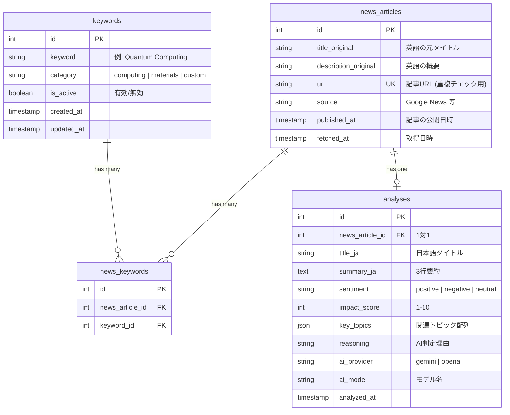

# データベース設計 (Phase 1)

## ER図



## テーブル詳細

### keywords

| カラム | 型 | 制約 | 備考 |
|--------|-----|------|------|
| id | SERIAL | PK | |
| keyword | VARCHAR(200) | NOT NULL, UNIQUE | 検索キーワード |
| category | VARCHAR(50) | NOT NULL, DEFAULT 'custom' | computing / materials / custom |
| is_active | BOOLEAN | NOT NULL, DEFAULT TRUE | 無効化でフェッチ対象外 |
| created_at | TIMESTAMPTZ | NOT NULL, DEFAULT NOW() | |
| updated_at | TIMESTAMPTZ | NOT NULL, DEFAULT NOW() | |

### news_articles

| カラム | 型 | 制約 | 備考 |
|--------|-----|------|------|
| id | SERIAL | PK | |
| title_original | VARCHAR(500) | NOT NULL | 英語タイトル |
| description_original | TEXT | NULLABLE | RSS description |
| url | VARCHAR(2048) | NOT NULL, UNIQUE | 重複検出用 |
| source | VARCHAR(100) | NOT NULL | RSS feed名 |
| published_at | TIMESTAMPTZ | NULLABLE | 記事公開日 |
| fetched_at | TIMESTAMPTZ | NOT NULL, DEFAULT NOW() | 取得日時 |

インデックス:
- `idx_news_url` on `url` (UNIQUEで自動)
- `idx_news_published` on `published_at DESC`
- `idx_news_fetched` on `fetched_at DESC`

### news_keywords (中間テーブル)

| カラム | 型 | 制約 | 備考 |
|--------|-----|------|------|
| id | SERIAL | PK | |
| news_article_id | INT | FK → news_articles.id, ON DELETE CASCADE | |
| keyword_id | INT | FK → keywords.id, ON DELETE CASCADE | |

制約: `UNIQUE(news_article_id, keyword_id)`

### analyses

| カラム | 型 | 制約 | 備考 |
|--------|-----|------|------|
| id | SERIAL | PK | |
| news_article_id | INT | FK, UNIQUE, ON DELETE CASCADE | 1対1保証 |
| title_ja | VARCHAR(500) | NOT NULL | 日本語翻訳タイトル |
| summary_ja | TEXT | NOT NULL | 3行要約 |
| sentiment | VARCHAR(20) | NOT NULL | positive / negative / neutral |
| impact_score | SMALLINT | NOT NULL, CHECK(1-10) | 市場影響度 |
| key_topics | JSONB | NULLABLE | ["量子", "半導体"] 等 |
| reasoning | TEXT | NULLABLE | 判定理由 |
| ai_provider | VARCHAR(20) | NOT NULL | gemini / openai |
| ai_model | VARCHAR(50) | NOT NULL | 使用モデル名 |
| analyzed_at | TIMESTAMPTZ | NOT NULL, DEFAULT NOW() | |

インデックス:
- `idx_analyses_sentiment` on `sentiment`
- `idx_analyses_impact` on `impact_score DESC`

## SQLModel 実装例

```python
# models/keyword.py
from sqlmodel import SQLModel, Field, Relationship
from datetime import datetime
from typing import Optional

class Keyword(SQLModel, table=True):
    __tablename__ = "keywords"

    id: Optional[int] = Field(default=None, primary_key=True)
    keyword: str = Field(max_length=200, unique=True)
    category: str = Field(max_length=50, default="custom")
    is_active: bool = Field(default=True)
    created_at: datetime = Field(default_factory=datetime.utcnow)
    updated_at: datetime = Field(default_factory=datetime.utcnow)

    # Relationships
    news_links: list["NewsKeyword"] = Relationship(back_populates="keyword")
```

```python
# models/news.py
class NewsArticle(SQLModel, table=True):
    __tablename__ = "news_articles"

    id: Optional[int] = Field(default=None, primary_key=True)
    title_original: str = Field(max_length=500)
    description_original: Optional[str] = None
    url: str = Field(max_length=2048, unique=True, index=True)
    source: str = Field(max_length=100)
    published_at: Optional[datetime] = None
    fetched_at: datetime = Field(default_factory=datetime.utcnow)

    # Relationships
    analysis: Optional["AnalysisResult"] = Relationship(back_populates="news_article")
    keyword_links: list["NewsKeyword"] = Relationship(back_populates="news_article")
```

```python
# models/analysis.py
class AnalysisResult(SQLModel, table=True):
    __tablename__ = "analyses"

    id: Optional[int] = Field(default=None, primary_key=True)
    news_article_id: int = Field(foreign_key="news_articles.id", unique=True)
    title_ja: str = Field(max_length=500)
    summary_ja: str
    sentiment: str = Field(max_length=20)
    impact_score: int = Field(ge=1, le=10)
    key_topics: Optional[list[str]] = Field(default=None, sa_type=JSONB)
    reasoning: Optional[str] = None
    ai_provider: str = Field(max_length=20)
    ai_model: str = Field(max_length=50)
    analyzed_at: datetime = Field(default_factory=datetime.utcnow)

    # Relationships
    news_article: Optional["NewsArticle"] = Relationship(back_populates="analysis")
```

```python
# models/associations.py
class NewsKeyword(SQLModel, table=True):
    __tablename__ = "news_keywords"

    id: Optional[int] = Field(default=None, primary_key=True)
    news_article_id: int = Field(foreign_key="news_articles.id")
    keyword_id: int = Field(foreign_key="keywords.id")

    # Relationships
    news_article: Optional["NewsArticle"] = Relationship(back_populates="keyword_links")
    keyword: Optional["Keyword"] = Relationship(back_populates="news_links")
```

## マイグレーション方針
- Alembic autogenerate で初期マイグレーション作成
- 手動で内容を確認してからコミット
- ダウングレードも必ず書く
- テストDBは `vector_test` を使用
