# データベース設計

## スキーマ構成

PostgreSQL 16 + pgvector。`auth` と `public` の2スキーマに分離。

| スキーマ | 管理者 | 内容 |
|---------|-------|------|
| `auth` | Better Auth CLI | user, session, account, verification テーブル |
| `public` | Alembic | アプリケーション主要テーブル |

- `auth` スキーマは Alembic の autogenerate から除外（`alembic/env.py` の `include_name` で制御）
- `user_keyword_subscriptions` と `watchlists` の `user_id` は Better Auth の cuid (VARCHAR(32)) で auth.user.id を参照

## ER図

```mermaid
erDiagram
    keywords {
        int id PK
        string keyword "例: Quantum Computing"
        timestamp created_at
        timestamp updated_at
    }

    keyword_categories {
        int id PK
        string slug "例: ai_ml, quantum"
    }

    keyword_category_translations {
        int id PK
        int category_id FK
        string locale "ja | en"
        string name "翻訳カテゴリ名"
    }

    keyword_category_links {
        int id PK
        int keyword_id FK
        int category_id FK
    }

    news_sources {
        int id PK
        string name "フィード名"
        string source_type "rss | api"
        string site_url "サイトURL"
        boolean is_active
        int fetch_interval_minutes
        timestamp next_fetch_at
        timestamp last_fetched_at
        int consecutive_errors
        string last_error_message
        string feed_url "RSS固有"
        string etag "RSS ETag"
        string last_modified_header "RSS Last-Modified"
        string api_endpoint "API固有"
        timestamp created_at
        timestamp updated_at
    }

    news_articles {
        int id PK
        string title_original "英語の元タイトル"
        string description_original "英語の概要"
        string url UK "記事URL (重複チェック用)"
        string source "Google News 等"
        timestamp published_at "記事の公開日時"
        timestamp fetched_at "取得日時"
        text content "記事全文 (trafilatura)"
        timestamp content_fetched_at "全文取得日時"
        int content_fetch_attempts "全文取得試行回数"
        vector embedding "768次元ベクトル (pgvector)"
        int source_id FK "ニュースソース"
        string guid UK "RSS GUID (重複排除)"
        int article_group_id FK "重複記事グループ"
    }

    article_groups {
        int id PK
        int canonical_id FK "代表記事 (news_articles.id)"
        int article_count "グループ内記事数"
        timestamp created_at
    }

    news_keywords {
        int id PK
        int news_article_id FK
        int keyword_id FK
    }

    ai_models {
        int id PK
        string provider "gemini | openai"
        string name "モデル名"
        boolean is_active
    }

    analyses {
        int id PK
        int news_article_id FK "1対N (記事×モデル)"
        int ai_model_id FK "ai_models.id"
        string sentiment "positive | negative | neutral"
        int impact_score "1-10"
        string reasoning "AI判定理由"
        timestamp analyzed_at
    }

    analysis_translations {
        int id PK
        int analysis_id FK
        string locale "ja | en"
        string title "翻訳タイトル"
        text summary "翻訳要約"
    }

    investment_categories {
        int id PK
        string slug "例: growth_catalyst"
    }

    investment_category_translations {
        int id PK
        int category_id FK
        string locale "ja | en"
        string name "翻訳カテゴリ名"
        text description "説明"
    }

    analysis_investment_categories {
        int id PK
        int analysis_id FK
        int category_id FK
    }

    fetch_logs {
        int id PK
        int source_id FK "news_sources.id CASCADE"
        string status "success | error"
        int articles_count "取得記事数"
        text error_message "エラー詳細"
        int duration_ms "処理時間(ms)"
        timestamp fetched_at "取得日時"
    }

    user_keyword_subscriptions {
        int id PK
        string user_id "VARCHAR(32) auth.user.id"
        int keyword_id FK
        timestamp created_at
    }

    watchlists {
        int id PK
        string user_id "VARCHAR(32) auth.user.id"
        int news_article_id FK
        timestamp created_at
    }

    keyword_categories ||--o{ keyword_category_translations : "has many"
    keyword_categories ||--o{ keyword_category_links : "has many"
    keywords ||--o{ keyword_category_links : "belongs to"
    keywords ||--o{ news_keywords : "has many"
    keywords ||--o{ user_keyword_subscriptions : "subscribed by"
    news_sources ||--o{ fetch_logs : "has many"
    news_sources ||--o{ news_articles : "has many"
    news_articles ||--o{ news_keywords : "has many"
    news_articles ||--o{ analyses : "has many"
    ai_models ||--o{ analyses : "has many"
    news_articles ||--o{ watchlists : "watched by"
    news_articles }o--o| article_groups : "grouped"
    article_groups ||--o| news_articles : "canonical"
    analyses ||--o{ analysis_translations : "has many"
    analyses ||--o{ analysis_investment_categories : "has many"
    investment_categories ||--o{ investment_category_translations : "has many"
    investment_categories ||--o{ analysis_investment_categories : "linked from"
    user_keyword_subscriptions }o--|| keywords : "subscribes"
    watchlists }o--|| news_articles : "watches"
```

## テーブル詳細

### auth スキーマ（Better Auth 管理）

Better Auth CLI (`npx @better-auth/cli migrate`) が自動生成・管理するテーブル。
Alembic の管理対象外。

| テーブル | 用途 |
|---------|------|
| `auth.user` | ユーザー (id: cuid, email, name, role, etc.) |
| `auth.session` | セッション管理 |
| `auth.account` | 認証プロバイダー連携 |
| `auth.verification` | メール検証トークン |

### keywords

| カラム | 型 | 制約 | 備考 |
|--------|-----|------|------|
| id | SERIAL | PK | |
| keyword | VARCHAR(200) | NOT NULL, UNIQUE | 検索キーワード |
| created_at | TIMESTAMPTZ | NOT NULL, DEFAULT NOW() | |
| updated_at | TIMESTAMPTZ | NOT NULL, DEFAULT NOW() | |

シードデータ: 10カテゴリ x 7-8件 = 72キーワード

### keyword_categories

| カラム | 型 | 制約 | 備考 |
|--------|-----|------|------|
| id | SERIAL | PK | |
| slug | VARCHAR(50) | NOT NULL, UNIQUE, INDEX | カテゴリ識別子 |

シードデータ: ai_ml, biotech, energy, fintech, materials, quantum, robotics, semiconductor, space, telecom

### keyword_category_translations

| カラム | 型 | 制約 | 備考 |
|--------|-----|------|------|
| id | SERIAL | PK | |
| category_id | INT | FK -> keyword_categories.id, ON DELETE CASCADE | |
| locale | VARCHAR(10) | NOT NULL | 言語コード（ja, en） |
| name | VARCHAR(100) | NOT NULL | 翻訳カテゴリ名 |

制約: `UNIQUE(category_id, locale)` -- uq_keyword_cat_locale

### keyword_category_links (中間テーブル)

| カラム | 型 | 制約 | 備考 |
|--------|-----|------|------|
| id | SERIAL | PK | |
| keyword_id | INT | FK -> keywords.id, ON DELETE CASCADE | |
| category_id | INT | FK -> keyword_categories.id, ON DELETE CASCADE | |

制約: `UNIQUE(keyword_id, category_id)` -- uq_keyword_category

### news_sources

| カラム | 型 | 制約 | 備考 |
|--------|-----|------|------|
| id | SERIAL | PK | |
| name | VARCHAR(200) | NOT NULL | フィード/ソース名 |
| source_type | VARCHAR(20) | NOT NULL, CHECK IN ('rss','api') | SourceType enum |
| site_url | VARCHAR(2048) | NULLABLE | サイトURL |
| is_active | BOOLEAN | NOT NULL, DEFAULT TRUE | 有効/無効 |
| fetch_interval_minutes | INT | NOT NULL, DEFAULT 720, CHECK 15-1440 | 取得間隔（分） |
| next_fetch_at | TIMESTAMPTZ | NULLABLE | 次回取得予定時刻 |
| last_fetched_at | TIMESTAMPTZ | NULLABLE | 最終取得日時 |
| consecutive_errors | INT | NOT NULL, DEFAULT 0 | 連続エラー回数 |
| last_error_message | TEXT | NULLABLE | 最後のエラーメッセージ |
| feed_url | VARCHAR(2048) | UNIQUE, NULLABLE | RSS固有: フィードURL |
| etag | VARCHAR(256) | NULLABLE | RSS固有: ETag ヘッダ |
| last_modified_header | VARCHAR(256) | NULLABLE | RSS固有: Last-Modified ヘッダ |
| api_endpoint | VARCHAR(200) | NULLABLE | API固有: エンドポイント |
| created_at | TIMESTAMPTZ | NOT NULL, DEFAULT NOW() | |
| updated_at | TIMESTAMPTZ | NOT NULL, DEFAULT NOW() | |

Check制約:
- `ck_news_sources_source_type`: source_type IN ('rss', 'api')
- `ck_news_sources_type_fields`: (source_type='rss' AND feed_url IS NOT NULL) OR (source_type='api' AND api_endpoint IS NOT NULL)
- `ck_news_sources_interval_range`: fetch_interval_minutes BETWEEN 15 AND 1440

インデックス:
- `idx_sources_active_next_fetch` on `next_fetch_at` (部分: is_active = TRUE)

### fetch_logs

| カラム | 型 | 制約 | 備考 |
|--------|-----|------|------|
| id | SERIAL | PK | |
| source_id | INT | FK -> news_sources.id, ON DELETE CASCADE, NOT NULL | ニュースソース |
| status | VARCHAR(20) | NOT NULL | "success" / "error" |
| articles_count | INT | NOT NULL, DEFAULT 0 | 取得記事数 |
| error_message | TEXT | NULLABLE | エラー詳細 |
| duration_ms | INT | NULLABLE | フェッチ処理時間（ミリ秒） |
| fetched_at | TIMESTAMPTZ | NOT NULL, DEFAULT NOW() | 取得日時 |

インデックス:
- `ix_fetch_logs_source_id_fetched_at` on `(source_id, fetched_at)` -- クォータチェック・履歴参照用

### news_articles

| カラム | 型 | 制約 | 備考 |
|--------|-----|------|------|
| id | SERIAL | PK | |
| title_original | VARCHAR(500) | NOT NULL | 英語タイトル |
| description_original | TEXT | NULLABLE | RSS description |
| url | VARCHAR(2048) | NOT NULL, UNIQUE | 重複検出用 |
| source | VARCHAR(100) | NOT NULL | RSS feed名（レガシー） |
| published_at | TIMESTAMPTZ | NULLABLE | 記事公開日 |
| fetched_at | TIMESTAMPTZ | NOT NULL, DEFAULT NOW() | 取得日時 |
| content | TEXT | NULLABLE | 記事全文（trafilaturaで取得） |
| content_fetched_at | TIMESTAMPTZ | NULLABLE | 全文取得日時 |
| content_fetch_attempts | INT | NOT NULL, DEFAULT 0 | 全文取得試行回数 |
| embedding | vector(768) | NULLABLE | pgvectorベクトル（Gemini Embedding） |
| source_id | INT | FK -> news_sources.id, ON DELETE SET NULL, NULLABLE | ニュースソースへの参照 |
| guid | VARCHAR(2048) | UNIQUE, NULLABLE | RSS GUID（重複排除用） |
| article_group_id | INT | FK -> article_groups.id, ON DELETE SET NULL, NULLABLE | 重複記事グループ |

インデックス:
- `idx_news_url` on `url` (UNIQUEで自動)
- `idx_news_published` on `published_at`
- `idx_news_fetched` on `fetched_at`
- HNSW index on `embedding` (`vector_cosine_ops`)
- `idx_articles_source_published` on `(source_id, published_at DESC)` (部分: source_id IS NOT NULL)
- `idx_news_articles_article_group_id` on `article_group_id`

### article_groups

| カラム | 型 | 制約 | 備考 |
|--------|-----|------|------|
| id | SERIAL | PK | |
| canonical_id | INT | FK -> news_articles.id, ON DELETE SET NULL, NULLABLE | 代表記事 |
| article_count | INT | NOT NULL, DEFAULT 1 | グループ内記事数 |
| created_at | TIMESTAMPTZ | NOT NULL, DEFAULT NOW() | |

インデックス:
- `idx_article_groups_canonical` on `canonical_id`

### news_keywords (中間テーブル)

| カラム | 型 | 制約 | 備考 |
|--------|-----|------|------|
| id | SERIAL | PK | |
| news_article_id | INT | FK -> news_articles.id, ON DELETE CASCADE | |
| keyword_id | INT | FK -> keywords.id, ON DELETE CASCADE | |

制約: `UNIQUE(news_article_id, keyword_id)` -- uq_news_keyword

### ai_models

| カラム | 型 | 制約 | 備考 |
|--------|-----|------|------|
| id | SERIAL | PK | |
| provider | VARCHAR(20) | NOT NULL | gemini / openai |
| name | VARCHAR(50) | NOT NULL | モデル名 |
| is_active | BOOLEAN | NOT NULL, DEFAULT TRUE | 有効/無効 |

制約: `UNIQUE(provider, name)` -- uq_ai_models_provider_name

### analyses

| カラム | 型 | 制約 | 備考 |
|--------|-----|------|------|
| id | SERIAL | PK | |
| news_article_id | INT | FK -> news_articles.id, ON DELETE CASCADE | 1対N（記事xモデル） |
| ai_model_id | INT | FK -> ai_models.id, ON DELETE RESTRICT | 使用AIモデル |
| sentiment | VARCHAR(20) | NOT NULL | positive / negative / neutral |
| impact_score | SMALLINT | NOT NULL, CHECK(1-10) | 市場影響度 |
| reasoning | TEXT | NULLABLE | 判定理由 |
| analyzed_at | TIMESTAMPTZ | NOT NULL, DEFAULT NOW() | |

制約: `UNIQUE(news_article_id, ai_model_id)` -- uq_analyses_article_model

インデックス:
- `idx_analyses_sentiment` on `sentiment`
- `idx_analyses_impact` on `impact_score DESC`
- `idx_analyses_ai_model_id` on `ai_model_id`

### analysis_translations

| カラム | 型 | 制約 | 備考 |
|--------|-----|------|------|
| id | SERIAL | PK | |
| analysis_id | INT | FK -> analyses.id, ON DELETE CASCADE | |
| locale | VARCHAR(10) | NOT NULL | 言語コード（ja, en） |
| title | VARCHAR(500) | NOT NULL | 翻訳タイトル |
| summary | TEXT | NOT NULL | 翻訳要約 |

制約: `UNIQUE(analysis_id, locale)` -- uq_analysis_locale

### investment_categories

| カラム | 型 | 制約 | 備考 |
|--------|-----|------|------|
| id | SERIAL | PK | |
| slug | VARCHAR(50) | NOT NULL, UNIQUE, INDEX | カテゴリ識別子 |

シードデータ: competitive_edge, financial_signal, growth_catalyst, market_disruption, regulatory_shift, risk_mitigation

### investment_category_translations

| カラム | 型 | 制約 | 備考 |
|--------|-----|------|------|
| id | SERIAL | PK | |
| category_id | INT | FK -> investment_categories.id, ON DELETE CASCADE | |
| locale | VARCHAR(10) | NOT NULL | 言語コード（ja, en） |
| name | VARCHAR(100) | NOT NULL | 翻訳カテゴリ名 |
| description | TEXT | NULLABLE | 説明 |

制約: `UNIQUE(category_id, locale)` -- uq_invest_cat_locale

### analysis_investment_categories (中間テーブル)

| カラム | 型 | 制約 | 備考 |
|--------|-----|------|------|
| id | SERIAL | PK | |
| analysis_id | INT | FK -> analyses.id, ON DELETE CASCADE | |
| category_id | INT | FK -> investment_categories.id, ON DELETE CASCADE | |

制約: `UNIQUE(analysis_id, category_id)` -- uq_analysis_category

### user_keyword_subscriptions

| カラム | 型 | 制約 | 備考 |
|--------|-----|------|------|
| id | SERIAL | PK | |
| user_id | VARCHAR(32) | NOT NULL, INDEX | Better Auth user.id (cuid) |
| keyword_id | INT | FK -> keywords.id, ON DELETE CASCADE | |
| created_at | TIMESTAMPTZ | NOT NULL, DEFAULT NOW() | |

制約: `UNIQUE(user_id, keyword_id)` -- uq_user_keyword

### watchlists

| カラム | 型 | 制約 | 備考 |
|--------|-----|------|------|
| id | SERIAL | PK | |
| user_id | VARCHAR(32) | NOT NULL, INDEX | Better Auth user.id (cuid) |
| news_article_id | INT | FK -> news_articles.id, ON DELETE CASCADE | |
| created_at | TIMESTAMPTZ | NOT NULL, DEFAULT NOW() | |

制約: `UNIQUE(user_id, news_article_id)` -- uq_user_watchlist

## 設計パターン

### 認証（PGスキーマ分離）
Better Auth が `auth` スキーマでユーザー・セッションを管理。
アプリ側テーブル（`user_keyword_subscriptions`, `watchlists`）は `user_id: VARCHAR(32)` で
auth.user.id を論理参照する（FK制約なし、スキーマ間の独立性を保つ）。

### 多言語対応
カテゴリ系テーブル（keyword_categories, investment_categories）と analyses は、
翻訳を別テーブルに分離する **Translation Table パターン** を採用。
`(parent_id, locale)` の UNIQUE 制約で1言語1レコードを保証。

### ソース管理（Discriminated Union）
`news_sources` は `source_type` カラムで RSS / API を識別し、
CHECK 制約で各タイプに必要なフィールドの NOT NULL を保証。

### ベクトル検索
pgvector 拡張で 768次元の Gemini Embedding を保持。
HNSW インデックス（cosine similarity）で類似記事検索に対応。

### 重複記事グループ化
`article_groups` テーブルで重複記事をグループ化。
cosine distance に基づき類似度の高い記事を同一グループに集約し、
`canonical_id` で代表記事を指定。

## マイグレーション

### 方針
- Alembic autogenerate で初期マイグレーション作成
- 手動で内容を確認してからコミット
- ダウングレードも必ず書く
- テストDBは `vector_test` を使用
- DBイメージは `pgvector/pgvector:pg16`（pgvector拡張が必要）
- `auth` スキーマは Alembic の管理対象外（`include_name` で除外）

### マイグレーション履歴

| # | リビジョン | 内容 |
|---|-----------|------|
| 1 | `b751d5bc7311` | 初期テーブル: keywords, news_articles, analyses, news_keywords |
| 2 | `e54c3f7851ce` | タイムスタンプを TIMESTAMPTZ に変換 |
| 3 | `2d02a83aa90f` | users, refresh_tokens テーブル追加 |
| 4 | `dc3cc7a3c587` | user_keyword_subscriptions, watchlists テーブル追加 |
| 5 | `3a9bf03a0b5f` | news_articles に content, content_fetched_at カラム追加 |
| 6 | `4bf262125474` | pgvector拡張有効化 + embedding vector(768) + HNSWインデックス |
| 7 | `a1b2c3d4e5f6` | refresh_tokens に revoked_at カラム追加（グレースピリオド対応） |
| 8 | `f1a2b3c4d5e6` | investment_categories, analysis_investment_categories テーブル追加（6カテゴリ seed） |
| 9 | `g2b3c4d5e6f7` | keyword_categories, 翻訳テーブル追加、keywords.category/is_active 削除 |
| 10 | `h3c4d5e6f7g8` | analysis_translations テーブル追加、analyses から title_ja/summary_ja/key_topics 削除 |
| 11 | `4bda779a1d5e` | news_articles に content_fetch_attempts カラム追加 |
| 12 | `f52d4ecebe6b` | 72キーワード + カテゴリリンクのシードデータ投入 |
| 13 | `a1` | news_sources テーブル追加（CHECK制約・部分インデックス付き） |
| 14 | `a2` | news_articles に source_id, guid カラム追加 |
| 15 | `a3` | 初期 RSS フィード 7件のシードデータ投入 |
| 16 | `a4` | news_sources.category_id カラム削除（FK制約含む） |
| 17 | `a5` | ai_models テーブル追加、analyses 正規化（ai_provider/ai_model -> ai_model_id FK、1:1 -> 1:N） |
| 18 | `a6` | fetch_logs テーブル追加（複合インデックス source_id + fetched_at） |
| 19 | `a7` | デフォルトAIモデルのシードデータ投入 |
| 20 | `a8` | article_groups テーブル追加、news_articles に article_group_id カラム追加 |
| 21 | `a9` | users テーブルに role カラム追加 |
| 22 | `b1` | Better Auth 移行: auth スキーマ作成、user_id INT->VARCHAR(32)、users/refresh_tokens 削除 |
