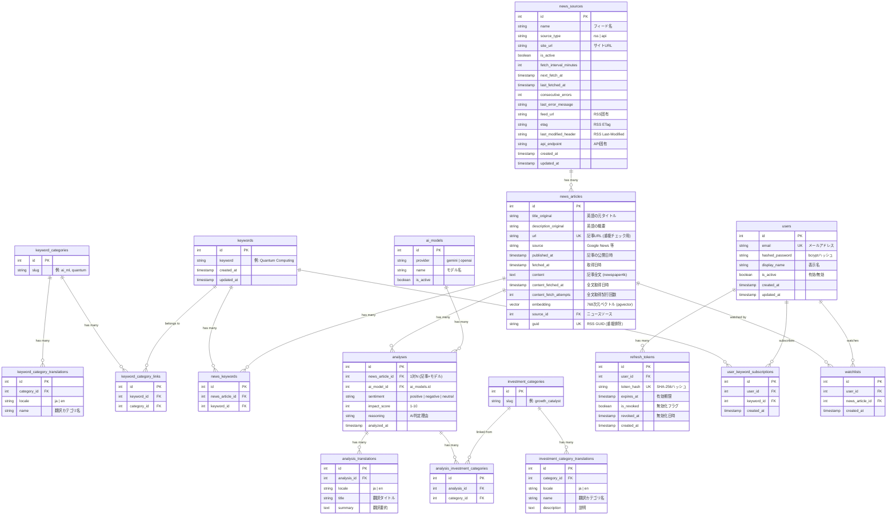

# データベース設計

## ER図



## テーブル詳細

### keywords

| カラム | 型 | 制約 | 備考 |
|--------|-----|------|------|
| id | SERIAL | PK | |
| keyword | VARCHAR(200) | NOT NULL, UNIQUE | 検索キーワード |
| created_at | TIMESTAMPTZ | NOT NULL, DEFAULT NOW() | |
| updated_at | TIMESTAMPTZ | NOT NULL, DEFAULT NOW() | |

シードデータ: 10カテゴリ × 7〜8件 = 72キーワード

### keyword_categories

| カラム | 型 | 制約 | 備考 |
|--------|-----|------|------|
| id | SERIAL | PK | |
| slug | VARCHAR(50) | NOT NULL, UNIQUE, INDEX | カテゴリ識別子 |

シードデータ: ai_ml, biotech, energy, fintech, materials, quantum, robotics, semiconductor, space, telecom

### keyword_category_translations

| カラム | 型 | 制約 | 備考 |
|--------|-----|------|------|
| id | SERIAL | PK | |
| category_id | INT | FK → keyword_categories.id, ON DELETE CASCADE | |
| locale | VARCHAR(10) | NOT NULL | 言語コード（ja, en） |
| name | VARCHAR(100) | NOT NULL | 翻訳カテゴリ名 |

制約: `UNIQUE(category_id, locale)` — uq_keyword_cat_locale

### keyword_category_links (中間テーブル)

| カラム | 型 | 制約 | 備考 |
|--------|-----|------|------|
| id | SERIAL | PK | |
| keyword_id | INT | FK → keywords.id, ON DELETE CASCADE | |
| category_id | INT | FK → keyword_categories.id, ON DELETE CASCADE | |

制約: `UNIQUE(keyword_id, category_id)` — uq_keyword_category

### news_sources

| カラム | 型 | 制約 | 備考 |
|--------|-----|------|------|
| id | SERIAL | PK | |
| name | VARCHAR(200) | NOT NULL | フィード/ソース名 |
| source_type | VARCHAR(20) | NOT NULL, CHECK IN ('rss','api') | SourceType enum |
| site_url | VARCHAR(2048) | NULLABLE | サイトURL |
| is_active | BOOLEAN | NOT NULL, DEFAULT TRUE | 有効/無効 |
| fetch_interval_minutes | INT | NOT NULL, DEFAULT 720, CHECK 15〜1440 | 取得間隔（分） |
| next_fetch_at | TIMESTAMPTZ | NULLABLE | 次回取得予定時刻 |
| last_fetched_at | TIMESTAMPTZ | NULLABLE | 最終取得日時 |
| consecutive_errors | INT | NOT NULL, DEFAULT 0 | 連続エラー回数 |
| last_error_message | TEXT | NULLABLE | 最後のエラーメッセージ |
| feed_url | VARCHAR(2048) | UNIQUE, NULLABLE | RSS固有: フィードURL |
| etag | VARCHAR(256) | NULLABLE | RSS固有: ETag ヘッダ |
| last_modified_header | VARCHAR(256) | NULLABLE | RSS固有: Last-Modified ヘッダ |
| api_endpoint | VARCHAR(200) | NULLABLE | API固有: エンドポイント |
| created_at | TIMESTAMPTZ | NOT NULL, DEFAULT NOW() | |
| updated_at | TIMESTAMPTZ | NOT NULL, DEFAULT NOW() | |

Check制約:
- `ck_news_sources_source_type`: source_type IN ('rss', 'api')
- `ck_news_sources_type_fields`: (source_type='rss' AND feed_url IS NOT NULL) OR (source_type='api' AND api_endpoint IS NOT NULL)
- `ck_news_sources_interval_range`: fetch_interval_minutes BETWEEN 15 AND 1440

インデックス:
- `idx_sources_active_next_fetch` on `next_fetch_at` (部分: is_active = TRUE)

シードデータ: TechCrunch, FierceBiotech, BioPharma Dive 等 7フィード

### news_articles

| カラム | 型 | 制約 | 備考 |
|--------|-----|------|------|
| id | SERIAL | PK | |
| title_original | VARCHAR(500) | NOT NULL | 英語タイトル |
| description_original | TEXT | NULLABLE | RSS description |
| url | VARCHAR(2048) | NOT NULL, UNIQUE | 重複検出用 |
| source | VARCHAR(100) | NOT NULL | RSS feed名（レガシー） |
| published_at | TIMESTAMPTZ | NULLABLE | 記事公開日 |
| fetched_at | TIMESTAMPTZ | NOT NULL, DEFAULT NOW() | 取得日時 |
| content | TEXT | NULLABLE | 記事全文（newspaper4kで取得） |
| content_fetched_at | TIMESTAMPTZ | NULLABLE | 全文取得日時 |
| content_fetch_attempts | INT | NOT NULL, DEFAULT 0 | 全文取得試行回数 |
| embedding | vector(768) | NULLABLE | pgvectorベクトル（Gemini Embedding） |
| source_id | INT | FK → news_sources.id, ON DELETE SET NULL, NULLABLE | ニュースソースへの参照 |
| guid | VARCHAR(2048) | UNIQUE, NULLABLE | RSS GUID（重複排除用） |

インデックス:
- `idx_news_url` on `url` (UNIQUEで自動)
- `idx_news_published` on `published_at DESC`
- `idx_news_fetched` on `fetched_at DESC`
- HNSW index on `embedding` (`vector_cosine_ops`)
- `idx_articles_source_published` on `(source_id, published_at DESC)` (部分: source_id IS NOT NULL)

### news_keywords (中間テーブル)

| カラム | 型 | 制約 | 備考 |
|--------|-----|------|------|
| id | SERIAL | PK | |
| news_article_id | INT | FK → news_articles.id, ON DELETE CASCADE | |
| keyword_id | INT | FK → keywords.id, ON DELETE CASCADE | |

制約: `UNIQUE(news_article_id, keyword_id)` — uq_news_keyword

### ai_models

| カラム | 型 | 制約 | 備考 |
|--------|-----|------|------|
| id | SERIAL | PK | |
| provider | VARCHAR(20) | NOT NULL | gemini / openai |
| name | VARCHAR(50) | NOT NULL | モデル名 |
| is_active | BOOLEAN | NOT NULL, DEFAULT TRUE | 有効/無効 |

制約: `UNIQUE(provider, name)` — uq_ai_models_provider_name

シードデータ: gemini/gemini-2.0-flash（マイグレーションで既存 analyses から自動投入）

### analyses

| カラム | 型 | 制約 | 備考 |
|--------|-----|------|------|
| id | SERIAL | PK | |
| news_article_id | INT | FK → news_articles.id, ON DELETE CASCADE | 1対N（記事×モデル） |
| ai_model_id | INT | FK → ai_models.id, ON DELETE RESTRICT | 使用AIモデル |
| sentiment | VARCHAR(20) | NOT NULL | positive / negative / neutral |
| impact_score | SMALLINT | NOT NULL, CHECK(1-10) | 市場影響度 |
| reasoning | TEXT | NULLABLE | 判定理由 |
| analyzed_at | TIMESTAMPTZ | NOT NULL, DEFAULT NOW() | |

制約: `UNIQUE(news_article_id, ai_model_id)` — uq_analyses_article_model

インデックス:
- `idx_analyses_sentiment` on `sentiment`
- `idx_analyses_impact` on `impact_score DESC`
- `idx_analyses_ai_model_id` on `ai_model_id`

### analysis_translations

| カラム | 型 | 制約 | 備考 |
|--------|-----|------|------|
| id | SERIAL | PK | |
| analysis_id | INT | FK → analyses.id, ON DELETE CASCADE | |
| locale | VARCHAR(10) | NOT NULL | 言語コード（ja, en） |
| title | VARCHAR(500) | NOT NULL | 翻訳タイトル |
| summary | TEXT | NOT NULL | 翻訳要約 |

制約: `UNIQUE(analysis_id, locale)` — uq_analysis_locale

### investment_categories

| カラム | 型 | 制約 | 備考 |
|--------|-----|------|------|
| id | SERIAL | PK | |
| slug | VARCHAR(50) | NOT NULL, UNIQUE, INDEX | カテゴリ識別子 |

シードデータ: competitive_edge, financial_signal, growth_catalyst, market_disruption, regulatory_shift, risk_mitigation

### investment_category_translations

| カラム | 型 | 制約 | 備考 |
|--------|-----|------|------|
| id | SERIAL | PK | |
| category_id | INT | FK → investment_categories.id, ON DELETE CASCADE | |
| locale | VARCHAR(10) | NOT NULL | 言語コード（ja, en） |
| name | VARCHAR(100) | NOT NULL | 翻訳カテゴリ名 |
| description | TEXT | NULLABLE | 説明 |

制約: `UNIQUE(category_id, locale)` — uq_invest_cat_locale

### analysis_investment_categories (中間テーブル)

| カラム | 型 | 制約 | 備考 |
|--------|-----|------|------|
| id | SERIAL | PK | |
| analysis_id | INT | FK → analyses.id, ON DELETE CASCADE | |
| category_id | INT | FK → investment_categories.id, ON DELETE CASCADE | |

制約: `UNIQUE(analysis_id, category_id)` — uq_analysis_category

### users

| カラム | 型 | 制約 | 備考 |
|--------|-----|------|------|
| id | SERIAL | PK | |
| email | VARCHAR(255) | NOT NULL, UNIQUE, INDEX | メールアドレス |
| hashed_password | VARCHAR(255) | NOT NULL | bcryptハッシュ |
| display_name | VARCHAR(100) | NULLABLE | 表示名 |
| is_active | BOOLEAN | NOT NULL, DEFAULT TRUE | アカウント有効/無効 |
| created_at | TIMESTAMPTZ | NOT NULL, DEFAULT NOW() | |
| updated_at | TIMESTAMPTZ | NOT NULL, DEFAULT NOW() | |

### refresh_tokens

| カラム | 型 | 制約 | 備考 |
|--------|-----|------|------|
| id | SERIAL | PK | |
| user_id | INT | FK → users.id, NOT NULL, INDEX | |
| token_hash | VARCHAR(255) | NOT NULL, UNIQUE | SHA-256ハッシュ |
| expires_at | TIMESTAMPTZ | NOT NULL | 有効期限（30日） |
| is_revoked | BOOLEAN | NOT NULL, DEFAULT FALSE | 無効化フラグ |
| revoked_at | TIMESTAMPTZ | NULLABLE | 無効化日時（グレースピリオド判定用） |
| created_at | TIMESTAMPTZ | NOT NULL, DEFAULT NOW() | |

### user_keyword_subscriptions

| カラム | 型 | 制約 | 備考 |
|--------|-----|------|------|
| id | SERIAL | PK | |
| user_id | INT | FK → users.id, ON DELETE CASCADE | |
| keyword_id | INT | FK → keywords.id, ON DELETE CASCADE | |
| created_at | TIMESTAMPTZ | NOT NULL, DEFAULT NOW() | |

制約: `UNIQUE(user_id, keyword_id)` — uq_user_keyword

### watchlists

| カラム | 型 | 制約 | 備考 |
|--------|-----|------|------|
| id | SERIAL | PK | |
| user_id | INT | FK → users.id, ON DELETE CASCADE | |
| news_article_id | INT | FK → news_articles.id, ON DELETE CASCADE | |
| created_at | TIMESTAMPTZ | NOT NULL, DEFAULT NOW() | |

制約: `UNIQUE(user_id, news_article_id)` — uq_user_watchlist

## SQLModel 実装例

```python
# models/keyword.py
from sqlmodel import SQLModel, Field, Relationship
from datetime import UTC, datetime

class Keyword(SQLModel, table=True):
    __tablename__ = "keywords"

    id: int | None = Field(default=None, primary_key=True)
    keyword: str = Field(max_length=200, unique=True)
    created_at: datetime = Field(default_factory=lambda: datetime.now(UTC))
    updated_at: datetime = Field(default_factory=lambda: datetime.now(UTC))

    # Relationships
    news_links: list["NewsKeyword"] = Relationship(back_populates="keyword")
    user_subscriptions: list["UserKeywordSubscription"] = Relationship(back_populates="keyword")
    category_links: list["KeywordCategoryLink"] = Relationship(back_populates="keyword")
```

```python
# models/keyword_category.py
class KeywordCategory(SQLModel, table=True):
    __tablename__ = "keyword_categories"

    id: int | None = Field(default=None, primary_key=True)
    slug: str = Field(max_length=50, unique=True, index=True)

    # Relationships
    translations: list["KeywordCategoryTranslation"] = Relationship(back_populates="category")
    keyword_links: list["KeywordCategoryLink"] = Relationship(back_populates="category")


class KeywordCategoryTranslation(SQLModel, table=True):
    __tablename__ = "keyword_category_translations"
    __table_args__ = (UniqueConstraint("category_id", "locale", name="uq_keyword_cat_locale"),)

    id: int | None = Field(default=None, primary_key=True)
    category_id: int = Field(foreign_key="keyword_categories.id")
    locale: str = Field(max_length=10)
    name: str = Field(max_length=100)

    # Relationships
    category: KeywordCategory = Relationship(back_populates="translations")


class KeywordCategoryLink(SQLModel, table=True):
    __tablename__ = "keyword_category_links"
    __table_args__ = (UniqueConstraint("keyword_id", "category_id", name="uq_keyword_category"),)

    id: int | None = Field(default=None, primary_key=True)
    keyword_id: int = Field(foreign_key="keywords.id")
    category_id: int = Field(foreign_key="keyword_categories.id")

    # Relationships
    keyword: "Keyword" = Relationship(back_populates="category_links")
    category: KeywordCategory = Relationship(back_populates="keyword_links")
```

```python
# models/news_source.py
from enum import StrEnum

class SourceType(StrEnum):
    RSS = "rss"
    API = "api"

class NewsSource(SQLModel, table=True):
    __tablename__ = "news_sources"
    __table_args__ = (
        CheckConstraint("source_type IN ('rss', 'api')", name="ck_news_sources_source_type"),
        CheckConstraint(
            "(source_type = 'rss' AND feed_url IS NOT NULL) OR "
            "(source_type = 'api' AND api_endpoint IS NOT NULL)",
            name="ck_news_sources_type_fields",
        ),
        CheckConstraint(
            "fetch_interval_minutes BETWEEN 15 AND 1440",
            name="ck_news_sources_interval_range",
        ),
    )

    id: int | None = Field(default=None, primary_key=True)
    name: str = Field(max_length=200)
    source_type: str = Field(max_length=20)
    site_url: str | None = Field(default=None, max_length=2048)
    is_active: bool = Field(default=True)
    fetch_interval_minutes: int = Field(default=720)
    next_fetch_at: datetime | None = None
    last_fetched_at: datetime | None = None
    consecutive_errors: int = Field(default=0)
    last_error_message: str | None = None
    # RSS-specific
    feed_url: str | None = Field(default=None, max_length=2048, unique=True)
    etag: str | None = Field(default=None, max_length=256)
    last_modified_header: str | None = Field(default=None, max_length=256)
    # API-specific
    api_endpoint: str | None = Field(default=None, max_length=200)
    created_at: datetime = Field(default_factory=lambda: datetime.now(UTC))
    updated_at: datetime = Field(default_factory=lambda: datetime.now(UTC))

    # Relationships
    articles: list["NewsArticle"] = Relationship(back_populates="source_ref")
```

```python
# models/news.py
from pgvector.sqlalchemy import Vector
from sqlalchemy import Column

class NewsArticle(SQLModel, table=True):
    __tablename__ = "news_articles"

    id: int | None = Field(default=None, primary_key=True)
    title_original: str = Field(max_length=500)
    description_original: str | None = None
    url: str = Field(max_length=2048, unique=True, index=True)
    source: str = Field(max_length=100)
    published_at: datetime | None = None
    fetched_at: datetime = Field(default_factory=lambda: datetime.now(UTC))
    content: str | None = None
    content_fetched_at: datetime | None = None
    content_fetch_attempts: int = Field(default=0)
    embedding: list[float] | None = Field(
        default=None, sa_column=Column(Vector(768), nullable=True)
    )
    source_id: int | None = Field(default=None, foreign_key="news_sources.id")
    guid: str | None = Field(default=None, max_length=2048, unique=True)

    # Relationships
    analyses: list["AnalysisResult"] = Relationship(back_populates="news_article")
    keyword_links: list["NewsKeyword"] = Relationship(back_populates="news_article")
    watchlist_items: list["WatchlistItem"] = Relationship(back_populates="news_article")
    source_ref: "NewsSource" = Relationship(back_populates="articles")
```

```python
# models/ai_model.py
class AIModel(SQLModel, table=True):
    __tablename__ = "ai_models"
    __table_args__ = (UniqueConstraint("provider", "name", name="uq_ai_models_provider_name"),)

    id: int | None = Field(default=None, primary_key=True)
    provider: str = Field(max_length=20)
    name: str = Field(max_length=50)
    is_active: bool = Field(default=True)

    # Relationships
    analyses: list["AnalysisResult"] = Relationship(back_populates="ai_model")
```

```python
# models/analysis.py
class AnalysisResult(SQLModel, table=True):
    __tablename__ = "analyses"
    __table_args__ = (
        UniqueConstraint("news_article_id", "ai_model_id", name="uq_analyses_article_model"),
        Index("idx_analyses_ai_model_id", "ai_model_id"),
    )

    id: int | None = Field(default=None, primary_key=True)
    news_article_id: int = Field(foreign_key="news_articles.id")
    ai_model_id: int = Field(foreign_key="ai_models.id")
    sentiment: str = Field(max_length=20)
    impact_score: int = Field(ge=1, le=10)
    reasoning: str | None = None
    analyzed_at: datetime = Field(default_factory=lambda: datetime.now(UTC))

    # Relationships
    news_article: "NewsArticle" = Relationship(back_populates="analyses")
    ai_model: "AIModel" = Relationship(back_populates="analyses")
    category_links: list["AnalysisInvestmentCategory"] = Relationship(back_populates="analysis")
    translations: list["AnalysisTranslation"] = Relationship(back_populates="analysis")


class AnalysisTranslation(SQLModel, table=True):
    __tablename__ = "analysis_translations"
    __table_args__ = (UniqueConstraint("analysis_id", "locale", name="uq_analysis_locale"),)

    id: int | None = Field(default=None, primary_key=True)
    analysis_id: int = Field(foreign_key="analyses.id")
    locale: str = Field(max_length=10)
    title: str = Field(max_length=500)
    summary: str

    # Relationships
    analysis: AnalysisResult = Relationship(back_populates="translations")
```

```python
# models/investment_category.py
class InvestmentCategory(SQLModel, table=True):
    __tablename__ = "investment_categories"

    id: int | None = Field(default=None, primary_key=True)
    slug: str = Field(max_length=50, unique=True, index=True)

    # Relationships
    translations: list["InvestmentCategoryTranslation"] = Relationship(back_populates="category")
    analysis_links: list["AnalysisInvestmentCategory"] = Relationship(back_populates="category")


class InvestmentCategoryTranslation(SQLModel, table=True):
    __tablename__ = "investment_category_translations"
    __table_args__ = (UniqueConstraint("category_id", "locale", name="uq_invest_cat_locale"),)

    id: int | None = Field(default=None, primary_key=True)
    category_id: int = Field(foreign_key="investment_categories.id")
    locale: str = Field(max_length=10)
    name: str = Field(max_length=100)
    description: str | None = None

    # Relationships
    category: InvestmentCategory = Relationship(back_populates="translations")


class AnalysisInvestmentCategory(SQLModel, table=True):
    __tablename__ = "analysis_investment_categories"
    __table_args__ = (UniqueConstraint("analysis_id", "category_id", name="uq_analysis_category"),)

    id: int | None = Field(default=None, primary_key=True)
    analysis_id: int = Field(foreign_key="analyses.id")
    category_id: int = Field(foreign_key="investment_categories.id")

    # Relationships
    analysis: "AnalysisResult" = Relationship(back_populates="category_links")
    category: InvestmentCategory = Relationship(back_populates="analysis_links")
```

```python
# models/associations.py
class NewsKeyword(SQLModel, table=True):
    __tablename__ = "news_keywords"
    __table_args__ = (UniqueConstraint("news_article_id", "keyword_id", name="uq_news_keyword"),)

    id: int | None = Field(default=None, primary_key=True)
    news_article_id: int = Field(foreign_key="news_articles.id")
    keyword_id: int = Field(foreign_key="keywords.id")

    # Relationships
    news_article: "NewsArticle" = Relationship(back_populates="keyword_links")
    keyword: "Keyword" = Relationship(back_populates="news_links")
```

```python
# models/user.py
class User(SQLModel, table=True):
    __tablename__ = "users"

    id: int | None = Field(default=None, primary_key=True)
    email: str = Field(max_length=255, unique=True, index=True)
    hashed_password: str = Field(max_length=255)
    display_name: str | None = Field(default=None, max_length=100)
    is_active: bool = Field(default=True)
    created_at: datetime = Field(default_factory=lambda: datetime.now(UTC))
    updated_at: datetime = Field(default_factory=lambda: datetime.now(UTC))

    # Relationships
    refresh_tokens: list["RefreshToken"] = Relationship(back_populates="user")
    subscriptions: list["UserKeywordSubscription"] = Relationship(back_populates="user")
    watchlist_items: list["WatchlistItem"] = Relationship(back_populates="user")
```

```python
# models/refresh_token.py
class RefreshToken(SQLModel, table=True):
    __tablename__ = "refresh_tokens"

    id: int | None = Field(default=None, primary_key=True)
    user_id: int = Field(foreign_key="users.id", index=True)
    token_hash: str = Field(max_length=255, unique=True)
    expires_at: datetime
    is_revoked: bool = Field(default=False)
    revoked_at: datetime | None = None
    created_at: datetime = Field(default_factory=lambda: datetime.now(UTC))

    # Relationships
    user: "User" = Relationship(back_populates="refresh_tokens")
```

```python
# models/user_keyword.py
class UserKeywordSubscription(SQLModel, table=True):
    __tablename__ = "user_keyword_subscriptions"
    __table_args__ = (UniqueConstraint("user_id", "keyword_id", name="uq_user_keyword"),)

    id: int | None = Field(default=None, primary_key=True)
    user_id: int = Field(foreign_key="users.id")
    keyword_id: int = Field(foreign_key="keywords.id")
    created_at: datetime = Field(default_factory=lambda: datetime.now(UTC))

    # Relationships
    user: "User" = Relationship(back_populates="subscriptions")
    keyword: "Keyword" = Relationship(back_populates="user_subscriptions")
```

```python
# models/watchlist.py
class WatchlistItem(SQLModel, table=True):
    __tablename__ = "watchlists"
    __table_args__ = (UniqueConstraint("user_id", "news_article_id", name="uq_user_watchlist"),)

    id: int | None = Field(default=None, primary_key=True)
    user_id: int = Field(foreign_key="users.id")
    news_article_id: int = Field(foreign_key="news_articles.id")
    created_at: datetime = Field(default_factory=lambda: datetime.now(UTC))

    # Relationships
    user: "User" = Relationship(back_populates="watchlist_items")
    news_article: "NewsArticle" = Relationship(back_populates="watchlist_items")
```

## 設計パターン

### 多言語対応
カテゴリ系テーブル（keyword_categories, investment_categories）と analyses は、
翻訳を別テーブルに分離する **Translation Table パターン** を採用。
`(parent_id, locale)` の UNIQUE 制約で1言語1レコードを保証。

### ソース管理（Discriminated Union）
`news_sources` は `source_type` カラムで RSS / API を識別し、
CHECK 制約で各タイプに必要なフィールドの NOT NULL を保証。

### ベクトル検索
pgvector 拡張で 768次元の Gemini Embedding を保持。
HNSW インデックス（cosine similarity）で類似記事検索に対応。

## マイグレーション

### 方針
- Alembic autogenerate で初期マイグレーション作成
- 手動で内容を確認してからコミット
- ダウングレードも必ず書く
- テストDBは `vector_test` を使用
- DBイメージは `pgvector/pgvector:pg16`（pgvector拡張が必要）

### マイグレーション履歴

| # | リビジョン | 内容 |
|---|-----------|------|
| 1 | `b751d5bc7311` | 初期テーブル: keywords, news_articles, analyses, news_keywords |
| 2 | `e54c3f7851ce` | タイムスタンプを TIMESTAMPTZ に変換 |
| 3 | `2d02a83aa90f` | users, refresh_tokens テーブル追加 |
| 4 | `dc3cc7a3c587` | user_keyword_subscriptions, watchlists テーブル追加 |
| 5 | `3a9bf03a0b5f` | news_articles に content, content_fetched_at カラム追加 |
| 6 | `4bf262125474` | pgvector拡張有効化 + embedding vector(768) + HNSWインデックス |
| 7 | `a1b2c3d4e5f6` | refresh_tokens に revoked_at カラム追加（グレースピリオド対応） |
| 8 | `f1a2b3c4d5e6` | investment_categories, analysis_investment_categories テーブル追加（6カテゴリ seed） |
| 9 | `g2b3c4d5e6f7` | keyword_categories, 翻訳テーブル追加、keywords.category/is_active 削除 |
| 10 | `h3c4d5e6f7g8` | analysis_translations テーブル追加、analyses から title_ja/summary_ja/key_topics 削除 |
| 11 | `4bda779a1d5e` | news_articles に content_fetch_attempts カラム追加 |
| 12 | `f52d4ecebe6b` | 72キーワード + カテゴリリンクのシードデータ投入 |
| 13 | `a1b2c3d4e5f7` | news_sources テーブル追加（CHECK制約・部分インデックス付き） |
| 14 | `a2b3c4d5e6f8` | news_articles に source_id, guid カラム追加 |
| 15 | `a3b4c5d6e7f9` | 初期 RSS フィード 7件のシードデータ投入 |
| 16 | `a4b5c6d7e8f0` | news_sources.category_id カラム削除（FK制約含む） |
| 17 | `a5b6c7d8e9f0` | ai_models テーブル追加、analyses 正規化（ai_provider/ai_model → ai_model_id FK、1:1 → 1:N） |
