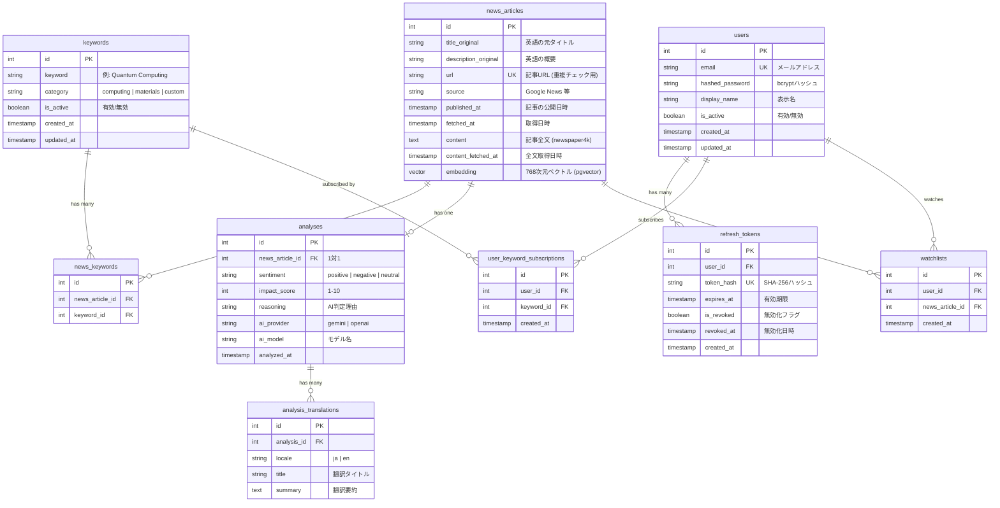

# データベース設計

## ER図



## テーブル詳細

### keywords

| カラム | 型 | 制約 | 備考 |
|--------|-----|------|------|
| id | SERIAL | PK | |
| keyword | VARCHAR(200) | NOT NULL, UNIQUE | 検索キーワード |
| category | VARCHAR(50) | NOT NULL, DEFAULT 'custom' | computing / materials / custom |
| is_active | BOOLEAN | NOT NULL, DEFAULT TRUE | 無効化でフェッチ対象外 |
| created_at | TIMESTAMPTZ | NOT NULL, DEFAULT NOW() | |
| updated_at | TIMESTAMPTZ | NOT NULL, DEFAULT NOW() | |

### news_articles

| カラム | 型 | 制約 | 備考 |
|--------|-----|------|------|
| id | SERIAL | PK | |
| title_original | VARCHAR(500) | NOT NULL | 英語タイトル |
| description_original | TEXT | NULLABLE | RSS description |
| url | VARCHAR(2048) | NOT NULL, UNIQUE | 重複検出用 |
| source | VARCHAR(100) | NOT NULL | RSS feed名 |
| published_at | TIMESTAMPTZ | NULLABLE | 記事公開日 |
| fetched_at | TIMESTAMPTZ | NOT NULL, DEFAULT NOW() | 取得日時 |
| content | TEXT | NULLABLE | 記事全文（newspaper4kで取得） |
| content_fetched_at | TIMESTAMPTZ | NULLABLE | 全文取得日時 |
| embedding | vector(768) | NULLABLE | pgvectorベクトル（Gemini Embedding） |

インデックス:
- `idx_news_url` on `url` (UNIQUEで自動)
- `idx_news_published` on `published_at DESC`
- `idx_news_fetched` on `fetched_at DESC`
- HNSW index on `embedding` (`vector_cosine_ops`)

### news_keywords (中間テーブル)

| カラム | 型 | 制約 | 備考 |
|--------|-----|------|------|
| id | SERIAL | PK | |
| news_article_id | INT | FK → news_articles.id, ON DELETE CASCADE | |
| keyword_id | INT | FK → keywords.id, ON DELETE CASCADE | |

制約: `UNIQUE(news_article_id, keyword_id)`

### analyses

| カラム | 型 | 制約 | 備考 |
|--------|-----|------|------|
| id | SERIAL | PK | |
| news_article_id | INT | FK, UNIQUE, ON DELETE CASCADE | 1対1保証 |
| sentiment | VARCHAR(20) | NOT NULL | positive / negative / neutral |
| impact_score | SMALLINT | NOT NULL, CHECK(1-10) | 市場影響度 |
| reasoning | TEXT | NULLABLE | 判定理由 |
| ai_provider | VARCHAR(20) | NOT NULL | gemini / openai |
| ai_model | VARCHAR(50) | NOT NULL | 使用モデル名 |
| analyzed_at | TIMESTAMPTZ | NOT NULL, DEFAULT NOW() | |

インデックス:
- `idx_analyses_sentiment` on `sentiment`
- `idx_analyses_impact` on `impact_score DESC`

### analysis_translations

| カラム | 型 | 制約 | 備考 |
|--------|-----|------|------|
| id | SERIAL | PK | |
| analysis_id | INT | FK → analyses.id, ON DELETE CASCADE | |
| locale | VARCHAR(10) | NOT NULL | 言語コード（ja, en） |
| title | VARCHAR(500) | NOT NULL | 翻訳タイトル |
| summary | TEXT | NOT NULL | 翻訳要約 |

制約: `UNIQUE(analysis_id, locale)`

### users

| カラム | 型 | 制約 | 備考 |
|--------|-----|------|------|
| id | SERIAL | PK | |
| email | VARCHAR(255) | NOT NULL, UNIQUE, INDEX | メールアドレス |
| hashed_password | VARCHAR(255) | NOT NULL | bcryptハッシュ |
| display_name | VARCHAR(100) | NULLABLE | 表示名 |
| is_active | BOOLEAN | NOT NULL, DEFAULT TRUE | アカウント有効/無効 |
| created_at | TIMESTAMPTZ | NOT NULL, DEFAULT NOW() | |
| updated_at | TIMESTAMPTZ | NOT NULL, DEFAULT NOW() | |

### refresh_tokens

| カラム | 型 | 制約 | 備考 |
|--------|-----|------|------|
| id | SERIAL | PK | |
| user_id | INT | FK → users.id, NOT NULL, INDEX | |
| token_hash | VARCHAR(255) | NOT NULL, UNIQUE | SHA-256ハッシュ |
| expires_at | TIMESTAMPTZ | NOT NULL | 有効期限（30日） |
| is_revoked | BOOLEAN | NOT NULL, DEFAULT FALSE | 無効化フラグ |
| revoked_at | TIMESTAMPTZ | NULLABLE | 無効化日時（グレースピリオド判定用） |
| created_at | TIMESTAMPTZ | NOT NULL, DEFAULT NOW() | |

### user_keyword_subscriptions

| カラム | 型 | 制約 | 備考 |
|--------|-----|------|------|
| id | SERIAL | PK | |
| user_id | INT | FK → users.id, ON DELETE CASCADE | |
| keyword_id | INT | FK → keywords.id, ON DELETE CASCADE | |
| created_at | TIMESTAMPTZ | NOT NULL, DEFAULT NOW() | |

制約: `UNIQUE(user_id, keyword_id)`

### watchlists

| カラム | 型 | 制約 | 備考 |
|--------|-----|------|------|
| id | SERIAL | PK | |
| user_id | INT | FK → users.id, ON DELETE CASCADE | |
| news_article_id | INT | FK → news_articles.id, ON DELETE CASCADE | |
| created_at | TIMESTAMPTZ | NOT NULL, DEFAULT NOW() | |

制約: `UNIQUE(user_id, news_article_id)`

## SQLModel 実装例

```python
# models/keyword.py
from sqlmodel import SQLModel, Field, Relationship
from datetime import UTC, datetime

class Keyword(SQLModel, table=True):
    __tablename__ = "keywords"

    id: int | None = Field(default=None, primary_key=True)
    keyword: str = Field(max_length=200, unique=True)
    category: str = Field(max_length=50, default="custom")
    is_active: bool = Field(default=True)
    created_at: datetime = Field(default_factory=lambda: datetime.now(UTC))
    updated_at: datetime = Field(default_factory=lambda: datetime.now(UTC))

    # Relationships
    news_links: list["NewsKeyword"] = Relationship(back_populates="keyword")
```

```python
# models/news.py
from pgvector.sqlalchemy import Vector
from sqlalchemy import Column

class NewsArticle(SQLModel, table=True):
    __tablename__ = "news_articles"

    id: int | None = Field(default=None, primary_key=True)
    title_original: str = Field(max_length=500)
    description_original: str | None = None
    url: str = Field(max_length=2048, unique=True, index=True)
    source: str = Field(max_length=100)
    published_at: datetime | None = None
    fetched_at: datetime = Field(default_factory=lambda: datetime.now(UTC))
    content: str | None = None
    content_fetched_at: datetime | None = None
    embedding: list[float] | None = Field(
        default=None, sa_column=Column(Vector(768), nullable=True)
    )

    # Relationships
    analysis: "AnalysisResult" = Relationship(back_populates="news_article")
    keyword_links: list["NewsKeyword"] = Relationship(back_populates="news_article")
    watchlist_items: list["WatchlistItem"] = Relationship(back_populates="news_article")
```

```python
# models/analysis.py
class AnalysisResult(SQLModel, table=True):
    __tablename__ = "analyses"

    id: int | None = Field(default=None, primary_key=True)
    news_article_id: int = Field(foreign_key="news_articles.id", unique=True)
    sentiment: str = Field(max_length=20)
    impact_score: int = Field(ge=1, le=10)
    reasoning: str | None = None
    ai_provider: str = Field(max_length=20)
    ai_model: str = Field(max_length=50)
    analyzed_at: datetime = Field(default_factory=lambda: datetime.now(UTC))

    # Relationships
    news_article: "NewsArticle" = Relationship(back_populates="analysis")
    translations: list["AnalysisTranslation"] = Relationship(back_populates="analysis")


class AnalysisTranslation(SQLModel, table=True):
    __tablename__ = "analysis_translations"
    __table_args__ = (UniqueConstraint("analysis_id", "locale"),)

    id: int | None = Field(default=None, primary_key=True)
    analysis_id: int = Field(foreign_key="analyses.id")
    locale: str = Field(max_length=10)
    title: str = Field(max_length=500)
    summary: str

    # Relationships
    analysis: AnalysisResult = Relationship(back_populates="translations")
```

```python
# models/associations.py
class NewsKeyword(SQLModel, table=True):
    __tablename__ = "news_keywords"

    id: int | None = Field(default=None, primary_key=True)
    news_article_id: int = Field(foreign_key="news_articles.id")
    keyword_id: int = Field(foreign_key="keywords.id")

    # Relationships
    news_article: "NewsArticle" = Relationship(back_populates="keyword_links")
    keyword: "Keyword" = Relationship(back_populates="news_links")
```

```python
# models/user.py
class User(SQLModel, table=True):
    __tablename__ = "users"

    id: int | None = Field(default=None, primary_key=True)
    email: str = Field(max_length=255, unique=True, index=True)
    hashed_password: str = Field(max_length=255)
    display_name: str | None = Field(default=None, max_length=100)
    is_active: bool = Field(default=True)
    created_at: datetime = Field(default_factory=lambda: datetime.now(UTC))
    updated_at: datetime = Field(default_factory=lambda: datetime.now(UTC))

    # Relationships
    refresh_tokens: list["RefreshToken"] = Relationship(back_populates="user")
    subscriptions: list["UserKeywordSubscription"] = Relationship(back_populates="user")
    watchlist_items: list["WatchlistItem"] = Relationship(back_populates="user")
```

```python
# models/refresh_token.py
class RefreshToken(SQLModel, table=True):
    __tablename__ = "refresh_tokens"

    id: int | None = Field(default=None, primary_key=True)
    user_id: int = Field(foreign_key="users.id", index=True)
    token_hash: str = Field(max_length=255, unique=True)
    expires_at: datetime
    is_revoked: bool = Field(default=False)
    revoked_at: datetime | None = None
    created_at: datetime = Field(default_factory=lambda: datetime.now(UTC))

    # Relationships
    user: "User" = Relationship(back_populates="refresh_tokens")
```

```python
# models/user_keyword.py
class UserKeywordSubscription(SQLModel, table=True):
    __tablename__ = "user_keyword_subscriptions"
    __table_args__ = (UniqueConstraint("user_id", "keyword_id"),)

    id: int | None = Field(default=None, primary_key=True)
    user_id: int  # FK → users.id, ON DELETE CASCADE
    keyword_id: int  # FK → keywords.id, ON DELETE CASCADE
    created_at: datetime = Field(default_factory=lambda: datetime.now(UTC))

    # Relationships
    user: "User" = Relationship(back_populates="subscriptions")
    keyword: "Keyword" = Relationship(back_populates="user_subscriptions")
```

```python
# models/watchlist.py
class WatchlistItem(SQLModel, table=True):
    __tablename__ = "watchlists"
    __table_args__ = (UniqueConstraint("user_id", "news_article_id"),)

    id: int | None = Field(default=None, primary_key=True)
    user_id: int  # FK → users.id, ON DELETE CASCADE
    news_article_id: int  # FK → news_articles.id, ON DELETE CASCADE
    created_at: datetime = Field(default_factory=lambda: datetime.now(UTC))

    # Relationships
    user: "User" = Relationship(back_populates="watchlist_items")
    news_article: "NewsArticle" = Relationship(back_populates="watchlist_items")
```

## マイグレーション

### 方針
- Alembic autogenerate で初期マイグレーション作成
- 手動で内容を確認してからコミット
- ダウングレードも必ず書く
- テストDBは `vector_test` を使用
- DBイメージは `pgvector/pgvector:pg16`（pgvector拡張が必要）

### マイグレーション履歴

| リビジョン | 内容 |
|-----------|------|
| `b751d5bc7311` | 初期テーブル: keywords, news_articles, analyses, news_keywords |
| `e54c3f7851ce` | タイムスタンプを TIMESTAMPTZ に変換 |
| `2d02a83aa90f` | users, refresh_tokens テーブル追加 |
| `dc3cc7a3c587` | user_keyword_subscriptions, watchlists テーブル追加 |
| `3a9bf03a0b5f` | news_articles に content, content_fetched_at カラム追加 |
| `4bf262125474` | pgvector拡張有効化 + news_articles に embedding vector(768) カラム + HNSWインデックス追加 |
| `a1b2c3d4e5f6` | refresh_tokens に revoked_at カラム追加（グレースピリオド対応） |
| `f1a2b3c4d5e6` | investment_categories, analysis_investment_categories テーブル追加 |
| `g2b3c4d5e6f7` | keyword_categories, 翻訳テーブル追加、keywords.category/is_active 削除 |
| `h3c4d5e6f7g8` | analysis_translations テーブル追加、analyses から title_ja/summary_ja/key_topics 削除 |
