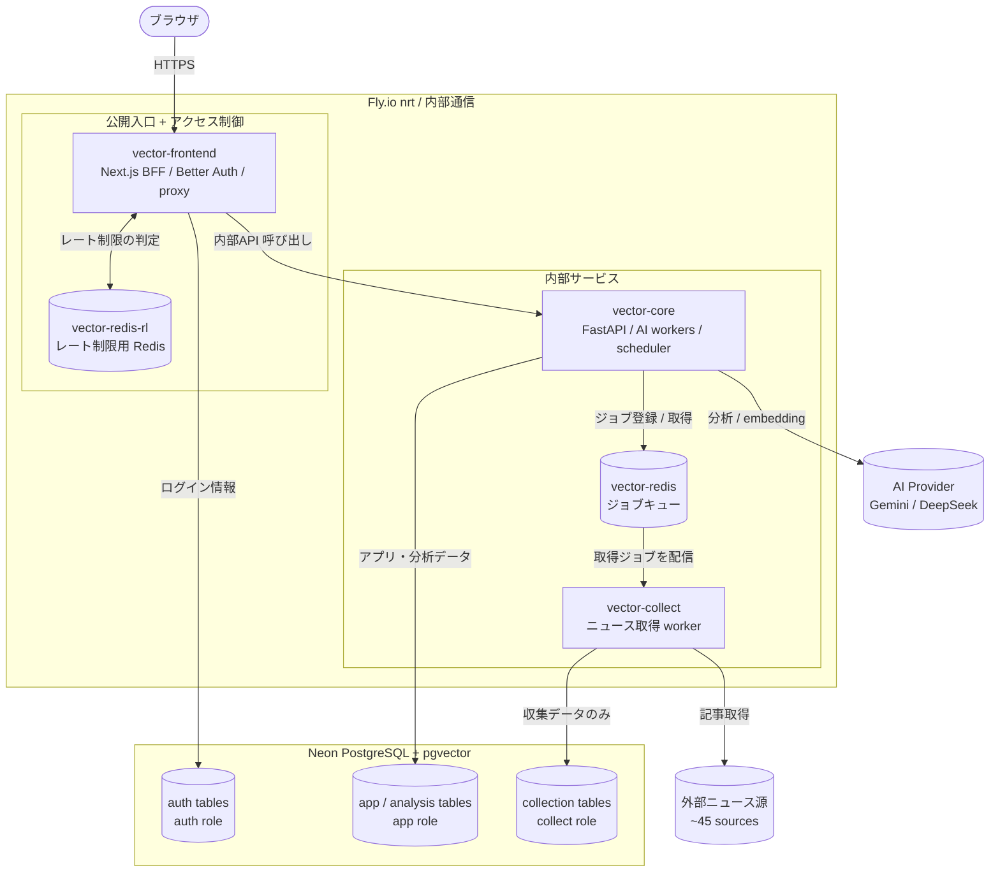

# Architecture

このドキュメントは、Vector の全体構成と主要な設計判断をまとめたものです。

ここでは「なぜこの構成にしたのか」「どの代替案を検討したのか」「どのトレードオフを受け入れたのか」に焦点を当てます。

設計に至るまでの試行錯誤や考え方の変化は [docs/design-journey/](design-journey/) に、
AI とどう協働して開発しているかは [how-i-build-with-ai](how-i-build-with-ai.md) に分けています。

## 設計前提

Vector は個人で開発・運用している本番アプリケーションです。運用に使える時間・費用・CI の月間実行枠には上限があります。

初めはプライベートで運用をしていたため、GitHub Actions は月間実行枠を使い切ることがあり、すべての変更で CI を完走させてからマージできていたわけではありません。現在は `ci-gate` を required check として運用していますが、過去の履歴には自動検証が十分に完了していない状態で取り込んだ変更も含まれます。

このリポジトリでは、アーキテクチャの説明に必要な論理名と構成は公開し、実 production の app 名、内部 URL、デプロイ / ロールバック / restore 手順は private な運用情報として扱います。`fly*.toml` は portfolio 用の構成例であり、実値は GitHub Environment secrets や Fly secrets から渡す前提です。

## このプロジェクトで重点的に取り組んだこと

Vector では、機能を作るだけでなく、個人で本番運用するアプリとして「どこが危ないか」「どこで壊れやすいか」「後から原因を追えるか」を意識して設計しました。特に次の 3 点に重点的に取り組んでいます。

1. **脅威を前提にしたセキュリティ設計**

   Claude Code で red-team レビュー用のコマンドを作り、外部 HTML 取得、認証境界、DB / Redis 権限、secret の分離、公開経路などのリスクを洗い出しました。

   セキュリティに十分詳しいとはまだ言えず、完璧な対策ができているとも考えていませんが、攻撃者目線で自分の設計を見ることで、app 分割、最小権限、内部ネットワーク化、BFF 経由の認証境界など、多くの改善につながりました。

2. **不正な状態を作りにくくする設計**

   ニュース収集から AI 分析までの非同期パイプラインでは、「この記事は次工程に進める状態か」「この値は保存してよい形式か」といった前提条件が多くあります。
   各処理で毎回 `if` を増やすのではなく、型、値オブジェクト、DB 制約、責務ごとのテーブル分離によって、処理できる状態だけを次の層へ渡す設計を目指しました。

   これは型安全そのものが目的ではなく、バグが入りやすい確認処理を散らさず、壊れにくく変更しやすい構造にするための取り組みです。

3. **失敗を後から追える運用基盤づくり**

   記事を収集してから分析するまでの非同期パイプラインでは、どの工程で処理が失敗しているのかに気づきにくい課題があります。
   そのため、各工程で起きた重要な出来事を監査ログ `pipeline_events` に記録し、どこで何が起きたのかを SQL で追えるようにしました。

   ただし、この仕組みを日常的な監視や復旧判断に十分つなげられているとはまだ言えません。

   今後は、ニュース取得元ごとの成功率、工程ごとの成功率、何をアラート対象にするか、失敗した処理をどう確認・再実行するかを整備していく段階です。

## システム全体図

本番は Fly.io の 5 app(すべて nrt リージョン)と Neon PostgreSQL で動作します。

## セキュリティ設計

Vector で最も注意が必要な入口は、外部サイトの HTML を取得して解析する収集処理です。自分たちで制御できない入力を扱うため、設計を誤ると RCE や SSRF の起点になり得ます。

この章では、実際に起きた問題への対応ではなく、想定される脅威に備えて入れている予防的な設計判断をまとめます。基本方針は、どこかが破られても影響をできるだけ狭い範囲に閉じ込めることです。

## 被害を最小限にする

ブラウザから直接到達できるのは、画面の提供、認証、backendへのリクエスト中継を担う公開入口だけです。

アプリケーションデータを扱うAPI、AI分析、scheduler、各種workerは、Fly.ioの内部ネットワークに閉じ、ブラウザから直接呼び出せない構成にしています。

また、外部サイトのHTMLを取得・解析する処理は、信頼できない入力を扱うため、APIやAI分析を担う処理から別appへ分離しています。両者はRedisのqueueを介して連携し、収集処理から内部APIへ直接アクセスする経路は設けていません。

| 境界 | 担当する処理 | 狙い |
|----|----|----|
| 公開入口（`vector-frontend`） | 画面提供、認証、backendへの中継 | ブラウザから内部サービスへ直接到達させない |
| 内部サービス（`vector-core`） | API、AI分析、scheduler | 重要なデータやsecretを外部入力から隔離する |
| 収集処理（`vector-collect`） | 外部HTMLの取得・解析 | 信頼できない入力を扱う処理の侵害範囲を限定する |

実装上は、公開入口を`vector-frontend`、API・AI分析・schedulerを`vector-core`、外部HTMLの収集処理を`vector-collect`が担当しています。
外部HTMLを扱う収集処理は、APIやAI分析を担う処理から別appへ分離しています。

ただし、appを分けるだけでは、同じDB権限やsecretを持っている場合、侵害時の影響を十分に限定できません。そのため、DB、Redis、secret、通信経路についても、処理の責務に応じて境界を分けています。

| 境界 | 採った対策 | 狙い |
|----|----|----|
| DB権限 | app / auth / collect / migration ownerでroleを分離 | 収集処理が侵害されても、アクセスできるtableと操作を収集に必要な範囲へ限定する |
| Redis権限 | 収集処理専用のユーザーを作り、必要なqueue操作だけを許可 | 他工程のqueue、AI予算、rate limitなど、収集に不要なRedisデータを操作させない |
| secret | 用途ごとにsecretを分け、弱い値や用途間での同一値を起動時に拒否 | 一つのsecretが漏洩しても、認証や署名など別用途の権限へ波及しにくくする |
| 通信経路 | 公開入口以外を内部ネットワークに閉じ、内部サービスの公開アドレスを持たせない | 認証情報や内部secretが漏洩した場合でも、外部から内部サービスを直接呼び出す経路を作らない |

## BFFを認証境界にする

現在はBFFを認証境界としていますが、当初はログイン処理やtokenの発行、ユーザー情報の管理まで、FastAPI backendが担っていました。

現在は、Next.jsのBFFがBetter Authのsessionを検証しています。BFFは認証済みユーザーの`user_id`と`role`を短い有効期限のJWTに含め、内部リクエストとしてbackendへ渡します。これにより backend は、記事や分析結果など、アプリケーションデータを扱う API に集中できるようにしました。

最初のBFF実装では、認証済みユーザーのIDとroleを、`X-User-ID`や`X-User-Role`といったHTTP headerに設定してbackendへ送っていました。
backendは、同じrequestに含まれる`X-Internal-Secret`が設定値と一致すれば、これらのheaderを信頼する構成でした。

この方式は実装が単純な一方で、backendはユーザー情報の正当性を`X-Internal-Secret`の一致だけで判断していました。
そのため、内部secretを不正に入手し、backendへリクエストを送れる攻撃者は、`X-User-Role: admin`のようなHTTP headerを設定してユーザー権限を偽装できる状態でした。

そこで現在は、BFFがBetter Authのsessionを検証し、認証済みユーザーの`user_id`と`role`を取得します。取得した情報を有効期限の短いJWTに含めて署名し、backendへの内部リクエストに付与する方式へ変更しました。

backendはJWTの署名、有効期限、発行元、宛先を検証し、すべての検証に成功したJWTに含まれる`user_id`と`role`だけを信頼します。

## リクエストに対するレートリミット

ブラウザからの request は、まず `vector-frontend` の Next.js proxy に入ります。proxy は request の種類、session、IP をもとに Redis の counter を確認し、短時間に多すぎる request でないかを判定します。

初期の `vector-frontend` では、静的アセット以外の request をすべて同じ IP 単位の枠で数えていました。そのため、Next.js の Server Components 用 request や prefetch、API request が同じ枠を消費し、通常の画面遷移だけでも 429 が返ることがありました。

単純に上限値を上げると通常操作は通りやすくなりますが、ログイン試行やデータ変更系 request まで一緒に緩くなります。問題は上限値そのものではなく、性質の違う request を同じ枠で数えていたことでした。

そこで現在は、prefetch、読み取り、変更系 request を別々の枠で数えています。
認証済み request では、同じ session からの request 数と、同じ IP からの request 数の両方を見て制限しています。

### Redis 障害時の扱い

rate limit の判定には Redis を使っています。ただし、Redis 障害時にすべての request を止めてしまうと、本体の API が動いていてもサービス全体が利用できなくなります。

そのため、proxy 側の Redis rate limit は Redis 障害時に fail-open し、少なくとも閲覧系 request で画面を見られることを優先しています。

### ログイン試行制限

一方で、ログイン試行は Redis に依存させず、Better Auth の DB-backed limiter で制限しています。Redis 障害時にログイン試行制限まで外れてしまうことを避けるためです。

ログイン試行制限は、red team からの指摘をきっかけに見直しました。当初は失敗回数を Redis に記録していましたが、Redis 障害時に counter を参照できなくなると、ログイン試行制限が外れるリスクがあります。

現在は Better Auth の DB-backed limiter に寄せています。これは問題を完全に解消するものではありませんが、ログイン試行制限では障害時に制限が外れるリスクをより重く見て、負荷や行数増加のリスクを DB 側で引き受ける判断をしました。

DB 側にログイン試行制限を寄せたことで、`auth."rateLimit"` の行が増え続けるリスクがあります。そのため、maintenance worker で古い行を定期的に削除し、ログイン試行制限に必要な短期 counter だけを残すようにしています。

## テーマ 2: 不正状態を作りにくくする構造

例えば、Vector の非同期パイプラインでは、記事の状態が工程ごとに変わります。最初に取得した記事を、分析できるようにデータを揃え、二段階の AI 分析を行い、最後にベクトルを生成します。

これらをすべて一つの「記事」として表そうとすると、工程によってはまだ存在しない値を nullable として持つことになります。その結果、Service や Task の各所で「この本文は本当にあるのか」「この記事は分析に進めてよい状態なのか」を何度も確認しなければなりません。

そこで、記事の状態や、各工程に進むために満たすべき条件を、型・DB 制約・テーブル設計で明確にすることを意識しました。これにより、各処理が暗黙の前提や毎回の if 文に頼らず、必要な条件を満たしたデータだけを扱いやすくしています。

具体的には、次のように役割を分けています。

- `ObservedArticle` / `AnalyzableArticle` など、アプリケーションの中で扱う記事の状態を型で定義する
- `ReadyForCuration` / `ReadyForAssessment` / `ReadyForEmbedding` などで、各工程を開始できる状態だけを表す
- DB の `CHECK` 制約や composite FK で、保存されるデータの整合性を守る

このテーマで重視しているのは、抽象を増やすことではなく、確認が必要な場所を減らすことです。

ただし、この切り分けは最初からうまく決められたわけではありません。

型を作るときは、その型が何を保証するのか、どこまでを責任範囲にするのかを決める必要があります。DB 制約も、強くしすぎると変更しづらくなり、弱すぎると不正なデータを止められません。

この経験から、型や DB 制約は単に追加すればよいものではなく、どの状態を何で保証するのか、どの層に責任を持たせるのかを理解してから入れる必要があると学びました。

判断に至る過程は [第2幕: 値オブジェクト](design-journey/02-value-objects.md) と [第6幕: ドメインモデル再構築](design-journey/06-domain-model-rebuild.md) に残しています。

## テーマ 3: 黙って消える失敗を見える形にする

非同期 pipeline の失敗は、同期 API の失敗より気づきにくいです。画面上にすぐエラーが出るわけではなく、記事が次工程に進まない、週次処理が動かない、queue に task が滞留する、といった形で表れます。

実際に過去には、収集工程が長時間止まっていたことに気づけなかったことがありました。

そこで Vector では、pipeline の各工程で起きた重要な出来事を `pipeline_events` に記録しています。特に、外部から取得したデータをアプリケーション内の概念に変換するときの失敗や、AI の応答が期待した形式・内容を満たさなかったケースなど、後から改善につなげられる情報を残すことを意識しています。

あわせて Logfire の span / metric でも、工程ごとの成功・失敗や処理結果を見られるようにしています。

一方で、この仕組みを日常的な監視や復旧判断に十分つなげられているとは、まだ言えません。監査ログとメトリクスは入れ始めていますが、障害時に「何を見て、どの条件なら再実行し、どの条件なら処理対象から外すか」まで、運用手順として固まっているわけではありません。

今後は、ニュース取得元ごとの成功率、工程ごとの成功率、アラート対象にする条件、失敗した処理の確認・再実行手順を整備していく段階です。
このテーマは、完成した障害対応ではなく、worker の失敗を見つけ、調べ、復旧手順につなげるための土台づくりとして位置づけています。

## 非同期パイプライン

Vector は、ニュースサイトや外部 AI API など、自分では応答時間や稼働状況を制御できないサービスに依存しています。

そのため、ニュース収集から AI 分析までの処理を複数の非同期 stage に分け、時間のかかる処理や一時的に失敗する可能性がある処理をバックグラウンドで実行しています。

### 処理の流れ

記事は、収集、本文補完、翻訳・要約、投資分析、ベクトル生成の順に処理されます。

| 分類 | stage | 役割 |
|----|----|----|
| 起点 | dispatch | DBから処理対象を選び、収集・本文補完のtaskを投入する |
| 収集 | acquisition | ニュースソースから新しい記事候補を取得する |
| 収集 | completion | 本文が不足している記事をHTMLから補完する |
| AI分析 | curation | 記事を日本語化・要約し、分析しやすい形に整える |
| AI分析 | assessment | 重要度、カテゴリ、投資文脈を分析する |
| AI分析 | embedding | 分析済み記事のベクトルを生成する |
| 派生処理 | trend discovery | 一定期間の記事から注目トレンドを抽出する |
| 派生処理 | briefing | カテゴリごとに記事を分析して週次ブリーフィングを生成する |
| 復旧・保守 | maintenance / backfill | 未完了工程の再投入やキューの監視を行う |

schedulerがcron形式のスケジュールで最初のtaskを投入し、各stageは処理結果をDBへ保存してから、次のstageのtaskを明示的に投入します。

### queueとworkerの境界

task queueにはRedis Streamsを使い、stageごとの滞留を個別に把握できるよう、キューを分けています。一方、worker processは処理の性質が近い工程で共有し、収集系のacquisitionとcompletion、AI分析系のcurationとassessmentがそれぞれ同じプロセスで動きます。

キューを分けているのは、各工程にどれだけタスクが滞留しているかを個別に把握するためです。それ以外のworker、同時実行数、DB接続、障害の影響範囲は共有し、プロセスを増やしすぎないことでメモリの使用量などを抑えています。

そのため、キューが分かれていても処理能力や障害の影響範囲までは分離されていません。特定のstageの遅延が続く場合は、観測結果をもとにworkerを分けるか判断します。

### 設計上の要点

外部サービスの遅延やworkerの停止を前提に、次の設計で整合性を保っています。

- タスクにはDBレコードのIDだけを渡し、workerが最新状態を読み直して前提条件を検証してから処理する
- 未完了工程の復旧はPending再配送とbackfillの2系統。タスクが重複することを前提に、DB側の制約で整合性を守る
- 再投入は件数・日次使用量・対象期間に上限を設け、hold gateやkill switchで抑制する

移行の経緯（Redis List → Streams）、Pending再配送、backfill、タスク重複実行への対処は、Zennの記事で詳しく解説しています。

[ニュースの収集とAI分析を支える非同期パイプラインの設計](Zennの記事URL)

## 運用して分かったこと / 取り組み中の課題

実際にデプロイしてみると、ローカル開発では見えていなかった問題がいくつも出ました。コードとして正しく動くことと、ユーザーが触ったときに安心して使えること、本番環境の制約の中で安定して動くことは別の問題だと学びました。

**非 AI worker のメモリ逼迫** — デプロイ後、AI を実行しない scheduler / collect / maintenance のプロセスが、起動直後にメモリ制限へ達することがありました。原因は、すべての worker が起動時に AI provider の重い SDK まで読み込んでいたことです。現在は、AI を使う worker だけが必要になったタイミングで SDK を読み込むようにし、非 AI プロセスの常駐メモリを抑えています。

**フロントエンドの使用感** — フロントエンドにはまだ改善の余地がありますが、実際に触る中で、ロード中なのか分からない、ボタンを押せたのか分からない、サーバーのコールドスタートで timeout する、といった問題に気づきました。API が正しいレスポンスを返すだけでは不十分で、待ち時間や操作中の状態を画面でどう伝えるかも含めてユーザー体験であり、それは実際に触ってみないと分からないことだと痛感しました。

**外部サービスや無料枠の制約** — DB、CI、AI provider などには実行枠や課金上限があり、使い切ると処理が止まることがあります。止まってから気づくのでは遅いため、使用量、queue の滞留、失敗件数を可視化し、どこで詰まっているのかを追える仕組みが必要だと分かりました。監査ログやメトリクスは入れ始めていますが、日常的な alert や復旧手順としてはまだ整備途中です。

**安全なデプロイ手順** — デプロイして初めて、DB migration だけでなく、queue に残っている task、処理中の worker、新旧コードの互換性まで確認する必要があると学びました。

新しい実装へ置き換えるときに古い経路をすぐ消すと、本番で問題が出たときに戻しにくくなります。そのため、新旧の経路を一時的に共存させ、デプロイ後に動作確認してから古い経路を削除する進め方が必要だと感じています。

まだ十分に体系化できてはいませんが、変更を小さく出し、確認してから片付ける意識を持つようになりました。
