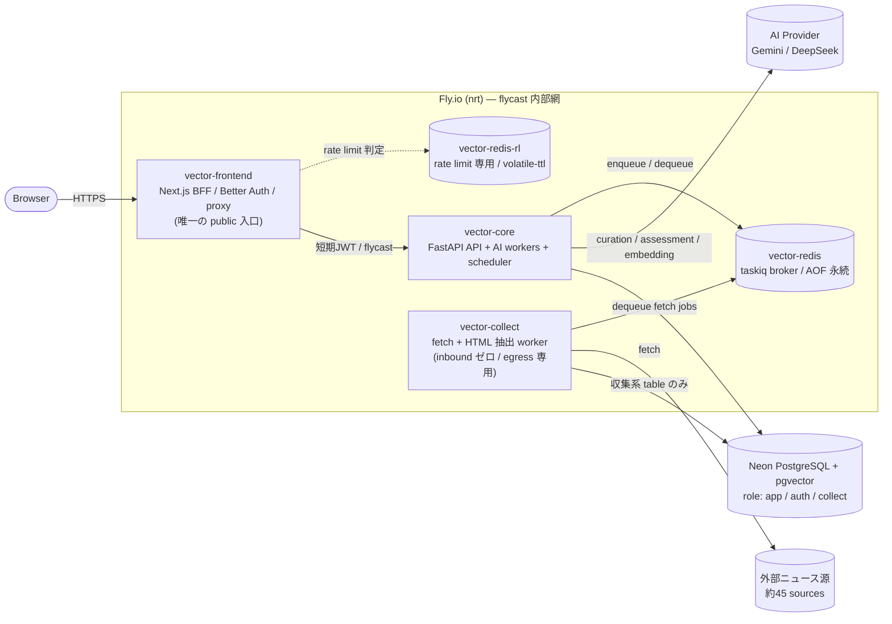

# Architecture

Vector は、海外テックニュースを自動収集し、AI で翻訳・要約・分析して投資判断を助けるダッシュボードです。個人開発のプロジェクトで、コードの多くは AI との協働で書いています。

本書は「各構成をなぜそう決めたのか」を、検討した代替案と受け入れたトレードオフとともに記録します。個々の判断の正本は [ADR](adr/README.md) に、判断に至る経緯は [docs/ddd-adoption/](ddd-adoption/) にあります。本書はそれらを設計テーマで束ねて見渡すための入口です。

## 設計で大事にしていること

本アプリの設計判断は、おおむね次の 3 つを大事にして選んでいます。以降の判断は、この 3 つに紐づけて読めます。

1. **どこかが破られても、被害を最小限にとどめる** — 攻撃や侵害で 1 か所が突破されても、その被害をできるだけ狭い範囲に閉じ込める。
2. **扱う領域ごとに責任を分ける** — ニュースの収集・AIによる分析といった異なる関心事を 1 つに混ぜず、それぞれが 1 つの役割だけを担うように境界を引く。境界をまたいで責任が混ざらないようにする。
3. **持続可能な設計を目指す** — 問題が起きたときに、気づいて直せるようにする。長く運用しても、無理なく手を入れられる状態を保つことを意識する。

## 制約

判断はいずれも次の制約の下での選択です。

- 個人開発で、運用に割ける時間と費用に上限があります。
- プライベートリポジトリで開発していたため、GitHub の branch protection / required checks といった一部の機能が使えませんでした。CI 自体は動かせても「テストが通るまではマージできない」といった強制ができないため、検証のかけ方をこの前提で組んでいます。
- AI provider(Gemini / DeepSeek)の API 課金コスト。

## あらかじめお伝えしておくこと

- 本番にはデプロイ済みで、パイプライン監査基盤(`pipeline_events`)と工程別の Logfire 計装も稼働しています。ただし監査基盤の投入から日が浅く、「改善前後」を比較できるだけの運用期間がまだ蓄積されていません。そのため失敗率の改善幅といった成果数値は提示せず、該当箇所は「計測成果ではなく設計判断」として記述します。
- CI は GitHub の有料プランで動かしていますが、月あたりの実行時間(3000 分)を使い切ってしまうことがあり、途中で一部のワークフローを止めざるを得なかったり、CI が失敗したままマージされた変更が残っていたりします。すべての変更が常に緑の状態でマージできているわけではない点を、あらかじめお伝えしておきます。

## システム全体図

### Container 構成

本番は Fly.io の 5 app(すべて nrt リージョン)と Neon PostgreSQL で動作します。

ブラウザが到達できるのは `vector-frontend` だけで、backend 以降は flycast の内部網に閉じています。`vector-collect` は外部サイトの HTML を扱うため、AI key を持つ `vector-core` から app ごと分け、両者は `vector-redis` のキュー越しにのみつながります。`vector-redis-rl` はリクエストの後段ではなく、frontend が rate limit を判定するための横の依存です。

## テーマ 1: 同心円の最小権限

Vector で最も危ないのは、外部サイトの HTML を取得して解析する収集処理です。中身を自分で制御できない入力を扱う以上、ここは RCE / SSRF(外部入力を悪用した任意コード実行や、サーバーを踏み台にした内部アクセス)の標的になり得ます。そこでこの 1 点を脅威の起点に置き、「いずれどこかは破られる」前提(assume breach)で、**破られても被害をその層の外へ出さない**ことを設計の軸にしました。

その最初の一手が、app の分割です。AI provider の API キーや BFF の署名鍵を持つ `vector-core` と、外部 fetch だけを担う `vector-collect` を、別々の Fly app に分けています。万一 collect が乗っ取られても、そこには鍵も分析結果も無く、core へは `vector-redis`(taskiq broker)のキュー越しにしか届きません。「危険な処理」と「守りたい資産」を同じ箱に同居させない、という分け方です。

この「1 か所の侵害を、その場で止める」考え方を、app だけでなく DB・Redis・secret・通信経路にも同心円状に重ねています。各層で「単純な作りだと何が漏れるか」を並べたのが次の表です。

| 層 | 分離 | 単純案で足りない理由 |
|----|------|----------------------|
| Fly app | core(AI鍵・BFF鍵を持つ)と collect(外部 fetch のみ)を別 app に | Fly secrets は app 単位でしか分離できず、同一 app 内の process group は全 secret を共有する。collect 侵害で 最重要　の 秘密鍵 が漏れるのを防げない |
| DB role | DB の権限を用途ごとに 3 つ(アプリ用 / 認証用 / ニュース収集用)に分け、各 app 用の権限で接続。ニュース収集用には、収集で使うテーブルへの必要最小限の操作だけを許可。監査ログは書き込みだけ許し、記録した中身は読み返せないようにしている(改ざん・証跡消しの防止) | 全 app が同じ権限で DB に繋ぐと、何か一つ が乗っ取られた瞬間に本来そのappに関係のない情報まで読み書きされてしまう。用途ごとに分けておけば、何か一つ が破られても触れるのは最小限のテーブルだけで止まる |
| Redis | collect 専用のユーザーを作り、収集工程で使うキュー(metadata / content)の読み書きと、処理結果の書き込みだけを許可。全消去(`FLUSHALL`)や設定変更(`CONFIG`)などの危険な操作は禁止 | 全 app が共有パスワードの単一ユーザーだと、collect が乗っ取られただけで、他工程のキューや AI の予算・レート制限カウンタまで触れてしまう |
| Secret | frontend↔backend で双方向に使う 2 つのシークレット(ログイン情報の署名 / キャッシュ更新の認証)を、用途ごとに別々の値へ分割。起動時に弱い値や両者が同値なら起動を止める | 2 つは危険度が大きく違う。キャッシュ更新の悪用は軽微だが、署名鍵が漏れると偽の管理者トークンを作られて backend を乗っ取られる。1 つに束ねると、軽い方のキャッシュ用が漏れただけで重い方の backend 乗っ取りまで一緒に開いてしまう。分けておけば、漏れても被害はその用途だけに収まる |
| Transport | backend の公開アドレスを廃止し、Fly の内部ネットワークからのみ到達できるようにした | backend が公開アドレスを持ったまま JWT 検証だけで守ると、検証にバグがある・署名鍵が漏れる、のどちらか 1 つで、インターネットから誰でも直接 backend を叩けてしまう。壁が JWT 1 枚だと、そこが破れた瞬間に全公開と同じになる。内部網に隠せば、JWT が破れても、まず内ネットワークへ侵入しない限り backend には届かない |

この結果、backend・DB・Redis に届くのは frontend 経由だけになりました。本番では接続先が内部ネットワークの住所でなければ起動を止めるので、開発用(localhost など)を誤って設定しても、こっそり動かず即座に起動失敗で気づけます。

では、その「frontend 経由」は中身をどう守っているか。**ブラウザは backend を直接は叩きません。** 唯一の公開入口である frontend(BFF)が、Better Auth の httpOnly Cookie セッションを検証し、本人情報(user_id とロール)を**署名した短期 JWT** に変えて backend へ渡します。backend は署名を検証し、正しいものだけを「frontend が認証済みとして送ってきたリクエスト」として信じます。この JWT は有効期限を 1 分未満に絞り、発行元と宛先(issuer / audience)も固定しているため、万一漏れても、ほぼ即座に期限切れになるうえ、宛先である backend 以外では弾かれます。盗んでも悪用できる隙がほとんど残らないと思います。

加えて、**認証データは別のスキーマ(`auth`)に隔離**しています。認証まわりのテーブルは Better Auth が、アプリ側のテーブルは Alembic(マイグレーション)が管理しており、同じ場所に混ぜると管理がぶつかります。スキーマを分けることで、アプリ用の権限からは認証テーブルに触れず(必要な箇所だけ FK で `auth.user` を指す)、認証情報をアプリ領域から構造的に切り離せます。

> これらの脅威は、外部監査で指摘されたものではなく、自分で立てた脅威モデルです。Claude Code 上に red-team エージェントを組み、本リポジトリへ敵対的レビューをかけて洗い出しました。ここでの分離はいずれも、実害を観測したからではなく、攻撃対する予防として設けています。

## テーマ 2: 不正状態を作れない構造

テーマ1が「外から破られても被害を封じ込める」話なら、こちらは内向きです。**守るべき約束(不変条件)を、「呼び出し側が気をつける」「実行時にチェックする」ではなく、型・DB 制約・ファクトリといった"構造"で、そもそも破れないようにします。** 約束の定義は一箇所(SSoT)に置き、そこから型・DB 制約・ファクトリへ伝播させます。

各手段は「**どんな不正状態を、どの構造で作れなくするか**」で並んでいます。

- **フォーマット不正な値を作れなくする** — `CategorySlug` などの値オブジェクトが持つ正規表現と、DB の `CHECK` 制約で、同じフォーマットを二重に守ります。検証を二度書くコストは受け入れています(`CHECK` のコストはほぼゼロで、両者がずれても DB 側が硬い境界として残るため)。
- **「ありえない状態」を型で排除する**(Parse, don't validate) — 記事を「メタ情報のみ」と「本文あり(NOT NULL)」のテーブルに分け、「本文テーブルに行がある = 分析可能」を型レベルの事実にしました。工程間で渡す結果も、フラグ + nullable の寄せ集めではなく「`Fetched` なら `article_id` 必須」のような判別可能な型にして、`(None, None, None)` のような中途半端な値を作れなくします。
- **不正な値での生成そのものを禁じる** — オブジェクトの構築を Service に直書きさせず、ファクトリ経由に限定して、不正な値ではインスタンスを作れないようにします。
- **2 箇所に持つ同じ identity がずれないようにする** — 同じ識別子を別テーブルにも持つ場合、composite FK で食い違い(drift)を DB が拒否し、移行は「列追加 → 既存データ埋め → 制約付与」の無停止手順で行います。

これらを構造で書けるようになった土台は、SQLModel から SQLAlchemy 2.0(DeclarativeBase)への移行です。SQLModel では DB 制約(`ondelete` / 複合 index / `server_default` など)や値オブジェクトを ORM 層に素直に載せられず、回避コードが常態化していたためです。

## テーマ 3: 黙って消える失敗の可視化

HTTP リクエストの失敗はユーザーに 500 が返りますが、worker の失敗は誰にも見えず、記事が在庫に埋もれるだけです(過去にある収集工程が長時間停止していたことに気づけませんでした)。これに気づけるようにするため、**append-only の監査ログ `pipeline_events` を中心の仕組みとして導入しました。**

- 非同期パイプラインの各段の事実を「1 行 = 1 イベント」で immutable に記録します。設計の第一原理は「すべてを忘れた未来の読み手が、この 1 行を見て何が起きたかを SQL 1 本で再構成できるか」です。
- **書き込み境界は非対称です。** 成功 / skip の監査 INSERT は業務 state 更新と同一トランザクションに置き「監査行が焼けた = 業務が確定した」を DB レベルで保証します。失敗時は業務 tx が既に rollback されているため別 session・別 tx で best-effort に焼き、監査自体が倒れても業務 task を道連れにしません(永続化失敗の記録が、その失敗の rollback で一緒に消える矛盾を断つため)。
- **失敗の語彙を直交軸に分けています。** 「何が起きたか(原因)」「retry できるか」「記事を消すか(処理方針)」を 1 つの分類 enum に詰めると、retry 状態で分類を決めたときに「直らない例外なのに retryable と焼かれ、アラートが最終試行まで黙る」嘘が生まれます。これを、原因コード / retryability / 処理方針 の別属性へ投影しました。
- 監査は「事実の witness」に純化し、採番 PK や検索都合の派生値、`type(scraper).__name__` のような情報量ゼロの定数は焼きません。「次に何をするか」(再試行 / drop / keep)は監査ではなく現在状態の側に持ちます。
- 監査に焼くかは「機構で分離できるか」ではなく「分離を要する consumer がいるか」で決めます(consumer-driven)。benign race や定常的な重複などの非イベントは沈黙させます。

Logfire は補助 telemetry に徹し、`pipeline_events` を監査の SSoT として温存します。非 AI worker の各工程を低 cardinality な span で計装し、メモリ監視は Fly の OOM 確定検知と Logfire の予兆検知(`system.memory.utilization`)に役割分担しています。HTTP を持たない collect worker の生死は、supervisord の fail_fast による restart loop の外形観測で見えるようにしています。

> このパイプライン監査基盤(`pipeline_events`)はまだ本番に投入しておらず、失敗率改善などの運用数値は提示できません。本書ではこれを計測成果ではなく設計判断として記述します。

詳細は [ADR-008(pipeline_events 監査)](adr/008_pipeline_events_audit.md)、[Pipeline Events Design](observability/pipeline-events-design.md)、[Failure Attributes](observability/pipeline-events-failure-attributes.md)、[Error Visibility](observability/error-visibility.md)、[Memory Monitoring](observability/memory-monitoring.md) を参照してください。

## テーマ 4: fail-open / fail-closed の非対称

同じ「失敗時にどう振る舞うか」でも、**守る対象によって方針を逆向きに使い分けます。**

- **一般の IP rate limit は fail-open** — レートリミット用 Redis が落ちたときに閲覧まで止めると、運用障害が DoS と等価になります。
- **認証のブルートフォース制限は fail-closed** — ログイン試行の制限が Redis 障害で無制限に開く穴(OWASP API2:2023)を避けるため、Better Auth のログイン limiter を Redis から DB-backed(Redis とは独立して動く DB)へ移しました。ただし atomic increment ではないため「厳密上限」ではなく「共有 DB 上の best-effort limiter」と保証範囲を明示しています。
- **起動時検証は fail-closed** — 弱い secret・誤った内部 URL・非 TLS の DB 接続・未宣言の migration 種別は、起動や deploy を止めます。沈黙より停止を選びます。

frontend の rate limit 自体も、通常閲覧の誤ブロックと攻撃の両方に対応するため、リクエストの種別(prefetch の RSC GET / 通常の読み取り / 変更系)× identity(session / IP)の multi-tier に再構成しています。session 単位の制限は必ず IP で backstop し(偽造 cookie によるバイパスを防ぐ)、prefetch の fan-out は別枠で寛容にします。

詳細は [ADR-006](adr/006_better_auth_rate_limit_strategy.md) / [ADR-007](adr/007_auth_ratelimit_db_storage.md) / [ADR-009(multi-tier rate limit)](adr/009_proxy_rate_limit_multitier.md) を参照してください。

## 非同期パイプライン

ニュース収集・本文抽出・AI 分析・embedding・trend discovery・週次ブリーフィング・maintenance は、HTTP リクエストパスから外して taskiq + Redis Streams の worker 上で段ごとに処理します。重い AI 呼び出しや外部 fetch を request path に置くと、遅延・timeout・障害連鎖を招くためです。段ごとに独立して queue・スケール・失敗隔離ができる代わり、cron が worker と別プロセスになるコストを Fly の process group で吸収しています。

タスクキューは [taskiq を採用](adr/001_taskiq_over_arq.md)しました(arq が maintenance-only に入っていたため)。AI provider の紐付け(curation / embedding = Gemini、assessment / 週次ブリーフィング = DeepSeek)は環境変数スイッチにせず、composition root にコードで固定配線します。共有 env の設定ミスで工程ごとの provider が入れ替わる事故を構造的に避けるためで、切り替えにはコード変更と worker 再起動を要します。

## セキュリティと実行時境界(リファレンス)

### Environment validation

環境変数の一覧は [`.env.example`](../.env.example) を正本にし、起動時の検証は [`backend/app/config.py`](../backend/app/config.py) に集約しています。

- `BFF_JWT_SIGNING_SECRET` / `REVALIDATE_BEARER_SECRET` は強度(>=32 字・既知の弱い値の拒否)を検証し、両者が同値なら起動を拒否する
- `DATABASE_URL` は公開済み placeholder や弱い秘密パターンを拒否し、本番では SSL(`verify-full` へ格上げ)を必須にする
- `INTERNAL_FRONTEND_BASE_URL` / 内部 API URL は allowlist で検証し、本番では `*.flycast` のみに制限する

### Database roles

本番では Neon に対して用途別のロールを分け、migration は table owner ロールで実行して runtime のアプリケーションロールと分けます。

| Role | Purpose |
|------|---------|
| `vector_app` | backend core、worker、scheduler のアプリケーション DML |
| `vector_auth` | Better Auth の `auth.*` DML(public 不可) |
| `vector_collect` | collect worker が触る収集系 table の最小 DML(列単位 grant) |

### AI provider selection

AI provider の選択は env switch にせず、[`backend/app/queue/composition.py`](../backend/app/queue/composition.py) に集約して worker 起動時に adapter を構築します。具象 SDK は各起動 hook 内で遅延 import し、AI を実行しないプロセス(scheduler / collect / maintenance)に重い SDK を常駐させません。

### Back-fill controls

curation / assessment / embedding の back-fill は、stage ごとの kill switch(`BACKFILL_*_ENABLED`)・日次予算(Redis 上の Lua atomic)・stage hold gate の 3 段で制御します。AI provider の一時失敗や quota による滞留を cron で救済しつつ、暴走時は段単位で止められます。記事の物理削除は provider の明示拒否に限定し、「API key の直し忘れで記事が大量削除される」事故を分離しています。

## 意図的にやらないこと(Non-goals)

複雑さを足さない判断も設計の一部です。次は規模に対して過剰なので採っていません。

- **マルチリージョン / Kubernetes / サービスメッシュ** — 単一リージョンの数 app 構成に対し運用コストが見合いません。
- **専用ベクタ DB** — 関連記事検索は同一 Neon に載せた pgvector で足り、別データストアを増やしません。
- **auth 専用の別 DB インスタンス** — migration ツールの競合と関心分離は、同一 DB の `auth` / `public` スキーマ論理分離で解けます([ADR-002](adr/002_auth_schema_separation.md))。

また、現時点で残している課題も伏せずに記録します。

- migration ゲートの破壊的操作判定に、複文(`SET ...; DROP ...`)を誤って許可しうる fail-open が残っています(follow-up)。
- DB-backed のログイン limiter は best-effort で、DB の部分障害では fail-open しうる残リスクがあります。

## ローカル環境

ローカルでは Docker Compose で frontend / backend / db / redis / worker / scheduler をまとめて起動します。公開される host port は frontend の `localhost:3000` のみで、backend / db / redis / worker は Docker の内部ネットワークで動作します。これは本番の「frontend が唯一の public 入口」という境界を dev でも再現するためです。統合テストは別 compose project を loopback 限定で立て、dev スタックの巻き添え削除を防ぎます。

## これから(未文書化の領域)

設計判断としては確立しているものの、まだ ADR 化していない領域があります。今後、次を起票して本書からリンクする予定です。

- **CI 検証ゲート戦略**(ADR-010 予定) — 変更領域別の gate、OpenAPI の property-based fuzzing(schemathesis)、IaC の脆弱性スキャン(Trivy)、warn-only → blocking の段階昇格。private repo で branch protection が使えない前提が、この戦略を規定しています。
- **コスト最適化**(ADR-011 予定) — ソース別フェッチ間隔の tier 化、back-fill 日次予算、AI rate limit の provider×model 整合、scheduler 4 プロセスの 1 event loop 統合(VM 1GB→512MB)。
- **frontend ロード戦略** — 日本語フォントの subset と CJK fallback、font preload の無効化、一覧 / trends の Suspense 化。
- **テスト戦略** — RSC を page-models に抽出した node project でのテスト、jsdom / node の振り分け([ADR-005](adr/005_rsc_test_strategy.md) はその一部)。

## 関連ドキュメント

- [ADR Index](adr/README.md) — 各設計判断の正本(context / 代替案 / トレードオフ)
- [docs/ddd-adoption/](ddd-adoption/) — 判断に至る経緯のナラティブ
- [Pipeline Events Design](observability/pipeline-events-design.md) / [Failure Attributes](observability/pipeline-events-failure-attributes.md)
- [Error Visibility](observability/error-visibility.md) / [Memory Monitoring](observability/memory-monitoring.md)
