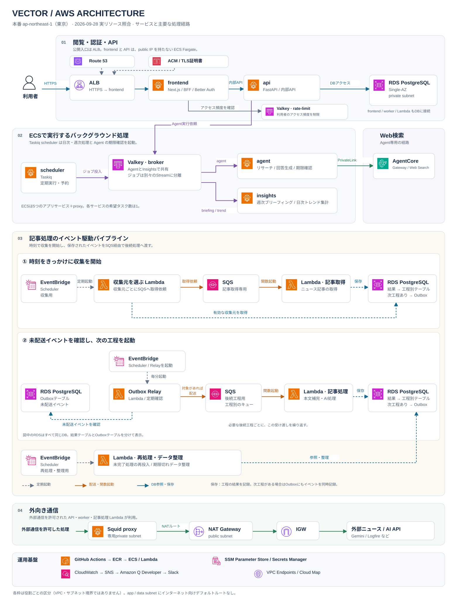

# VectorのAWS構成

2026年9月28日、東京リージョン（`ap-northeast-1`）の本番リソースを読み取り用ロールで確認した。構成図はAWS APIで得たリソース・接続設定を、`infra/aws/`のTerraformとアプリケーションの起動設定に照合して作成した。

## 図の読み方

- Route 53はドメインの名前解決を担当する。ブラウザーはDNSリゾルバーからALBのIPアドレスを受け取り、ALBへHTTPSで接続する。ACMはHTTPSで使うTLSサーバー証明書を管理し、ALBがその証明書をブラウザーに提示する。
- 枠は処理の役割による区分で、VPCやサブネットの境界ではない。ネットワークの境界は[READMEのネットワーク図](../README.md#ネットワーク境界と通信経路)を参照する。
- 記事処理の区画では、灰色の破線が定期起動、橙色の実線がキュー配送・関数起動、青色がDB参照・保存を表す。②のRelayからOutboxへの矢印は、担当工程の未配送イベントを確認する問い合わせを示す。レスポンス、Agentのライブ配信、図示した以外のDB接続、画面キャッシュの更新通知などは省略している。
- 記事処理の区画は「① 時刻をきっかけに収集を開始」と「② 未配送イベントを確認し、次の工程を起動」に分けた。①はSchedulerを起点に、収集元を選ぶLambdaが収集元ごとの取得依頼を記事取得用SQSへ送り、記事取得Lambdaが結果と必要な後続イベントを保存する。②はRelayがOutboxテーブルを確認し、対象イベントがある場合だけ後続工程用SQSへ配送する。記事処理LambdaはSQSの依頼を受けて、対応する工程を実行する。
- 収集用・配送用・再処理用のEventBridge Schedulerは、用途別のスケジュールを分けて描いたもの。②ではRelayの定期起動を主なデータの流れから外し、上から入る補助線で示した。Relayは毎分起動してDBを確認し、保存済みの未配送イベントをSQSへ送る。記事取得の完了やDB更新がRelayを直接起動するわけではない。
- 各区画のRDSは、すべて上段と同じDBを再掲している。収集起動による対象ソースの参照、記事処理による結果・後続イベントの保存、Outbox Relayによる未配送イベントの参照を示す。①・②の参照矢印はいずれもLambdaからRDSへの問い合わせを表し、RDSがLambdaを直接起動する意味ではない。保存側のRDSには工程ごとの結果テーブルとOutboxを示し、工程の結果を保存したうえで、次工程が必要な場合だけOutboxへイベントを同時に記録する。
- LambdaはVPCに接続する。関数の実行環境自体をECSと同じサブネット内に配置している、という意味ではない。
- 記事取得用のSQS・Lambdaは個別に示し、後続4工程のSQS・Lambdaと4つのOutbox Relayはそれぞれ集約して表示している。後続イベントが必要な処理では、結果とイベントをRDSの同一トランザクションで記録し、Relayが次工程のSQSへ配送する。②の受け渡しを工程ごとに繰り返す。
- EventBridge Schedulerから直接起動するのは、収集対象選択、Outbox Relay、backfill、認証レート制限データの清掃。記事処理の5つのConsumerはSQSのイベントソースマッピングから起動する。
- 処理用キューに設定されたDLQへの移動、収集起動・実行の失敗先、対象外記事や重複記事などの分岐、backfillからSQSへの再投入経路は、全体図では簡略化している。

## 実リソースの確認結果

件数と状態は確認時点のスナップショットであり、継続的な稼働状況を保証するものではない。

| 領域 | 確認した構成 | 主な根拠 |
|---|---|---|
| 公開入口 | Route 53の公開ドメインからALBへのAlias。ACM証明書は`ISSUED`。HTTP 80はHTTPSへ転送、HTTPS 443はfrontendへ転送。frontendの3000番ポートのターゲットは`healthy` | Route 53 / ACM / ELBv2 API、[web.tf](../infra/aws/web.tf) |
| ECS | `frontend`、`api`、`scheduler`、`insights`、`agent`、`proxy`の6サービス。すべてFargate / ARM64、desired 1・running 1・pending 0。すべてpublic IP無効 | ECS API、[locals.tf](../infra/aws/locals.tf)、[platform_ecs_services.tf](../infra/aws/platform_ecs_services.tf)、[platform_egress_proxy.tf](../infra/aws/platform_egress_proxy.tf) |
| Lambda | 15関数。収集対象選択1、記事処理Consumer 5、Outbox Relay 4、backfill 4、認証レート制限データ清掃1。すべてコンテナイメージ形式、VPC接続 | Lambda API、`infra/aws/news_pipeline_*.tf`、[news_pipeline_outbox_relays.tf](../infra/aws/news_pipeline_outbox_relays.tf)、[news_pipeline_backfill.tf](../infra/aws/news_pipeline_backfill.tf)、[web_auth_rate_limit_cleanup.tf](../infra/aws/web_auth_rate_limit_cleanup.tf) |
| SQS | 12キュー。処理用5、各工程のDLQ 5、収集起動・実行の失敗用2。5つの処理用キューは受信回数5回のredrive policyを持ち、それぞれのConsumerとのイベントソースマッピングは`Enabled` | SQS / Lambda API、[news_pipeline_source_dispatch.tf](../infra/aws/news_pipeline_source_dispatch.tf)、[news_pipeline_outbox.tf](../infra/aws/news_pipeline_outbox.tf) |
| EventBridge Scheduler | 12スケジュール、すべて`ENABLED`。収集頻度別3、毎分のOutbox Relay 4、backfill 4、認証レート制限データ清掃1 | Scheduler API、[news_pipeline_source_dispatch.tf](../infra/aws/news_pipeline_source_dispatch.tf)、[news_pipeline_backfill.tf](../infra/aws/news_pipeline_backfill.tf) |
| RDS | `vector-db`、PostgreSQL 17.9、`db.t4g.small`、Single-AZ、`ap-northeast-1a`、非公開、IAM認証有効、`available` | RDS API、[platform_database.tf](../infra/aws/platform_database.tf) |
| Valkey | `vector-broker`と`vector-rate-limit`の2系統。各`cache.t4g.micro`、primary 1ノード、`ap-northeast-1a`、自動フェイルオーバー無効、通信暗号化有効、`available` | ElastiCache API、[platform_valkey.tf](../infra/aws/platform_valkey.tf) |
| Web検索 | AgentCore Gatewayと`web-search`ターゲットがともに`READY`。管理されたWeb検索コネクターを利用 | AgentCore Control API、[agent.tf](../infra/aws/agent.tf) |
| イメージ | ECRに`vector/frontend`、`vector/backend`、`vector/proxy`の3リポジトリ | ECR API、[platform_registry.tf](../infra/aws/platform_registry.tf) |
| 内部名前解決 | Cloud Mapに`frontend`、`api`、`proxy`を登録 | Service Discovery API、[platform_ecs_services.tf](../infra/aws/platform_ecs_services.tf)、[platform_egress_proxy.tf](../infra/aws/platform_egress_proxy.tf) |
| アラート | `vector-`で始まるCloudWatch metric alarmが15。Amazon Q DeveloperのSlackチャネル設定が`vector-alerts` SNSトピックを購読 | CloudWatch / Chatbot API、[platform_alerting.tf](../infra/aws/platform_alerting.tf) |

アプリ内のジョブ名・処理内容はリポジトリの実装から補完した。確認時点のECSタスク定義の起動コマンドとも照合したが、稼働イメージ内の全コードとチェックアウトの同一性を検証したものではない。図作成のためのジョブ起動、データ更新、疎通テストは行っていない。

## Valkeyと2種類のスケジューラー

`vector-rate-limit`は、frontendが利用者のアクセス頻度を制限するために使う。frontendはValkey上でリクエスト履歴を記録・判定し、上限を超えたリクエストにHTTP 429を返す。

記事処理と、Agent・Insightsのジョブは異なる経路を使う。

| 用途 | 起動・配送経路 |
|---|---|
| 記事収集・記事処理 | EventBridge Scheduler → 収集起動 / Relay Lambda → SQS → Consumer Lambda |
| 日次トレンド集計 | ECSのTaskiq scheduler → Valkeyの`trend_discovery` → insights内の専用worker |
| 週次ブリーフィング | ECSのTaskiq scheduler → Valkeyの`briefing` → insights内の専用worker |
| Agentの実行 | API → Valkeyの`agent` → agent worker |
| Agentの期限確認 | ECSのTaskiq scheduler → Valkeyの`agent` → agent worker |

日次集計は日本時間00:05、週次ブリーフィングは月曜00:05、Agentの定期回収は毎分。Agentにはrunごとの単発期限確認予約もある。定期起動をEventBridgeへ移す変更は行っていない。

`vector-broker`内では3つのジョブStreamを分けている。Agentのライブ配信は`agent:run:*`、単発期限予約は`vector-agent-deadline:*`という別のキー領域を使う。実際のValkeyユーザーのACLでも、`agent`と`insights`の消費対象、`scheduler`の投入・予約取得権限が分かれている。BriefingとTrendのworkerは同じ`insights`ユーザーを共有する。CPU・メモリ・ノード障害の影響は共有する。

根拠：[broker定義](../backend/app/queue/brokers.py)、[Trend worker](../backend/app/insights/trend_discovery/worker.py)、[統合scheduler](../backend/app/queue/scheduler_entrypoint.py)、[定期実行時刻](../backend/app/queue/schedule.py)、[期限予約](../backend/app/queue/deadline_schedule.py)、[Valkey ACL](../infra/aws/platform_valkey.tf)。

## ネットワークと外部通信

- ALBのpublic subnetは`ap-northeast-1a`と`ap-northeast-1c`。アプリ・proxy・VPC接続Lambda用のサブネットは主AZにあり、RDSとValkeyも主AZで動く。アプリ全体が複数AZで冗長化されている構成ではない。
- app / dataのルートテーブルに`0.0.0.0/0`はない。proxy subnetのデフォルトルートだけがNAT Gatewayを向き、public subnetはInternet Gatewayを向く。
- NAT Gatewayは1つ、`available`。アプリの外部HTTP通信は許可された送信元からSquidへ進み、NAT・IGWを経由する。宛先の許可範囲は[proxy設定](../infra/aws/platform_egress_proxy.tf)で管理する。
- VPC Endpointは8つ、すべて`available`。Interface型がECR API、ECR DKR、CloudWatch Logs、SSM、AgentCore Gateway、SQS、Secrets Managerの7つ。Gateway型はS3の1つ。
- AgentCoreのWeb検索はPrivateLinkを使う。Geminiなどの外部AI API呼び出しはproxy経由であり、経路が異なる。
- 公開入口のSG、各段からRDS・Valkey・proxy・endpointへのSG参照を照合した。IAM・SG・endpoint policyの全権限監査や、許可・拒否の実通信テストは今回の確認範囲に含めていない。
- このVPC内のEC2インスタンスは0件。DB保守の一時タスクやTerraform管理基盤などは、README用の全体図では省略している。

## デプロイと監視

GitHub ActionsからOIDCで用途別ロールを引き受け、ECRにイメージを保存してECS / Lambdaへ反映する。アプリ更新、Terraform apply、DB migration、DBロール管理は別のworkflowになっている。図はその主要経路を要約している。

ECSの秘密情報注入にはSSM Parameter Storeを使用し、RDS管理用の秘密情報はSecrets Managerで扱う。CloudWatchの通知はSNSからAmazon Q Developerを経由してSlackへ届く。アプリケーションの観測にはLogfireも利用する。

根拠：[アプリのworkflow](../.github/workflows/aws-app-images.yml)、[Terraformのworkflow](../.github/workflows/aws-terraform-apply.yml)、[ECS設定](../infra/aws/platform_ecs_services.tf)、[DBロール設定](../infra/aws/platform_database.tf)、[通知設定](../infra/aws/platform_alerting.tf)。秘密情報の値は取得していない。

## 編集方法とアイコン

- 編集元：[aws-architecture.drawio](assets/readme/aws-architecture.drawio)
- READMEに表示する画像：[aws-architecture.svg](assets/readme/aws-architecture.svg)
- [draw.io](https://app.diagrams.net/)で「ファイル → 開く → デバイス」から編集元を開く。サービスごとのカード内のアイコン・文字はグループ化されている。
- 編集後はSVGを書き出して画像を更新し、READMEで文字のはみ出し、矢印の接続先、AWSとソースコードとの整合を確認する。SVGと編集元を同じ変更で更新する。
- AWSアイコンは[AWS Architecture Icons](https://aws.amazon.com/architecture/icons/)の2026年7月31日版を使用した。公式SVGを図に埋め込んでおり、表示時の外部画像取得は不要。アイコンの出典はAmazon Web Services。

確認記録にはアカウントID、内部リソースID、ARN、接続先アドレス、秘密情報を含めていない。実リソースを更新した場合は、図と確認日も更新する。
