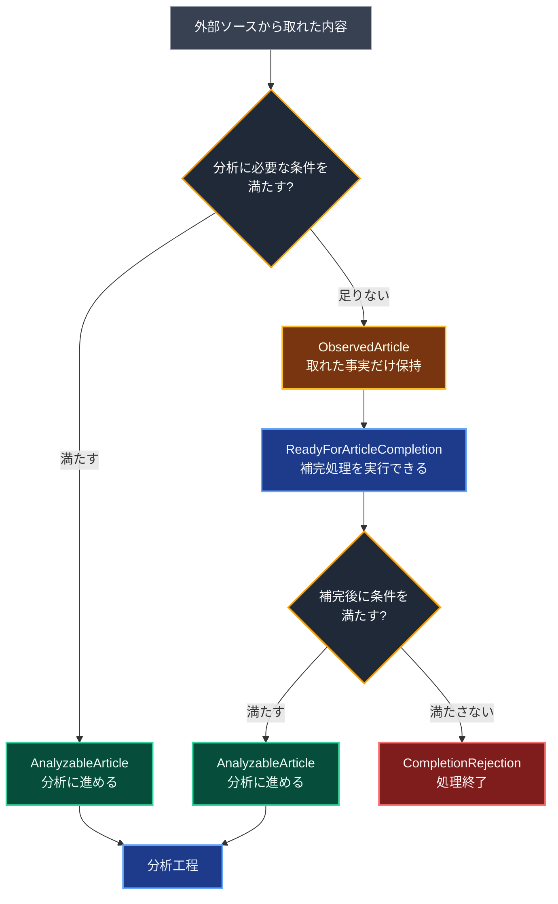

[← 目次](README.md) ・ 前: [第2幕](02-value-objects.md)

# 第3幕 — 小さな違和感をきっかけに、振る舞いの置き場を探す

形だけではあったかもしれませんが、値オブジェクトの導入には手応えを感じていました。その値が存在する時点で「検証済みである」ことを、型が保証してくれる。より良い設計に近づいている——そう考えていました。

書籍を読み進める中で、「ドメイン」という概念に少しずつ触れていきました。最初はまだ、自分のアプリケーションにどう結びつければよいのか分かっていませんでしたが、この頃から、その考え方をコードに取り入れ始めます。

値だけでなく、振る舞いも設計の対象になる。そう知ったことで、手順として書いていた処理を、メソッドとしてどこかに置いてみようと考えるようになりました。
その最初の入口になったのが、管理画面でニュースソースを有効化・無効化する、ごく小さな処理でした。管理者しか触らない設定変更で、今振り返ると、ここに大きな設計投資をする必要はなかったかもしれません。

それでも、コードを読んで引っかかった小さな違和感を、「なぜこの処理は分かりにくいのか」「この部分は何を表しているのか」と一つずつ問い直していきました。
その答えを、メソッドを置く場所やデータの型として形にしていく。「状態を変える」という処理をどこに置くのかを、初めて真剣に考えました。

## 3.1 小さな違和感

ニュースソースの有効 / 無効を切り替える処理では、Service が `source.is_active = not source.is_active` のように値を直接書き換え、変更済みのオブジェクトを Repository の `save()` に渡していました。

```python
# Service
async def toggle_source(self, source: NewsSource) -> NewsSourceDetail:
    source.is_active = not source.is_active
    source = await self.repo.save(source)
    return NewsSourceDetail.model_validate(source)

# Repository
async def save(self, source: NewsSource) -> NewsSource:
    self.session.add(source)
    await self.session.commit()
    await self.session.refresh(source)
    return source
```
ここに違和感を持ちました。コードを読んでも、操作の意図がすぐには見えてきません。やりたいことは「ニュースソースを有効化する / 無効化する」ことなのに、
実際には is_active を反転して保存する、という手順として表現されていました。

そこで、Repository に `activate()` / `deactivate()` という名前のメソッドを作りました。

```python
async def activate(self, source: NewsSource) -> NewsSource:
    source.is_active = True
    self.session.add(source)
    await self.session.commit()
    await self.session.refresh(source)
    return source

async def deactivate(self, source: NewsSource) -> NewsSource:
    source.is_active = False
    self.session.add(source)
    await self.session.commit()
    await self.session.refresh(source)
    return source
```
呼ぶ側からも、`source = await self.repo.activate(source)` のように
「有効化する」「無効化する」という意図をそのままコードから読み取れるようになりました。

名前を与えたことで、操作の意図は見えるようになりました。
次に気になったのが、トランザクション境界についてです。

自分は最初、DB に保存する処理は Repository の責任であり、`commit` も Repository が行うものだと思っていました。その考え方は、AI とのやり取りの中で見直すことになります。

Repository がその場で `commit` してしまうと、複数の変更をひとまとまりの操作として扱いにくくなります。途中で失敗したときに、片方の変更だけが確定し、もう片方は反映されない、という中途半端な状態が残るかもしれません。

ここで初めて、「1 ユースケース = 1 トランザクション」という考え方を知りました。

## 3.2 DB の値を変える、ということ

`commit` を外すと、Repository の `activate()` に残るのは「`is_active` を変える」という処理だけになります。

```python
async def activate(self, source: NewsSource) -> None:
    source.is_active = True

async def deactivate(self, source: NewsSource) -> None:
    source.is_active = False
```
この試行錯誤の中で、`NewsSource` モデルに振る舞いを持たせる、という考え方を知りました。ただ、このときの自分は、DB の値が変わる流れを、まだうまくイメージできていませんでした。`source.is_active = True` と書くだけで、なぜ DB の値が変わるのか。DB を変える操作なら Repository の仕事のはずなのに、と引っかかっていたのです。

このころ、自分は「振る舞いを Model に持たせる」という考え方を知り始めていました。Repository に残っている処理を見ると、やっているのは保存というより、取得済みの `NewsSource` の状態を変えることです。ならば、これは `NewsSource` 自身の振る舞いとして表せるのではないか。
そう考えて、`source.activate()` / `source.deactivate()` を Model に置いてみようとしました。

けれど、そこで手が止まりました。`source.activate()` の中で `self.is_active = True` と書くだけで、なぜ DB の値が変わるのか。DB を変更する処理なら Repository の仕事なのではないか、と引っかかったのです。

調べていくうちに、更新処理は DB の行を直接その場で書き換えているわけではないと分かりました。まず DB から `NewsSource` を取得し、アプリケーションのメモリ上にオブジェクトとして展開する。そのオブジェクトの属性を変更すると、SQLAlchemy が変更を追跡し、トランザクションが閉じるときに DB へ反映する。正常に終われば `commit` され、途中で例外が起きれば `rollback` されます。

この流れを理解して、`source.activate()` は DB 保存の手続きではなく、取得済みの `NewsSource` オブジェクトの状態を変える処理なのだと分かりました。変わっているのは、まずメモリ上のオブジェクト自身の状態です。その変更が、Unit of Work によって後から DB に反映される。ここを区別できていなかったのです。

ただ、今振り返ると、この判断には動機が先行していたと思います。「振る舞い」を実装してみたかった。実際にやっているのは `is_active` と `updated_at` を変えるだけで、この小ささなら Repository に `activate()` / `deactivate()` を置き、Service から呼ぶ形でも十分だったかもしれません。

それでも、メモリ上のオブジェクトの状態と DB に保存される値を区別できたこと、そして DB に保存される値を変える処理でも必ず Repository に置くわけではないと分かったことは、この小さな実装の収穫でした。

## 3.3 コードの置き場所を、作業の単位で考える

この頃、コードを直すたびに引っかかっていたことがありました。

たとえば「記事を分析する」という処理を追おうとすると、まずタスクキューから呼び出される入口を見ます。そこから Service に進み、分析対象の記事を取得し、AI に渡す。
AI とのやり取りではプロンプトと必要なデータを渡し、Gemini を呼び出し、応答を確認する。最後に、その結果を DB に保存する。

一つの作業としては「記事を分析する」だけです。けれど当時のコードでは、その流れが複数の場所に分かれていました。

```text
記事を分析する

tasks/analysis_tasks.py
  キューから呼び出される入口

services/ai_analyzer.py
  分析処理の共通的な流れ

services/gemini_analyzer.py
  Gemini を使った具体的な分析実装

repositories/
  分析対象の取得と、分析結果の保存
```

どのファイルも、置き場所として間違っているわけではありません。けれど、理解するには時間がかかり、素直にしんどいと感じるようになっていました。

そのとき頭にあったのが、少し前から触れていた「ドメインのまとまりで分ける」という考え方でした。取得・分析・保存といった実装上の役割ではなく、
「アプリの中で何を実現する処理なのか」という単位で捉え直す。

最初に手をつけたのは、AI 分析まわりでした。AI モデルの差し替えやプロンプトの見直しなど、今後変更することが明確だったからです。作業の単位でまとめれば、変更するときにも読みやすくなるのではないかと考えました。

AI 分析に関わる処理は、もともと `services/ai_analyzer.py` や `ai/` のように、「AI を使う」という実装上の役割で散らばっていました。そこで、「記事を分析する」というまとまりが見えるように、`app/analysis/` を作ることにしました。

内部をどこまで分けるかには迷いました。最初は、分析の中でやっていた要約、翻訳、分類、キーワード抽出を、それぞれ別ファイルに分ければ分かりやすくなると考えていました。けれど当時の分析は、それらを一つのプロンプトでまとめて処理していました。

操作ごとにファイルを分けると、ファイルの分かれ方と実際の処理の単位がずれてしまいます。一回の AI 呼び出しを理解するために、かえって複数のファイルを追うことになる。それはやりすぎだと感じ、内部の分割は AI 分析と埋め込みの二つに留めました。それ以上の分割は、プロンプトを分ける理由が見えてから考えることにしました。

同じ流れで、ニュースを集める処理は `collection/`、分析結果を使って検索する処理は `search/` へ分けていきます。今の形にはそのまま残っていない部分もありますが、この頃から少しずつ、コードを「どの技術を使っているか」ではなく、「どの責任を持つ処理なのか」で見るようになっていきました。

## 3.4 構造と型でドメインを表す

次に気になったのは、「このデータは次の工程に進めるのか」をどう表すかでした。

当時、収集した記事はすべて `NewsArticle` という一つのテーブルで扱っていました。記事を見つけた段階で行を作り、本文を取得できたら同じ行の `original_content` に書き込み、データが足りないものは、同じ行にフラグを立てて「分析に進めない記事」として区別していました。

```text
news_articles

+----------------------+--------------------------------------------+
| column               | 役割                                       |
+----------------------+--------------------------------------------+
| id                   | 記事 ID                                    |
| original_title       | 元記事タイトル                             |
| original_url         | 元記事 URL                                 |
| original_description | 配信元から得た短い概要・説明文                     |
| news_source_id       | 取得元ニュースソース                       |
| published_at         | 公開日時                                   |
| original_content     | 記事本文。取得できるまでは NULL                |
| skip_content_fetch   | 本文取得を諦め、分析へ進めないことを表す   |
+----------------------+--------------------------------------------+
```

この構造では、取得した記事そのものの属性と、システムがその記事をどの段階まで処理したかが、同じ場所に置かれます。URL、タイトル、公開日、本文のような記事の属性と、本文取得待ち、取得スキップ、分析可能といったパイプラインの処理の都合が混ざっていました。

この混在は、本文を取得する処理やリトライ処理、あるいは「どの記事を分析に回すか」を選ぶ処理で、具体的な読みにくさとして表れました。
たとえば「どの記事を分析に回すか」を選ぶ処理では、カラムの有無を見て分岐していました。

```python
for article in source_result.new_articles:
    if article.original_content is not None and article.published_at is not None:
        await extract_content.kiq(article.id)
    else:
        await fetch_content.kiq(article.id)
```

ここで気づいたことがありました。判定を書く代わりに、「分析対象だけが入るテーブル」を作れば、その判定自体が要らなくなるのではないか。行があること自体が「分析に回せる記事だ」という意味になるなら、`if` で確かめる必要がなくなります。

そこで、テーブルを二つに分けることにしました。ひとつは、記事を見つけた時点で分かる URL、タイトル、取得元を記録する場所。
もうひとつは、本文の取得に成功し、分析に進める状態になった記事だけを置く場所です。

```text
discovered_articles(見つけた段階の記事)
+----+----------------+--------------+----------------+---------------+
| id | news_source_id | original_url | original_title | discovered_at |
+----+----------------+--------------+----------------+---------------+
        |
        | 本文取得に成功したものだけ
        v
articles(分析に進める状態)
+----+-----------------------+----------------+------------------+--------------+
| id | discovered_article_id | original_title | original_content | published_at |
+----+-----------------------+----------------+------------------+--------------+
```

分析対象になった記事では本文を必須にしました。本文を取得できて初めて行が作られるので、その行が存在すること自体が「本文があり、分析へ回せる」という意味になります。
この設計で、状態を後から確かめる必要がなくなりました。「この記事は本文があるか」を処理のたびに見ていたのが、「行があるか」だけで分析に回せるか決まります。

本文取得処理の戻り値でも、同じ問題が見えてきました。

当時の戻り値は、`status` と `article_id` を一つの型にまとめたものでした。
`status` には「取得できた」「すでに取得済みだった」「スキップした」のどれかが入り、`article_id` には分析に回す記事の ID が入ります。

```python
@dataclass(frozen=True)
class ContentFetchResult:
    status: Literal["fetched", "already_exists", "skipped"]
    article_id: int | None = None
```

ただ、この型では `status` と `article_id` の関係までは保証できていませんでした。型の上では、「取得成功なのに ID がない」「スキップなのに ID がある」という組み合わせを作れてしまいます。

ここで気づいたのは、型を作るだけではなく、守りたい条件が型の形に表れていなければ意味がない、ということでした。
「取得できた結果には `article_id` がある」「スキップした結果には `article_id` がない」。この関係を型そのものに持たせる必要がありました。

```python
@dataclass(frozen=True)
class Fetched:
    article_id: int

@dataclass(frozen=True)
class AlreadyExists:
    article_id: int

@dataclass(frozen=True)
class Skipped:
    pass

ContentFetchResult = Fetched | AlreadyExists | Skipped
```
この二つを通じて、自分の中で少しずつ考え方が変わっていきました。あとから条件分岐で確かめるのではなく、最初から間違った形で表せないようにする。
満たさなければならない条件を、型や構造で保証する。そういう発想が、少しずつ生まれていったのだと思います。

## 3.5 第3幕の終わりに

ここで触れた具体的な設計は、今の形にはほとんど残っていません。`NewsArticle` はなくなり、記事テーブルの分割や `Fetched | AlreadyExists | Skipped` という戻り値の型も、その後のリファクタリングで作り直されました。

今の形では、外部ソースから取れた内容を、分析に進めるものと、まだ補完が必要なものに分けて扱っています。
`AnalyzableArticle` は分析に進める条件を満たした型で、`ObservedArticle` は取れた事実だけを保持する型です。



当時の設計には、まだ粗さが多く残っていました。何を型にするべきなのか。本当に保証すべき条件は何なのか。今振り返ると、そこまで十分に考えられていたわけではありません。

それでも、この時期に得たものは大きかったと思います。満たすべき条件を、あとから条件分岐で確かめるのではなく、型やテーブルの構造として表す。間違った形をそもそも作れないようにする。その考え方は、この後の設計を考えるうえでの土台になっていきました。

ここまでは、設計を良くしたいという思いに引っ張られていた部分がありました。
次の第4幕では、設計の形そのものではなく、「このアプリで価値を生むものは何か」から考え直していきます。

次: [第4幕 — 価値の中核に、設計を集中する](04-investing-in-value.md)
