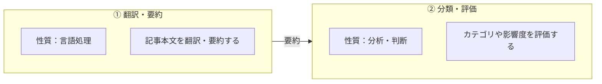

[← 目次](README.md) ・ 前: [第3幕](03-behavior-into-domain.md)

# 第4幕 — このアプリケーションの価値とは？

第3幕までで、値・振る舞い・構造に意味を持たせるための設計の手段が、少しずつ揃ってきていました。

しかし、この頃はまだ

「いい設計にしたい」、「コードを綺麗にしたい」、「ベストプラクティスの形に寄せたい」

そんな思いで手を動かしてはいたものの、それらの設計がこのアプリケーションにどのような価値をもたらすのかまでは、十分に理解できていませんでした。

海外の先端テックニュースを集め、翻訳し、AIで分析して、日本の投資家が読める形で届ける。やりたいこと自体は明確でした。
しかし、このアプリケーションを選び、使い続けてもらう理由はどこにあるのか。ユーザーは何に価値を感じるのか。そこまでは、まだ正面から考えきれていませんでした。

第4幕は、考え方が変わった時期の記録です。「どうすれば綺麗になるか」ではなく、「このアプリで価値を生んでいるのは何か」「それをどう良くするか」を先に考えるようになりました。

たどり着いた価値の中心は、AIによる分析でした。海外ニュースをただ翻訳するのではなく、投資家にとって意味のある形に整理し、投資判断の材料へと変える。そこにこのアプリケーションの価値があると捉え、そこから逆算して設計を進めていきました。

不思議なことに、こうして意識を切り替えてからのほうが、漠然とコードを綺麗にしようとしていた頃よりも、開発ははるかに前へ進むようになりました。

## 4.1 小さなきっかけ

最初の大きな転換は、このアプリケーションが提供している価値とは何かを考え直したことでした。

「このアプリケーションの中核は、AIによる翻訳・要約・分析を経た記事を届けることにある」この前提に立ったことで、それまで見えていなかった設計上のズレが浮かび上がってきました。

ユーザーが画面上で目にするのは、翻訳や要約に加え、分類や投資家向けの見立てまで付与された、分析済みの記事です。ところが、APIが返す記事のIDも、一覧を取得するDBクエリの起点も、依然として分析前の記事を基準にしていました。

```python
class ArticleBrief(_CamelBase):
    """GET /api/v1/articles — 一覧カード用"""

    id: int  # この id に問題があった
    translated_title: str
    summary: str
    impact_level: ImpactLevel
    source: NewsSourceEmbed
    published_at: datetime | None = None
    keywords: list[KeywordEmbed] = []
    is_watched: bool = False

# レスポンスを組み立てる関数
def build_brief(article: NewsArticle, watched_ids: set[int] | None = None) -> ArticleBrief:
    a = article.article_analysis

    return ArticleBrief(
        id=article.id,  # 分析したニュースではなく、取得した記事に紐づいていた
        translated_title=a.translated_title,
        summary=a.summary,
        impact_level=a.impact_level,
        ...
    )
```
しかも、リポジトリのメソッドもAPIの設計も、それまでに何度もレビューし、繰り返し手を入れてきた場所でした。

設計としては不自然だったにもかかわらず、「コードを綺麗にする」「責務を分ける」「構造を整える」という観点だけでは、そのズレに気づくことができなかったのです。

そこで、ユーザーが画面で見るもの、APIが外部に公開するID、DBクエリの起点を、いずれも価値の中心である分析済みの記事に揃え直しました。

小さな改善だったと思います。けれど、「価値のあるものは何か」という視点を持つことで設計のズレが見えるようになった、今後にもつながる大きな経験でした。

## 4.2 AI 分析をより良いものに

AI 分析が中核なら、それをより良くするにはどうすればよいのか。そう考えるようになりました。

当時、AI 分析で行っていた処理は、次のような流れでした。

- 英語の記事タイトルを日本語に翻訳する。
- 記事本文を読み、重要な内容を日本語で要約する。
- そのニュースが業界に与える影響や、投資家が注目すべき点を出す。
- 記事がどのカテゴリに属するかを判定する。
- 記事の内容に合うトピック名を付ける。
- 市場への影響度を判定し、なぜその判定にしたのかを日本語で説明する。

しかし、この構成では分析結果の品質に問題がありました。
日本語で出力してほしい箇所に英語が混ざったり、カテゴリ分類でも「なぜこの記事がここに入るのか」と疑問を感じたりすることがありました。

そこで、タスクの性質を捉え直してみることにしました。
改めて見直してみると、翻訳、要約、分類、投資家向けの見立てという性質の異なる処理を、一度のAI呼び出しに詰め込みすぎていたのではないかと感じました。

そこで、まず取得した記事から重要な情報を正確に抽出・整理し、その結果をもとに投資家向けの見立てを加える。この二段階に分けるのがよいのではないかと考えました。



この整理で、出力を改善することができました。以前のように日本語で出してほしい箇所に英語が混ざることはほとんどなくなり、AI 分析はプロンプトだけでなく、処理の分け方そのものでも品質が変わるのだと実感しました。


## 4.3 ユーザーが本当に求めているものを考える

次に、「ユーザーは何を求めているのか」という視点で考えることにしました。

ニュースの一覧画面を見ると、分析結果の中に、明らかに投資文脈に関係のない記事が混ざっていました。
例えば、ただの新製品の紹介、ブログの記事に近いものなどです。

それまで私は、AIによる処理を終えた記事を、すべて一律に「分析済みの記事」として扱っていました。けれど、ユーザーに届ける価値という観点から見ると、その括り方では粗すぎました。AIの処理が完了していても、投資家にとって価値のある記事とは限らないからです。

そこで、投資に関係のない記事を区別するため、AIがカテゴリを判定する際に、投資の文脈から外れていることを示す out_of_scope を選べるようにしました。

```text
# プロンプトの流れ

1. 投資判断に資する具体的な事象が記事内にない場合は category=out_of_scope を選ぶ。
2. 具体的な事象があり、成果物の領域がカテゴリに該当する場合は、その category を選ぶ。
3. 迷った場合は category=out_of_scope を選ぶ。

技術用語の存在だけで投資価値ありと判断しない。
```

こうすることで、分析済みの記事の中にある違いを、後から曖昧に処理するのではなく、

「投資判断に資する具体的な事象がない場合は対象外にする」「技術用語が出ているだけで投資価値があると判断しない」という基準を明確にし、概念として分けられるようにしました。

この時点では、まだ現在のように型や保存先まで一貫して整理できていたわけではありません。

それでも、AI 処理が終わった記事をすべて同じ「分析済み記事」として扱うのではなく、ユーザーに見せる価値があるものと、対象外にするものを分ける入口を作ることができました。


### AI の出力を見直す

この頃から、AIに何を出力させるべきかについても、改めて考えるようになりました。
既存の出力項目を一つずつ見直してみると、ユーザーの価値につながっていないものがあることに気づきました。

その一つが、市場への影響度を表す impact_level です。
値は `critical` / `high` / `medium` / `low` の4段階で、当初は記事を読む優先順位を判断する手がかりとして使う想定でした。

しかし実際には、投資判断に直結しないニュースにも `high` が付いたり、多くの記事が `medium` に寄ったりしていました。

ほかにも当時は、新しい技術トレンドを捉えるため、記事ごとにAIがトピック名を生成する設計にしていました。
新しいテーマが登場したとき、あらかじめ用意した分類へ無理に当てはめるのではなく、その記事が何について書かれているのかを柔軟に表現する。そして、ユーザーが関心のあるトピックで記事を絞り込めるようにすることが狙いでした。

しかし実際には、AIが生成するトピック名を安定させることは困難でした。

記事ごとにトピック名を生成していたため、同じカテゴリの中に、ほとんど同じ意味を持つトピックが別々の名前で増えていきました。
その結果、同じ話題の記事が複数のトピックに分散し、それぞれに紐づく記事数も少なくなっていました。

```text
記事A  OpenAI 新LLM発表   --> LLM
記事B  Meta 軽量LLM公開   --> 大規模言語モデル
記事C  Google 生成AI刷新  --> 生成AI
記事D  新型AIチップ発表   --> AIチップ
```

impact_level については、代わりとなる別の指標を採用することを考えました。
トピックについても、定期的に名寄せを行う方法や、プロンプトに渡す候補をあらかじめ絞る方法を検討しました。しかし、その仕組みを維持するコストに対して、得られる価値は大きくないと判断し、これらの出力は廃止しました。

振り返れば、改善方法を考えたうえで、それでも必要がないと判断したものを削除した、初めての経験だったと思います。


## 4.4 「分析する価値のある記事」とは何か、という問い

こうした改善を重ねるなかで、そもそも「分析する価値のある記事」とは何かを考えるようになりました。
そのきっかけとなったのが、ニュースの公開日時です。

本来知りたいのは、分析された元のニュースが実際にいつ公開されたのかです。

ところが当時は、公開日時を取得できなかった場合、分析を行った時刻で補完していました。
これは、単に値が欠けている以上に問題のある状態でした。公開日時は、投資家がニュースの鮮度を判断するための重要な情報です。
それにもかかわらず、その意味を十分に捉えないまま、性質の異なる時刻で置き換えていたのです。

当時、AI分析に進める記事の選別基準は、本文を取得できているかどうかを中心とした、かなり単純なものでした。その記事が分析の入力として十分な情報を備えているかまでは、考えられていなかったのです。

公開日時の問題は、その見方を変えるきっかけになりました。たとえ本文を取得できていても、いつ公開されたニュースなのかが分からなければ、投資家に届ける情報としては不十分です。
そこで、公開日時を取得できなかった場合に分析時刻で補完するのをやめ、不明なものは None のまま扱うようにしました。そのうえで、本文と公開日時の両方が揃った記事だけを、AI分析へ進める設計に改めました。

```python
# 本文と公開日時の両方を取得できた記事だけを分析に進める
if article.original_content is not None and article.published_at is not None:
    await analyze_article.kiq(article.id)
```

ただし、この時点で記事の選別条件が完成していたわけではありません。
現在のように、必要な情報が揃っていることを型で保証する設計でもなく、何を必須とするかは、その後も何度も見直すことになります。

それでも、同じ「記事」と呼んでいても、アプリケーションの中では役割や状態に応じて、異なる概念として扱う必要があるのだと学びました。


### 工程を見直す

「外部ソースから見つけた記事」と「AIに渡して分析する記事」を分けて考えるようになると、その二つをつなぐ工程が必要だと気づきました。

それまでは、取得した時点で必要な情報が足りない記事は、分析に進められないものとして扱っていました。しかし、不足している情報を補うことができれば、分析対象にできる記事を増やせます。それだけでなく、AIに渡す入力そのものの品質も高められます。

記事が最初から持っている情報は、取得元によって異なります。RSSに本文がほとんど含まれていないこともあれば、公開日時が欠けていることもあります。一方で、元のHTMLページをたどれば、本文や、より正確なタイトルを取得できる場合もあります。

そこで、外部ソースから受け取った情報をそのまま完成形とみなすのではなく、元ページのHTMLをスクレイピングして不足している情報を補完する工程を設け、その後の処理へ渡す設計に変更しました。

分析対象にできる記事を増やし、AIに渡す入力の品質を高めるために、個々の処理ではなく工程全体を設計し直す。これは、それまでの自分にはなかった発想でした。


## 4.5 第4幕の終わりに

「このアプリで価値を生むのは何か」「どうすればより良くなるのか」。この考えを持つようになってから、設計に対する考え方は大きく変わりました。
手を入れるべき場所が見えやすくなり、開発の進み方も変わりました。とても大きな経験でした。

ただ、こうして価値の中心に手を入れたことで、新たな問題も見えてきました。

このアプリケーションでは、記事の取得からAI分析までを非同期パイプラインで処理しています。あるとき、一覧画面に表示される記事が更新されていないことに気づきました。
原因を調べようにも、処理がどのステージまで進み、どこで止まったのかを確認する手段がありませんでした。

そこで、パイプラインの状態を見えるようにするため、監査ログを導入し始めました。この取り組みが、次の第5幕へとつながっていきます。

次の第5幕では、失敗の定義と向き合うことになります。

次: [第5幕 — 監査ログをきっかけに](05-audit-makes-separation-real.md)
