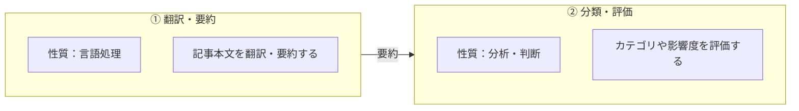
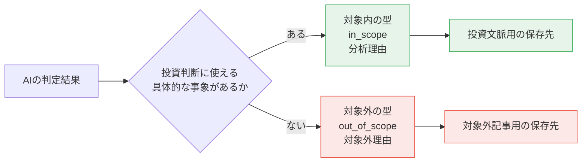

[← 目次](README.md) ・ 前: [第3幕](03-behavior-into-domain.md)

# 第4幕 — 価値の中核に、設計を集中する

第3幕までで、値・振る舞い・構造に意味を持たせる、少しずつ、設計の手段が揃ってきていました。

しかし、この頃はまだ

「いい設計にしたい」、「コードを綺麗にしたい」、「ベストプラクティスの形に寄せたい」

そうやって手は動かしていたものの、その設計がこのアプリケーションにどのような価値を与えるのかを、まだ十分には掴めていませんでした。

海外の先端テックニュースを集め、翻訳し、AI で分析して、日本の投資家が読める形にする。
けれど、このアプリケーションのどの部分が本当に使ってもらう理由になるのか。ユーザーが価値を感じるものはなんなのか？そこを正面から考えきれていませんでした。

第4幕は、考え方が変わった時期の記録です。「どうすれば綺麗になるか」ではなく、「このアプリで価値を生んでいるのは何か」「それをどう良くするか」を先に考えるようになりました。

価値の中心は、AI 分析でした。海外ニュースをただ翻訳することではなく、投資家が読むべき情報として整理し、判断材料に変えること。そこが価値の中核だと見て、逆算して設計していきました。

不思議なもので、このように意識を変えてからの方が、漠然と綺麗にしようとしていた頃よりも、開発ははるかに前に進むようになりました。

## 4.1 小さなきっかけ

最初の大きな転換は、このアプリケーションが提供している価値とは何かを考え直したことでした。

「中核にあるのは、AI によって翻訳・要約・分析された記事を提供すること」この前提に立ってから、これまで見えていなかった設計上のズレが見えるようになりました。

ユーザーが画面で見ているのは、翻訳され、要約され、分類や投資家向けの見立てが加えられた、分析済みの記事です。にもかかわらず、API で外部に見せる ID や、一覧を取得する DB クエリの起点は、まだ分析前の記事になっていました。

```python
class ArticleBrief(_CamelBase):
    """GET /api/v1/articles — 一覧カード用"""

    id: int #このidに問題があった
    translated_title: str
    summary: str
    impact_level: ImpactLevel
    source: NewsSourceEmbed
    published_at: datetime | None = None
    keywords: list[KeywordEmbed] = []
    is_watched: bool = False

# レスポンスを組み立てるメソッド
def build_brief(article: NewsArticle, watched_ids: set[int] | None = None) -> ArticleBrief:
    a = article.article_analysis

    return ArticleBrief(
        id=article.id,  # 分析したニュースではなく、取得した記事に紐づいていた
        translated_title=a.translated_title,
        summary=a.summary,
        impact_level=a.impact_level,
        ...
    )
```
不思議なことに、レポジトリのメソッドも API の設計も、これまで何度もレビューし、何度も手を入れてきた場所でした。

設計としては不自然だったにもかかわらず、コードを綺麗にする、責務を分ける、構造を整える、という見方だけでは気づくことができなかったのです。

そこで、ユーザーが画面で見るもの、API が外へ見せる ID、DB クエリが最初に辿る対象を、実際に価値を持つ分析済みの記事へ揃え直しました。

小さな改善だったと思います。けれどこれは、「価値のあるものは何か」という視点を持つことで設計のズレが見えるようになった、今後にもつながる大きな経験でした。

## 4.2 AI 分析を より良いものに

AI 分析が中核なら、それをより良くするにはどうすればよいのか。そう考えるようになりました。

当時、AI 分析で行っていた処理は、次のような流れでした。

- 英語の記事タイトルを日本語に翻訳する。
- 記事本文を読み、重要な内容を日本語で要約する。
- そのニュースが業界に与える影響や、投資家が注目すべき点を出す。
- 記事がどのカテゴリに属するかを判定する。
- 記事の内容に合うトピック名を付ける。
- 市場への影響度を判定し、なぜその判定にしたのかを日本語で説明する。

しかし、この構成では分析結果の品質に問題がありました。
日本語で出力してほしい箇所に英語が混ざったり、カテゴリ分類でも「なぜこの記事がここに入るのか」と疑問を感じたりすることがありました。

なぜこのような問題が起きるのか？
そこで、タスクの性質を捉え直してみることにしました。
考えてみると、翻訳、要約、分類、投資家向けの見立てという性質の異なるタスクを、1 回の AI 呼び出しに詰め込みすぎているのではと感じました。

そこで、まず取得した記事から重要な情報を正確に取り出し、そのあとで、その情報をもとに投資家向けの判断を加えていくという流れがよいのではないかと考えました。



この整理で、出力を改善することができました。以前のように日本語で出してほしい箇所に英語が混ざることはほとんどなくなり、AI 分析はプロンプトの文言だけでなく、処理の分け方そのものでも品質が変わるのだと実感しました。

AI 分析の品質を上げるにはどうすればよいかを真剣に考え、実際に工程を見直した最初の経験になりました。

## 4.3 ユーザーが本当に求めているものを考える

次に、「ユーザーは何を求めているのか」という視点で考えることにしました。

ニュースの一覧画面を見ると、分析結果の中に、明らかに投資文脈に関係のない記事が混ざっていました。

それまで私は、AI の処理が終わった記事を、そのまま「分析済みの記事」として扱っていました。けれど、ユーザーに見せる価値という観点で考えると、それだけでは粗すぎました。

ここで、投資に関係のない記事をどう扱うか？考える必要がありました。

そのために、AI がカテゴリを判定するときに 投資文脈に入っていないことを表す`out_of_scope` を選べるようにしました。
こうすることで、分析済みの記事の中にある違いを、後から曖昧に処理するのではなく、

「投資判断に資する具体的な事象がない場合は対象外にする」「技術用語が出ているだけで投資価値があると判断しない」という基準を明確にし、概念として分けられるようにしました。

現在は保存する先、型も分離する設計になっています。



### AIの出力を見直す

この頃から、AI に何を出力させるべきかも考え直すようになりました。
確認すると、価値を生んでいないものがあるように感じました。

それまでは、AI に市場への影響度を表す `impact_level` を出力させていました。
値は `critical` / `high` / `medium` / `low` の4段階で、当初は記事を読む優先順位を判断する手がかりとして使う想定でした。

しかし実際には、投資判断に直結しないニュースにも `high` が付いたり、多くの記事が `medium` に寄ったりしていました。

他にも当時は、新しい技術トレンドを拾えるようにするために、記事ごとに、トピック名を生成させる設計にしていました。
新しいテーマが出てきたときに、あらかじめ用意した分類に無理に当てはめるのではなく、柔軟にどのような記事かを表すことで、ユーザーがみたいトピックで記事を絞り込めるようにするためです。

しかし実際には、安定して扱うのが難しいものでした。

```text
記事A  OpenAI 新LLM発表   --> LLM
記事B  Meta 軽量LLM公開   --> 大規模言語モデル
記事C  Google 生成AI刷新  --> 生成AI
記事D  新型AIチップ発表   --> AIチップ
```

記事ごとにトピックを生成していたため、カテゴリの中に、ほとんど同じ意味のトピックが別々の名前で増えていきました。
同じ話題が複数のトピックに散らばり、一つのトピックに紐づく記事数も少なくなっていました。

定期的な名寄せや、プロンプトに渡す候補トピックを絞る方法も考えました。
けれど、その仕組みを維持するコストに対して、得られる価値は大きくないと判断し、この設計は削除しました。

AI が生成できる情報を並べるのではなく、投資家が読むときに本当に有効な情報へ絞っていく。ここから、AI 分析の出力を「ユーザーにとって価値のある情報」として設計し直すようになっていきました。


## 4.4 「分析する価値のある記事」とは何か、という問い

主役・処理・出力を価値から測り直していくと、そもそも「分析する価値のある記事」とは何か、を考えるようになりました。

きっかけは、ニュースの公開日時でした。

本来見たいのは、そのニュースがいつ公開されたのかです。けれど当時は、公開日時を取得できなかったときに、分析を行なった時刻で補完していました。
これは、単に値が欠けているよりも悪い状態でした。公開日時を、投資家がニュースの鮮度を判断するための重要な情報だということを捉えることができていませんでした。

当時、分析をする前の記事の選別は、取得した記事に本文があるかどうかを中心にした、かなりシンプルなものでした。その記事が分析の入力として十分なデータを備えているかまでは考えきれていませんでした。

公開日時の問題は、その見方を変えるきっかけでした。本文が取れていても、いつ公開されたニュースなのかが分からなければ、投資家に見せる情報としては不十分です。

公開日時を取得できなかったときに処理時刻で埋めることをやめ、分からないものは `None` のまま扱うようにしました。そのうえで、本文と公開日時の両方が揃った記事だけを AI 分析へ進めるようにしました。

```python
if article.original_content is not None and article.published_at is not None:
    await analyze_article.kiq(article.id)
```

ただし、この時点で条件が完成していたわけではありません。現在のように型で保証する設計でもなく、どこまでを必須にするかは後から何度も整理し直すことになります。それでも、同じ「記事」でも、アプリケーションの中では異なる概念になりうるのだと学びました。


### 工程を見直す

「外部ソースから見つけた記事」と「AI に渡して分析する記事」を分けて考えるようになると、その間にもう一つ工程が必要だと気づきました。

それまでは、取得した記事に必要な情報が足りなければ、分析に進めないものとして扱っていました。けれど、足りない情報を補うことができれば、分析に回せる記事を増やすことができます。さらに、AI に渡す入力の品質も高められます。

取得するソースによって、最初から持っている情報は違います。RSS に本文がほとんど入っていないものもあれば、公開日時が欠けているものもあります。一方で、HTML 側から ページ本文からより正確なタイトルを取れたりする場合もあります。

そこで、ソースが最初に渡してきた情報をそのまま最終形として扱うのではなく、HTMLからスクレイピングを行い、足りない情報を補ってから次の工程へ渡すように考え方を変えました。

分析に回せる記事を増やし、分析する記事の品質を高めるために、工程そのものを見直す。それまでの自分にはなかった発想でした。

## 4.5 第4幕の終わりに

「このアプリで価値を生むのは何か」「どうすればより良くなるのか」。この考えを持つようになってから、設計に対する考え方は大きく変わりました。

ここに設計を投資する価値があるか。ユーザーにとって価値があるものは何か。そう考えるようになってから、手を入れるべき場所が見えやすくなり、開発の進み方も変わりました。それも大きな経験でした。

この考え方は、現在の AI 分析の内容にもつながっています。
今は、AI 分析の両方の工程で、投資文脈に関係のない記事を弾く工夫をしています。
一段目では、明らかに関係のないものを `noise` として止める。
二段目では、カテゴリを分けるときに、どのカテゴリにも紐づかないものを `out_of_scope` として扱う。

出力の形も、同じ考え方から変わっています。
今は、記事の重要な内容を `key_points` として整理し、その中から企業名・製品名・技術名などを抽出するようにしています。
固有名を独立した一覧として並べるのではなく、どの重要な内容の中で登場したのかまで見えるようにするためです。

ここでの考え方がなければ、このような設計を思いつくこともなかったと思います。

ただ、価値の中心に手を入れたことで、新たな問題も見えてきました。
このアプリでは、非同期パイプラインの中で記事の取得から AI 分析までを行います。あるとき、記事が更新されていないことに気づきました。

取得で落ちたのか、本文補完で止まったのか、AI 分析で失敗したのか。どのステージで止まったのかが、まったく分からない設計になっていました。
そこを見えるようにしようとして監査を入れ始めたことが、次の第5幕につながります。

次の第5幕では、監査を入れようとしたことで、それまで「分けられている」と思っていた責任の境界が、まだかなり甘かったことに気づいていきます。

次: [第5幕 — 監査が、責任分離を本物にする](05-audit-makes-separation-real.md)
