# 現状データベーススキーマ棚卸し

> 作成日: 2026-03-19
> ソース: `backend/app/models/` のSQLModelモデル定義 + Alembicマイグレーション履歴

## 概要

- PostgreSQL 16 + pgvector
- 2スキーマ構成: `auth`（Better Auth管理）+ `public`（Alembic管理）
- public スキーマ: 17テーブル（実体9 + 翻訳3 + 中間4 + ログ1）

## ER図

```mermaid
erDiagram
    %% ── ニュースソース・記事 ──
    news_sources {
        serial id PK
        varchar200 name "NOT NULL"
        varchar20 source_type "NOT NULL, rss|api"
        varchar2048 site_url "NULLABLE"
        boolean is_active "DEFAULT TRUE"
        int fetch_interval_minutes "DEFAULT 720, CHECK 15-1440"
        timestamptz next_fetch_at "NULLABLE"
        timestamptz last_fetched_at "NULLABLE"
        int consecutive_errors "DEFAULT 0"
        text last_error_message "NULLABLE"
        varchar2048 feed_url "UNIQUE, NULLABLE (RSS)"
        varchar256 etag "NULLABLE (RSS)"
        varchar256 last_modified_header "NULLABLE (RSS)"
        varchar200 api_endpoint "NULLABLE (API)"
        timestamptz created_at "DEFAULT NOW()"
        timestamptz updated_at "DEFAULT NOW()"
    }

    news_articles {
        serial id PK
        varchar500 title_original "NOT NULL"
        text description_original "NULLABLE"
        varchar2048 url "NOT NULL, UNIQUE"
        varchar100 source "NOT NULL (legacy)"
        timestamptz published_at "NULLABLE"
        timestamptz fetched_at "DEFAULT NOW()"
        text content "NULLABLE (trafilatura)"
        timestamptz content_fetched_at "NULLABLE"
        int content_fetch_attempts "DEFAULT 0"
        vector768 embedding "NULLABLE (pgvector)"
        int source_id "FK news_sources, SET NULL"
        varchar2048 guid "UNIQUE, NULLABLE (RSS)"
        int article_group_id "FK article_groups, SET NULL"
    }

    article_groups {
        serial id PK
        int canonical_id "FK news_articles, SET NULL"
        int article_count "DEFAULT 1"
        timestamptz created_at "DEFAULT NOW()"
    }

    fetch_logs {
        serial id PK
        int source_id "FK news_sources, CASCADE"
        varchar20 status "NOT NULL, success|error"
        int articles_count "DEFAULT 0"
        text error_message "NULLABLE"
        int duration_ms "NULLABLE"
        timestamptz fetched_at "DEFAULT NOW()"
    }

    %% ── キーワード ──
    keywords {
        serial id PK
        varchar200 keyword "NOT NULL, UNIQUE"
        timestamptz created_at "DEFAULT NOW()"
        timestamptz updated_at "DEFAULT NOW()"
    }

    keyword_categories {
        serial id PK
        varchar50 slug "NOT NULL, UNIQUE"
    }

    keyword_category_translations {
        serial id PK
        int category_id "FK keyword_categories, CASCADE"
        varchar10 locale "NOT NULL"
        varchar100 name "NOT NULL"
    }

    keyword_category_links {
        serial id PK
        int keyword_id "FK keywords, CASCADE"
        int category_id "FK keyword_categories, CASCADE"
    }

    news_keywords {
        serial id PK
        int news_article_id "FK news_articles, CASCADE"
        int keyword_id "FK keywords, CASCADE"
    }

    %% ── AI分析 ──
    ai_models {
        serial id PK
        varchar20 provider "NOT NULL"
        varchar50 name "NOT NULL"
        boolean is_active "DEFAULT TRUE"
    }

    analyses {
        serial id PK
        int news_article_id "FK news_articles, CASCADE"
        int ai_model_id "FK ai_models, RESTRICT"
        varchar20 sentiment "NOT NULL"
        smallint impact_score "NOT NULL, CHECK 1-10"
        text reasoning "NULLABLE"
        timestamptz analyzed_at "DEFAULT NOW()"
    }

    analysis_translations {
        serial id PK
        int analysis_id "FK analyses, CASCADE"
        varchar10 locale "NOT NULL"
        varchar500 title "NOT NULL"
        text summary "NOT NULL"
    }

    investment_categories {
        serial id PK
        varchar50 slug "NOT NULL, UNIQUE"
    }

    investment_category_translations {
        serial id PK
        int category_id "FK investment_categories, CASCADE"
        varchar10 locale "NOT NULL"
        varchar100 name "NOT NULL"
        text description "NULLABLE"
    }

    analysis_investment_categories {
        serial id PK
        int analysis_id "FK analyses, CASCADE"
        int category_id "FK investment_categories, CASCADE"
    }

    %% ── ユーザー関連 ──
    user_keyword_subscriptions {
        serial id PK
        varchar32 user_id "NOT NULL, INDEX (auth.user.id)"
        int keyword_id "FK keywords, CASCADE"
        timestamptz created_at "DEFAULT NOW()"
    }

    watchlists {
        serial id PK
        varchar32 user_id "NOT NULL, INDEX (auth.user.id)"
        int news_article_id "FK news_articles, CASCADE"
        timestamptz created_at "DEFAULT NOW()"
    }

    %% ── リレーション ──
    news_sources ||--o{ news_articles : "has many"
    news_sources ||--o{ fetch_logs : "has many"
    news_articles }o--o| article_groups : "grouped"
    article_groups ||--o| news_articles : "canonical"
    news_articles ||--o{ news_keywords : "has many"
    news_articles ||--o{ analyses : "has many"
    news_articles ||--o{ watchlists : "watched by"
    keywords ||--o{ news_keywords : "has many"
    keywords ||--o{ keyword_category_links : "belongs to"
    keywords ||--o{ user_keyword_subscriptions : "subscribed by"
    keyword_categories ||--o{ keyword_category_translations : "has many"
    keyword_categories ||--o{ keyword_category_links : "has many"
    ai_models ||--o{ analyses : "has many"
    analyses ||--o{ analysis_translations : "has many"
    analyses ||--o{ analysis_investment_categories : "has many"
    investment_categories ||--o{ investment_category_translations : "has many"
    investment_categories ||--o{ analysis_investment_categories : "linked from"
```

## テーブル一覧

### 分類

| 分類 | テーブル | 件数目安 |
|------|---------|---------|
| 実体 | news_sources, news_articles, article_groups, keywords, keyword_categories, investment_categories, ai_models, analyses, fetch_logs | 9 |
| 翻訳 | keyword_category_translations, analysis_translations, investment_category_translations | 3 |
| 中間 | news_keywords, keyword_category_links, analysis_investment_categories, user_keyword_subscriptions | 4 |
| ユーザー紐付 | user_keyword_subscriptions, watchlists | 2 (中間と重複あり) |

### auth スキーマ（Better Auth CLI 管理、Alembic対象外）

| テーブル | 用途 |
|---------|------|
| auth.user | ユーザー（id: cuid, email, name, role 等） |
| auth.session | セッション管理 |
| auth.account | 認証プロバイダー連携（OAuth等） |
| auth.verification | メール検証トークン |

## UNIQUE制約一覧

| テーブル | 制約名 | カラム |
|---------|--------|--------|
| keywords | (自動) | keyword |
| news_articles | (自動) | url |
| news_articles | (自動) | guid |
| news_sources | (自動) | feed_url |
| ai_models | uq_ai_models_provider_name | (provider, name) |
| analyses | uq_analyses_article_model | (news_article_id, ai_model_id) |
| analysis_translations | uq_analysis_locale | (analysis_id, locale) |
| news_keywords | uq_news_keyword | (news_article_id, keyword_id) |
| keyword_category_translations | uq_keyword_cat_locale | (category_id, locale) |
| keyword_category_links | uq_keyword_category | (keyword_id, category_id) |
| investment_category_translations | uq_invest_cat_locale | (category_id, locale) |
| analysis_investment_categories | uq_analysis_category | (analysis_id, category_id) |
| user_keyword_subscriptions | uq_user_keyword | (user_id, keyword_id) |
| watchlists | uq_user_watchlist | (user_id, news_article_id) |

## CHECK制約一覧

| テーブル | 制約名 | 条件 |
|---------|--------|------|
| news_sources | ck_news_sources_source_type | source_type IN ('rss', 'api') |
| news_sources | ck_news_sources_type_fields | (type='rss' AND feed_url IS NOT NULL) OR (type='api' AND api_endpoint IS NOT NULL) |
| news_sources | ck_news_sources_interval_range | fetch_interval_minutes BETWEEN 15 AND 1440 |
| analyses | (自動) | impact_score BETWEEN 1 AND 10 |

## インデックス一覧

| テーブル | インデックス名 | カラム | 備考 |
|---------|---------------|--------|------|
| news_sources | idx_sources_active_next_fetch | next_fetch_at | 部分: is_active = TRUE |
| news_articles | idx_news_published | published_at | |
| news_articles | idx_news_fetched | fetched_at | |
| news_articles | idx_articles_source_published | (source_id, published_at DESC) | 部分: source_id IS NOT NULL |
| news_articles | idx_news_articles_article_group_id | article_group_id | |
| news_articles | (HNSW) | embedding | vector_cosine_ops |
| article_groups | idx_article_groups_canonical | canonical_id | |
| analyses | idx_analyses_sentiment | sentiment | |
| analyses | idx_analyses_impact | impact_score DESC | |
| analyses | idx_analyses_ai_model_id | ai_model_id | |
| fetch_logs | ix_fetch_logs_source_id_fetched_at | (source_id, fetched_at) | 複合 |
| user_keyword_subscriptions | ix_user_keyword_subscriptions_user_id | user_id | |
| watchlists | ix_watchlists_user_id | user_id | |
| keyword_categories | (自動) | slug | |
| investment_categories | (自動) | slug | |

## Enum型

| Enum | 定義箇所 | 値 |
|------|---------|-----|
| SourceType | models/news_source.py | RSS="rss", API="api" |
| Sentiment | models/analysis.py | POSITIVE="positive", NEGATIVE="negative", NEUTRAL="neutral" |
| FetchStatus | models/fetch_log.py | SUCCESS="success", ERROR="error" |

## シードデータ

### keyword_categories (10件)

ai_ml, biotech, energy, fintech, materials, quantum, robotics, semiconductor, space, telecom

### keywords (72件)

10カテゴリ x 7-8件。各カテゴリの翻訳（ja/en）も同時投入。

### investment_categories (6件)

competitive_edge, financial_signal, growth_catalyst, market_disruption, regulatory_shift, risk_mitigation

各カテゴリの翻訳（ja/en）も同時投入。

### ai_models (1件)

gemini / gemini-2.0-flash (is_active=TRUE)

### news_sources (7件)

初期RSSフィード7件（TechCrunch, Ars Technica 等）。

## 設計パターン

| パターン | 適用箇所 | 説明 |
|---------|---------|------|
| PGスキーマ分離 | auth / public | Better Auth は auth スキーマで隔離。user_id は論理参照（FK制約なし） |
| Translation Table | categories, analyses | 翻訳を別テーブルに分離、(parent_id, locale) UNIQUE で1言語1レコード保証 |
| Discriminated Union | news_sources | source_type + CHECK制約でRSS/APIの必須フィールドを保証 |
| ベクトル検索 | news_articles.embedding | pgvector 768次元 + HNSW (cosine) で類似記事検索 |
| 重複グループ化 | article_groups | cosine distance で類似記事をグループ化、canonical_id で代表記事を指定 |
| 物理削除のみ | 全テーブル | 論理削除なし。CASCADE / SET NULL で整合性を保持 |

## マイグレーション履歴

| # | リビジョン | 内容 |
|---|-----------|------|
| 1 | b751d5bc7311 | 初期テーブル: keywords, news_articles, analyses, news_keywords |
| 2 | e54c3f7851ce | TIMESTAMP → TIMESTAMPTZ |
| 3 | 2d02a83aa90f | users, refresh_tokens 追加 |
| 4 | dc3cc7a3c587 | user_keyword_subscriptions, watchlists 追加 |
| 5 | 3a9bf03a0b5f | news_articles に content, content_fetched_at 追加 |
| 6 | 4bf262125474 | pgvector有効化 + embedding + HNSW |
| 7 | a1b2c3d4e5f6 | refresh_tokens に revoked_at 追加 |
| 8 | f1a2b3c4d5e6 | investment_categories 追加（6カテゴリseed） |
| 9 | g2b3c4d5e6f7 | keyword_categories + 翻訳テーブル追加 |
| 10 | h3c4d5e6f7g8 | analysis_translations 追加 |
| 11 | 4bda779a1d5e | content_fetch_attempts 追加 |
| 12 | f52d4ecebe6b | 72キーワード + カテゴリリンクseed |
| 13 | a1 | news_sources テーブル追加 |
| 14 | a2 | source_id, guid カラム追加 |
| 15 | a3 | 初期RSSフィード7件seed |
| 16 | a4 | news_sources.category_id 削除 |
| 17 | a5 | ai_models 追加、analyses 正規化 |
| 18 | a6 | fetch_logs 追加 |
| 19 | a7 | デフォルトAIモデルseed |
| 20 | a8 | article_groups 追加 |
| 21 | a9 | users に role 追加 |
| 22 | b1 | Better Auth移行: auth スキーマ作成、user_id型変更、レガシーauth削除 |
