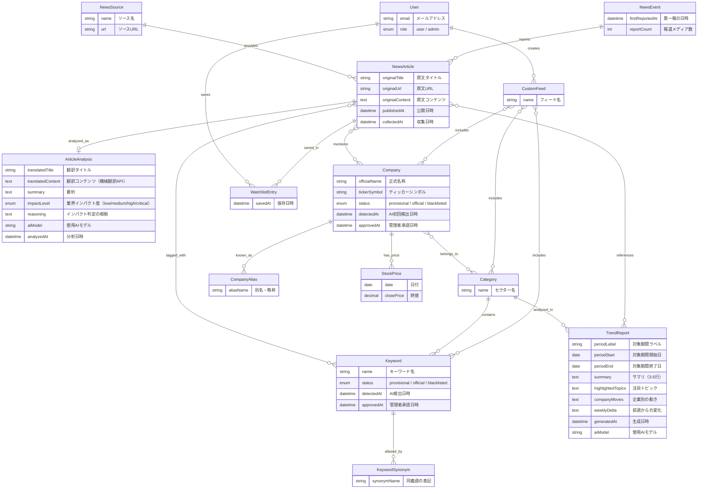

# Vector ドメイン概念モデル

> このドキュメントはアプリケーション定義（`specs/domain_overview.md`）から導出し、
> ギャップ分析（`specs/schema_gap_analysis.md`）の結論を反映した概念モデルである。
> 最終更新: 2026-03-20

## 1. エンティティ関係図



## 2. エンティティ定義

### 2.1 NewsSource（ニュースソース）

**役割**: ニュース記事の収集元。管理者が信頼できるソースのみを登録する。

| 属性 | 説明 |
|------|------|
| name | ソース名（例: TechCrunch, Reuters） |
| url | ソースのベースURL |

**関係**:
- 1つのNewsSourceは複数のNewsArticleを提供する（1:N）

**設計上の要点**:
- ソースレベルの信頼度・優先度属性（importanceLevel）は持たない。信頼度は記事内容の属性であり、同じメディアでも公式発表の報道と噂レベルの憶測記事が混在するため
- 信頼性の担保は「管理者が収集対象ソースを選定する」ことで実現する

**実装段階**: 稼働中

---

### 2.2 NewsArticle（ニュース記事）

**役割**: ドメインの中心エンティティ。英語の一次ソースから収集された記事。翻訳・分析・タグ付けの対象であり、ユーザーが閲覧する主要コンテンツ。

| 属性 | 説明 |
|------|------|
| originalTitle | 原文タイトル |
| originalUrl | 原文URL（出所の追跡可能性を担保） |
| originalContent | 原文コンテンツ |
| publishedAt | 原文の公開日時 |
| collectedAt | システムが収集した日時（速報性の計測に使用） |

**関係**:
- NewsSource → NewsArticle（N:1）: 1つのソースから収集される
- NewsEvent → NewsArticle（1:N）: 1つの出来事を複数メディアが報道する
- NewsArticle → ArticleAnalysis（1:1）: 第1層AI分析の結果を持つ
- NewsArticle ↔ Keyword（M:N）: 複数のキーワードでタグ付けされる
- NewsArticle ↔ Company（M:N）: 記事中で言及される企業
- NewsArticle ↔ WatchlistEntry（1:N）: ユーザーによるお気に入り登録
- NewsArticle ↔ TrendReport（M:N）: トレンドレポートの素材として参照される

**導出関係**:
- NewsArticle → Category: 記事のセクターは直接紐づかない。付与された Keyword が所属する Category から導出される（Keyword 経由のボトムアップ分類）

**実装段階**: 稼働中

---

### 2.3 NewsEvent（ニュース事象）

**役割**: 現実世界で起きた1つの出来事を表す。複数メディアが同じニュースを報じた場合、それらの記事を束ねる単位。同じ事実に対するメディアごとの論調（reasoning）を読み比べることで、多様な視点を提供する。報道メディア数自体が注目度のシグナルとなる。

| 属性 | 説明 |
|------|------|
| firstReportedAt | 第一報の日時（グループ内で最も早い記事の公開日時） |
| reportCount | 報道メディア数（グループ内の記事数） |

**関係**:
- NewsEvent → NewsArticle（1:N）: 1つの出来事を複数メディアが報道する。グループ内で1つの記事が canonical（代表記事）となる

**現段階の実装との距離**:
- 現在は embedding cosine distance による機械的クラスタリング（article_groups）で近似的に実現している
- 「同じ出来事」を正確に捉えているとは限らない（類似トピックが混ざる可能性）
- ドメインモデルが実装をリードする形を取り、将来的にグループ単位の要約生成や精度向上で概念に近づけていく

**実装段階**: 稼働中（article_groups として近似実装）

---

### 2.4 ArticleAnalysis（AI分析結果 / 第1層）

**役割**: 個別記事に対するAIの翻訳・要約・分析結果。「参考情報」であり事実の断定ではないという性質を構造的に持つ。使用AIモデルの追跡可能性を確保する。

| 属性 | 説明 |
|------|------|
| translatedTitle | 日本語翻訳タイトル |
| translatedContent | 日本語翻訳コンテンツ。AI分析とは別パイプラインで機械翻訳API（Google Cloud Translation / DeepL等）を使用して生成。LLMでの全文翻訳はリソースの無駄であり、機械翻訳APIで十分な品質が得られる |
| summary | 要約 |
| impactLevel | 業界インパクト度（enum 4段階）。AI分析で判定される、この記事が業界に与える影響の大きさ。`critical`（業界構造を変えるパラダイムシフト）/ `high`（特定企業・セクターへの重大な影響）/ `medium`（業界動向として把握すべき進捗）/ `low`（限定的な影響）。詳細な判断基準は `docs/prompt_design.md` に定義 |
| reasoning | インパクト判定の根拠説明。自然言語でAIが記述する。ユーザーはこの説明を読んで自分で投資判断の材料にする |
| aiModel | 分析に使用したAIモデル名・バージョン（文字列）。モデル切り替え時は新規記事から新モデルを適用し、既存記事の再分析は行わない。分析時点のモデルを記録する監査属性 |
| analyzedAt | 分析実行日時 |

**関係**:
- NewsArticle → ArticleAnalysis（1:1）

**実装段階**: 稼働中

---

### 2.5 Category（カテゴリ / セクター）

**役割**: 業界分類の大枠。事前定義される固定のセクター分類（AI/ML、半導体、バイオテック等）で、10個程度を想定。トレンドレポートの単位でもある。

| 属性 | 説明 |
|------|------|
| name | セクター名（例: AI・ML、半導体、バイオテック） |

**関係**:
- Category → Keyword（1:N）: キーワードの所属セクター
- Category ↔ Company（M:N）: 企業の所属セクター（1つ以上必須）
- Category → TrendReport（1:N）: セクター別レポートの単位
- Category ↔ CustomFeed（M:N）: カスタムフィードのフィルタ対象

**導出関係**:
- Category ← NewsArticle: 記事のセクターは直接M:Nで紐づけない。記事に付与された Keyword の所属 Category から導出される。これにより分類の SSoT を Keyword 経由に一本化し、直接紐づけとの二重管理（データ矛盾）を防ぐ

**実装段階**: 稼働中

---

### 2.6 Keyword（キーワード / 技術タグ）

**役割**: セクター内の具体的な技術・テーマを表すタグ。AIが記事から自動検出し、管理者が承認するワークフローを持つ。

| 属性 | 説明 |
|------|------|
| name | キーワード名（例: large language model, 量子エラー訂正） |
| status | `provisional`（暫定）/ `official`（正式）/ `blacklisted`（除外） |
| detectedAt | AIによる初回検出日時 |
| approvedAt | 管理者による承認日時（officialになった時） |

**関係**:
- Category → Keyword（N:1）: 1つのセクターに所属
- Keyword ↔ NewsArticle（M:N）: 記事にタグとして付与
- Keyword → KeywordSynonym（1:N）: 同義語を持つ
- Keyword ↔ CustomFeed（M:N）: カスタムフィードのフィルタ対象

**状態遷移**:
```
AI検出 → provisional（暫定タグ: ユーザーに控えめなデザインで表示）
  ├→ 管理者が正式化 → official（トレンド集計対象）
  ├→ 管理者がマージ → KeywordSynonymとして既存キーワードに紐づけ
  └→ 管理者が削除 → blacklisted（再出現防止）
```

**自動非表示ルール**: provisional のまま一定期間（detectedAt から起算）が経過した場合、ユーザーへの表示対象から除外する。ステータスは provisional のまま変更しない（管理者が後から承認すれば即座に表示される）。期間の閾値は運用パラメータとして設定で管理する。

**設計上の要点**:
- 暫定タグはトレンドレポートの集計対象に含めない
- マージによりAIの表記ゆれを学習的に吸収する
- 初期キーワードは事前定義、以降はAI検出 + 管理者承認で追加

**実装段階**: 基本機能は稼働中。承認ワークフロー・暫定タグUIは未実装

---

### 2.7 KeywordSynonym（キーワード同義語）

**役割**: キーワードの表記ゆれ・同義語を管理者がマージした結果を保持し、次回以降の自動変換に使う。

| 属性 | 説明 |
|------|------|
| synonymName | 同義語の表記（例: 「Generative AI」→ 正式キーワード「生成AI」の同義語） |

**関係**:
- Keyword → KeywordSynonym（1:N）: 1つの正式キーワードに複数の同義語

**実装段階**: 未実装（承認ワークフローと同時に実装）

---

### 2.8 Company（企業）

**役割**: 記事に登場する企業。AIが記事から企業名を検出し、provisional として作成される。管理者の承認を経て official になる。Keyword と同一のライフサイクルを持つ。

| 属性 | 説明 |
|------|------|
| officialName | 正式名称（例: NVIDIA Corporation）。provisional 時はAI検出名 |
| tickerSymbol | ティッカーシンボル（例: NVDA）。official 昇格時に管理者が設定。米国株のみでスタート |
| status | `provisional`（暫定）/ `official`（正式）/ `blacklisted`（除外） |
| detectedAt | AIによる初回検出日時 |
| approvedAt | 管理者による承認日時（official になった時） |

**関係**:
- Company ↔ Category（M:N、official 時に1つ以上必須）: 所属セクター
- Company → CompanyAlias（1:N）: 別名・略称・同義語を持つ
- Company ↔ NewsArticle（M:N）: 記事で言及される
- Company → StockPrice（1:N）: 株価データを持つ（段階C）

**状態遷移**（Keyword と同一パターン）:
```
AI検出 → provisional（暫定: ユーザーに控えめなデザインで表示）
  ├→ 管理者が正式化 → official（Category 紐づけ必須、企業ページ対象）
  ├→ 管理者がマージ → CompanyAliasとして既存企業に紐づけ
  └→ 管理者が削除 → blacklisted（再出現防止）
```

**自動非表示ルール**: Keyword と同一。provisional のまま一定期間（detectedAt から起算）が経過した場合、ユーザーへの表示対象から除外する。ステータスは変更しない。

**対象範囲の境界**:
- **official 対象**: 先端テック企業のみ。Vector が分析対象とする業界の企業
- **blacklist 対象**: 非テック企業（VC、投資銀行、政府機関等）、誤検出
- **理由**: 非テック企業は記事の「文脈」であり「主題」ではない。投資トレンド情報（出資額等）はテック企業側の記事本文で十分に把握できる

**実装段階**: 段階A（企業マスタの初期構築が前提条件）

---

### 2.9 CompanyAlias（企業別名）

**役割**: 企業の別名・略称・外国語表記を管理する。管理者のマージ操作で追加され、次回以降のAI抽出結果を自動変換する。

| 属性 | 説明 |
|------|------|
| aliasName | 別名の表記（例: NVIDIA, Nvidia, エヌビディア） |

**関係**:
- Company → CompanyAlias（1:N）

**実装段階**: 段階A

---

### 2.10 StockPrice（株価データ）

**役割**: 企業に紐づく日次株価データ。投資判断の「事実」として表示される（投資助言ではない）。

| 属性 | 説明 |
|------|------|
| date | 日付 |
| closePrice | 終値 |

**関係**:
- Company → StockPrice（1:N）

**実装段階**: 段階C（段階B完了 + 株価API導入が前提条件）

---

### 2.11 TrendReport（トレンドレポート / 第2層分析）

**役割**: セクター別の週次トレンド分析レポート。複数記事を横断した業界動向の深い分析であり、アプリの第1の価値（分析の深さ）の核心部分。

| 属性 | 説明 |
|------|------|
| periodLabel | 対象期間のラベル（例: 2026年第12週） |
| periodStart | 対象期間の開始日 |
| periodEnd | 対象期間の終了日 |
| summary | サマリ（3-5行。業界全体の流れの要約） |
| highlightedTopics | 注目トピック（株価・業界へのインパクトが大きいイベント） |
| companyMoves | 企業別の動き |
| weeklyDelta | 前週からの変化 |
| generatedAt | レポート生成日時 |
| aiModel | 分析に使用したAIモデル |

**関係**:
- Category → TrendReport（1:N）: セクターごとに生成
- TrendReport ↔ NewsArticle（M:N）: 対象期間の記事を参照

**間接参照パス**（直接のM:Nを持たないが、素材記事経由で到達可能）:
- TrendReport → NewsArticle → Keyword: レポートの素材記事に付与されたキーワードを集計で導出
- TrendReport → NewsArticle → Company: レポートの素材記事で言及された企業を導出
- Company → Category → TrendReport: 企業が属するセクターのレポート一覧を取得

**実装段階**: 未実装

---

### 2.12 User（ユーザー）

**役割**: アプリケーションの利用者。一般ユーザーと管理者の2つのロールを持つ。将来の有料化に備え、プラン・権限を後付けできる構造が必要。

| 属性 | 説明 |
|------|------|
| email | メールアドレス |
| role | `user`（一般ユーザー）/ `admin`（管理者） |

**関係**:
- User → WatchlistEntry（1:N）: お気に入り記事の保存
- User → CustomFeed（1:N）: カスタムフィードの作成

**管理者の責務**:
- 暫定キーワード・企業名の承認（正式化 / マージ / 削除）
- カテゴリ・キーワード管理
- 企業マスタ管理
- ニュースソース管理

**将来検討**: プラン（無料/有料）や権限の概念を後付けする可能性あり

**実装段階**: 稼働中（Better Auth移行中）

---

### 2.13 WatchlistEntry（ウォッチリスト / お気に入り）

**役割**: ユーザーが気になった記事を保存する機能。後で読み返すために使う。

| 属性 | 説明 |
|------|------|
| savedAt | 保存日時 |

**関係**:
- User → WatchlistEntry（1:N）
- NewsArticle → WatchlistEntry（1:N）

**実装段階**: 稼働中

---

### 2.14 CustomFeed（カスタムフィード）

**役割**: ユーザーが用途別に作成するフィルタのプリセット。投資家は文脈に応じて情報収集の目的を切り替える（全体俯瞰、特定テーマの深掘り、保有銘柄の監視など）。CustomFeed はその切り替えを即座に行うための仕組み。

| 属性 | 説明 |
|------|------|
| name | フィード名（例: 「朝の全体チェック」「半導体深掘り」「保有銘柄」） |

**関係**:
- User → CustomFeed（1:N）: ユーザーは複数のフィードを作成できる
- CustomFeed ↔ Category（M:N）: このフィードで表示するセクター
- CustomFeed ↔ Keyword（M:N）: このフィードで表示するキーワード
- CustomFeed ↔ Company（M:N）: このフィードで表示する企業

**実装段階**: 未実装

---

## 3. 実装段階サマリ

| 段階 | エンティティ | 前提条件 |
|------|------------|----------|
| **稼働中** | NewsSource, NewsArticle, NewsEvent（近似実装）, ArticleAnalysis, Category, Keyword（基本）, User, WatchlistEntry | - |
| **未実装（段階なし）** | KeywordSynonym, CustomFeed, TrendReport | KeywordSynonym・TrendReport は承認ワークフロー実装と同時期 |
| **段階A** | Company, CompanyAlias | 企業マスタの初期構築 |
| **段階B** | （新規エンティティなし。Company の表示拡充） | 段階A完了 |
| **段階C** | StockPrice | 段階B完了 + 株価API（Twelve Data / Finnhub）導入 |

## 4. 概念間の主要な関係まとめ

| 関係 | 多重度 | 説明 | 段階 |
|------|--------|------|------|
| NewsSource → NewsArticle | 1:N | ソースから記事を収集 | 稼働中 |
| NewsEvent → NewsArticle | 1:N | 1つの出来事を複数メディアが報道 | 稼働中（近似） |
| NewsArticle → ArticleAnalysis | 1:1 | 記事ごとに第1層AI分析 | 稼働中 |
| NewsArticle ↔ Keyword | M:N | 記事への技術タグ付与 | 稼働中 |
| Category → Keyword | 1:N | キーワードの所属セクター | 稼働中 |
| Keyword → KeywordSynonym | 1:N | 表記ゆれの吸収 | 未実装 |
| NewsArticle ↔ Company | M:N | 記事内の企業言及 | 段階A |
| Company → CompanyAlias | 1:N | 企業の別名管理 | 段階A |
| Company → StockPrice | 1:N | 企業の日次株価 | 段階C |
| Category → TrendReport | 1:N | セクター別週次レポート | 未実装 |
| Company ↔ Category | M:N | 企業の所属セクター（1つ以上必須） | 段階A |
| TrendReport ↔ NewsArticle | M:N | レポートの素材記事 | 未実装 |
| User → WatchlistEntry → NewsArticle | 1:N:1 | お気に入り記事保存 | 稼働中 |
| User → CustomFeed | 1:N | ユーザーのカスタムフィード | 未実装 |
| CustomFeed ↔ Category | M:N | フィードに含めるセクター | 未実装 |
| CustomFeed ↔ Keyword | M:N | フィードに含めるキーワード | 未実装 |
| CustomFeed ↔ Company | M:N | フィードに含める企業 | 未実装 |

**導出関係**（直接のリレーションを持たないが、他のリレーション経由で導出可能）:

| 関係 | 導出パス | 説明 |
|------|---------|------|
| NewsArticle → Category | NewsArticle → Keyword → Category | 記事のセクターはキーワード所属セクターから導出 |

## 5. 設計判断の記録

| 判断 | 結論 | 理由 |
|------|------|------|
| ArticleAnalysis の多重度 | 1:1 維持 | モデル比較はユーザー機能ではなく内部検証用。YAGNI。必要時に Alembic で 1:N に移行可能 |
| Keyword の Category 所属 | 1:N（単一所属）維持 | セクター横断性は記事側の M:N が吸収する。キーワードが1つに決められないなら、それはカテゴリ定義の問題 |
| Company のセクター管理 | `sector` 文字列を廃止し Category との M:N に変更 | 巨大テック企業（Google: AI+クラウド+量子等）は複数セクターにまたがる。Category を再利用することでセクター定義の一貫性を保つ |
| Company マスタの対象範囲 | 先端テック企業に限定、非テック企業は blacklist | 非テック企業（VC、銀行等）は記事の「文脈」であり「主題」ではない。投資トレンド情報はテック企業側の記事本文で把握できる。非テック企業数は40〜50社程度で管理負担は軽微 |
| TrendReport の M:N 関係 | 3つ→1つに削減（NewsArticle のみ） | Keyword・Company との直接M:Nは素材記事経由の間接参照で代替可能。開発コストを大幅に削減 |
| TrendReport ↔ Company の逆引き | 素材記事経由の間接JOINで対応 | `Company → NewsArticle → TrendReport` または `Company → Category → TrendReport` で実現可能。記事数・レポート数の規模ではパフォーマンス問題なし |
| CompanyTag の廃止 | Company を Keyword と同一パターンに統一 | CompanyTag は Article-Company 間の中間エンティティだったが、Company 自体に provisional ステータスを持たせれば不要。Keyword と対称な設計になり、概念モデルが簡潔になる |
| importancePriority の再配置 | NewsArticle から削除、ArticleAnalysis に impactLevel として配置 | 処理順序の優先度（トリアージ）はパイプラインの実装詳細であり概念モデルに不要。ユーザーに意味があるのは「業界インパクト度」であり、これは AI 分析の出力 |
| isReference の削除 | ArticleAnalysis から削除 | 全分析結果が「参考情報」であることはドメイン不変条件。個別レコードの属性ではなくUI層の免責表示で担保する |
| 暫定タグの自動非表示 | ステータス追加ではなくクエリ時フィルタで実現 | provisional のまま detectedAt から一定期間経過で非表示。ステータスを変更しないため、管理者が後から承認すれば即座に復帰可能。閾値は運用パラメータ |
| FilterPreference → CustomFeed | json 属性のエンティティから、Category・Keyword へのリレーションを持つエンティティに変更 | 投資家は文脈（全体俯瞰/テーマ深掘り/銘柄監視）を切り替えて情報収集する。複数プリセットが必要であり、フィルタ内容は Category・Keyword への参照なのでリレーションで表現すべき |
| NewsArticle ↔ Category の直接M:N廃止 | Keyword 経由の導出関係に変更 | 記事のセクターは分析結果（キーワード抽出）で初めて決まる。取得段階では判断不可能。直接紐づけとキーワード経由の二重管理は SSoT 違反でデータ矛盾の原因になる |
| NewsSource.importanceLevel の削除 | ソースレベルの信頼度属性を持たない | 信頼度はソースではなく記事内容の属性。同じメディアでも公式発表と憶測記事が混在する。信頼性は管理者がソースを選定することで担保する |
| ArticleAnalysis に reasoning 追加 | インパクト判定の根拠を自然言語で保持 | impact_score 単体ではユーザーが判断材料にできない。reasoning があれば根拠を読んで自分で判断できる。固定ラベル（sentiment, investment_categories）ではなく自然言語で表現することで主観性の問題を回避 |
| investment_categories の削除 | ドメインモデルに追加しない | 「AIの分析結果にAIが固定ラベルを貼る」構造で投資観点の主観性を隠蔽しているだけ。impact_score + reasoning で十分カバーされる |
| sentiment の削除 | AI単独の主観ラベルは有効でない | 外部データ（SNSセンチメント等）で民意を反映できる段階で再追加する |
| translatedContent の生成方式 | 機械翻訳API（Google Cloud Translation / DeepL等）で別パイプライン | LLMでの全文翻訳はリソースの無駄。機械翻訳APIなら低コストで十分な品質。AI分析パイプラインとは分離することで分析品質への影響も回避 |
| NewsEvent の導入 | article_groups を NewsEvent に概念昇格 | 同じニュースでもメディアごとに論調が異なる。これは「重複排除」ではなく「多様な視点の提示」というドメイン価値。reasoning の読み比べで投資家は深いインサイトを得られる。現段階は embedding cosine distance による近似実装 |
| impactLevel の形式 | 数値スコア（1-10）を廃止し enum 4段階（low/medium/high/critical）に変更 | 1-10スコアはLLMの真ん中寄せバイアスにより7-8に集中し差別化できない。4段階enumは「投資家の行動」を軸にした明確な判断基準を定義でき、critical が出た時の注目度が高まる。判断基準の詳細は `docs/prompt_design.md` に定義 |

## 6. 将来の拡張候補（注記のみ）

以下は現時点では不要だが、将来ニーズが発生した場合に検討する拡張。

| 拡張候補 | 内容 | トリガー |
|----------|------|----------|
| 非テック企業の `external` ステータス | blacklist ではなくタグとして残し、記事フィルタに使えるようにする | 「特定VCの投資先を横断で見たい」等のユースケースが顕在化した場合 |
| ArticleAnalysis の 1:N 拡張 | 同一記事に対して複数AIモデルの分析結果を保持 | AIモデルのA/Bテストや品質比較を体系的に行う必要が出た場合 |
| 外部センチメントデータの取り込み | SNS等から民意・市場センチメントを収集し、記事分析と組み合わせる。旧 investment_categories（AI固定タグ）は「AIの意見にAIがラベルを貼る」構造で主観性を隠蔽していたため削除した。外部データを取り込む段階で、その時のニーズに合った構造を改めて設計する | SNSセンチメント分析や外部市場データの統合ニーズが顕在化した場合 |
| sentiment 属性の再追加 | ArticleAnalysis に positive/negative/neutral の判定を持たせる。AI単独の主観ラベルでは有効性が低いため現段階では削除したが、外部データで民意を反映できる段階で再追加する | 外部センチメントデータとの統合が実現した場合 |
| ArticleAnalysis.reliability（情報確度） | 記事の情報確度を判定する属性（official / confirmed / rumor 等）。信頼度はソースではなく記事内容が持つ属性。同じメディアでも公式発表の報道と噂レベルの憶測記事が混在する | 情報確度によるフィルタリングや重み付けのニーズが顕在化した場合 |
